# myMaven笔记

## Maven简介

传统项目管理状态分析

- jar包不统一，jar包不兼容
- 工程升级维护过程操作繁琐
- ……

<span style="color:red;">Maven的本质是一个项目管理工具，将项目开发和管理过程抽象成一个项目对象模型（POM）</span>

POM：Project Object Model 项目对象模型

（<b style="color:blue;">关于pom.xml文件的内容，可以查看《POM文件帮助文档.md》</b>）

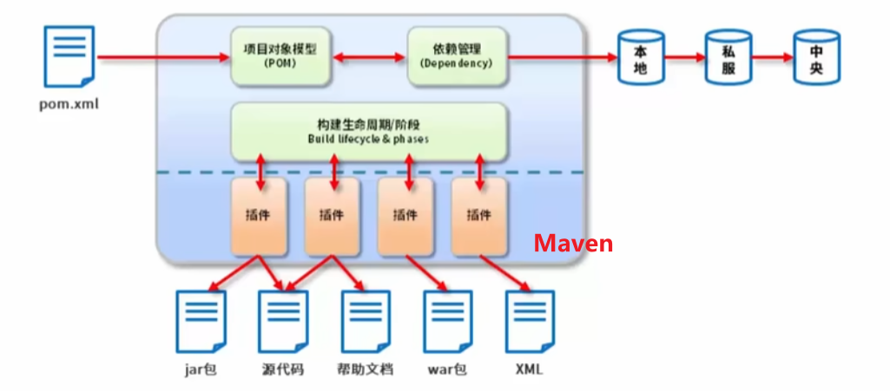

**Maven的作用**

- 项目构建：提供标准的、跨平台的自动化项目构建方式
- 依赖管理：方便快捷的管理项目依赖的资源（jar包），避免资源间的版本冲突问题
- 统一开发结构：提供标准的、统一的项目结构

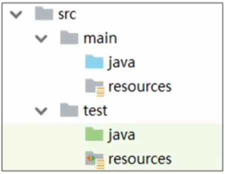


## Maven的下载&安装

官网：https://maven.apache.org/

下载地址：https://maven.apache.org/download.cgi

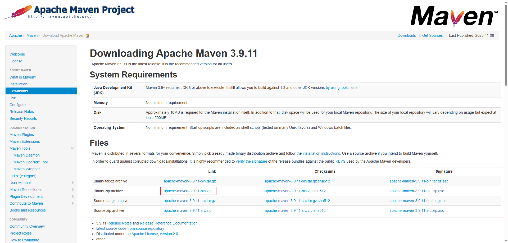

将下载的压缩包解压后，可以看到如下目录结构

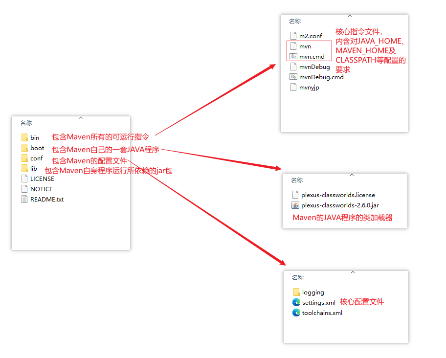

配置环境变量

JAVA_HOME配置：略

MAVEN_HOME配置：

1、新建**MAVEN_HOME**系统变量

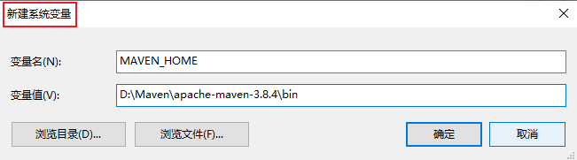

2、修改系统变量**Path**

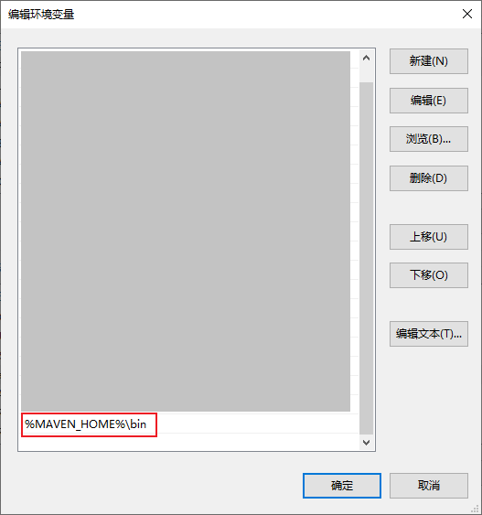

3、通过CMD命令验证Maven是否安装成功


## 基础概念

**仓库**

- 仓库：用于存储资源，包含各种 jar 包
- 仓库分类:
    - 本地仓库：自己电脑上存储资源的仓库，连接远程仓库获取资源
    - 远程仓库：非本机电脑上的仓库，为本地仓库提供资源
        - 中央仓库: Maven 团队维护，存储所有资源的仓库
        - 私服：部门 / 公司范围内存储资源的仓库，从中央仓库获取资源
- 私服的作用:
    - 保存具有版权的资源，包含购买或自主研发的 jar
        - 中央仓库中的 jar 都是开源的，不能存储具有版权的资源
    - 一定范围内共享资源，仅对内部开放，不对外共享

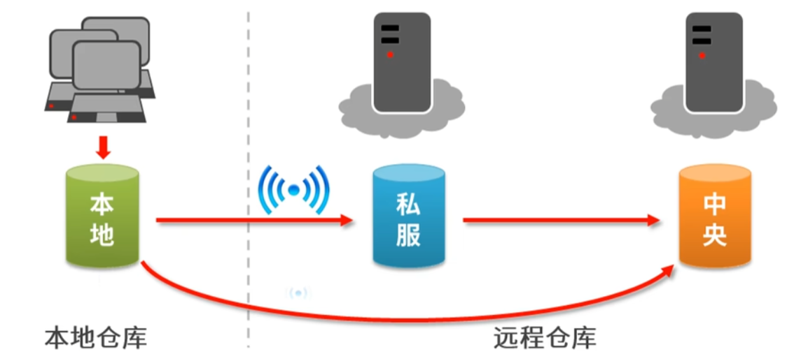

**坐标**

- 什么是坐标？

    - Maven 中的坐标用于描述仓库中资源的位置
    - https://repo1.maven.org/maven2/

- Maven 坐标主要组成

    - groupId：定义当前 Maven 项目隶属组织名称（通常是域名反写，例如：org.mybatis）

    - artifactId：定义当前 Maven 项目名称（通常是模块名称，例如 CRM、SMS）

    - version：定义当前项目版本号

    - packaging：定义该项目的打包方式

- Maven 坐标的作用
    - <span style="color:red;">使用唯一标识，唯一性定位资源位置，通过该标识可以将资源的识别与下载工作交由机器完成</span>


## 仓库配置

**配置本地仓库**

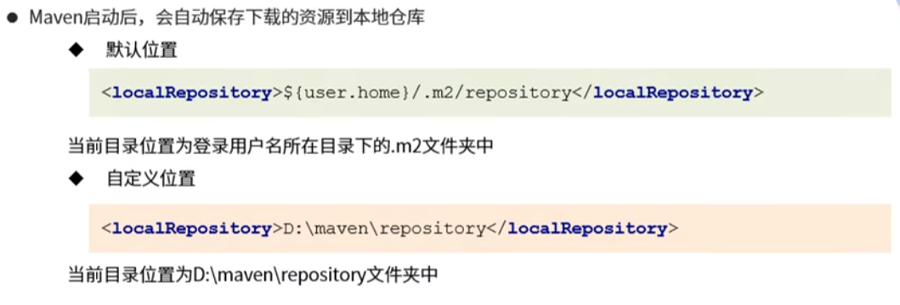

**配置远程仓库（镜像仓库配置）**

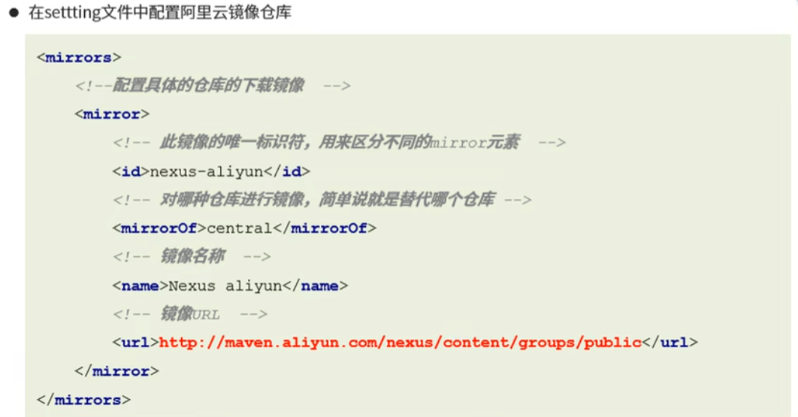


## 首个Maven项目

### 手动生成

手动创建Maven工程目录结构

> project
>
> - src
>     - main
>         - java
>             - com
>                 - stone
>                     - HelloWorld.java
>         - resources
>     - test
>         - java
>             - com
>                 - stone
>                     - HelloWorldTest.java
>         - resources
> - pom.xml

`HelloWorld`

```java
package com.stone;

public class HelloWorld {
	public String hello(String name) {
		System.out.println("Hello " + name);
		return "Hello " + name;
	}
}
```

`HelloWorldTest`

```java
package com.stone;

import org.junit.Test;
import org.junit.Assert;

public class HelloWorldTest {
	
	@Test
	public void testHello() {
		HelloWorld hw = new HelloWorld();
		String res = hw.hello("World);
		// 利用断言判断值是否相等
		Assert.assertEquals("Hello World", res);
	}
}
```

`pom.xml`

```xml
<project xmlns="http://maven.apache.org/POM/4.0.0" xmlns:xsi="http://www.w3.org/2001/XMLSchema-instance"
         xsi:schemaLocation="http://maven.apache.org/POM/4.0.0 http://maven.apache.org/maven-v4_0_0.xsd">
    <!--Maven对象模型版本号-->
	<modelVersion>4.0.0</modelVersion>

    <groupId>com.stone</groupId>
    <artifactId>project-java</artifactId>
    <version>1.0</version>

    <packaging>jar</packaging>

    <name>project-java</name>

    <dependencies>
		<dependency>
			<groupId>junit</groupId>
			<artifactId>junit</artifactId>
			<version>4.12</version>
		</dependency>
    </dependencies>
</project>
```

使用Maven命令来构建项目

<span style="color:red;">Maven命令使用mvn开头，后面添加功能参数，可以一次执行多个命令，使用空格分隔</span>

```shell
$ mvn compile	# 编译
$ mvn clean		# 清理
$ mvn test		# 测试
$ mvn package	# 打包
$ mvn install	# 安装到本地仓库
```

在项目的根路径下，使用cmd窗口来运行命令


此外，我们还可以通过插件来创建项目工程

- 创建工程

```shell
$ mvn archetype:generate
$    -DgroupId={project-packaging}
$    -DartifactId={project-name}
$    -DarchetypeArtifactId=maven-archetype-quickstart
$    -DinteractiveMode=false
```

- 创建java工程

```shell
$ mvn archetype:generate
$    -DgroupId=com.stone
$    -DartifactId=java-project
$    -DarchetypeArtifactId=maven-archetype-quickstart
$    -Dversion=0.0.1-snapshot 
$    -DinteractiveMode=false
```

- 创建Web工程

```shell
$ mvn archetype:generate
$    -DgroupId=com.itheima
$    -DartifactId=web-project
$    -DarchetypeArtifactId=maven-archetype-webapp
$    -Dversion=0.0.1-snapshot
$    -DinteractiveMode=false
```


### IDEA生成

要想通过IDEA生成Maven项目，<span style="color:red;">首先需要给IDEA配置Maven</span>，

我们创建一个空项目工程

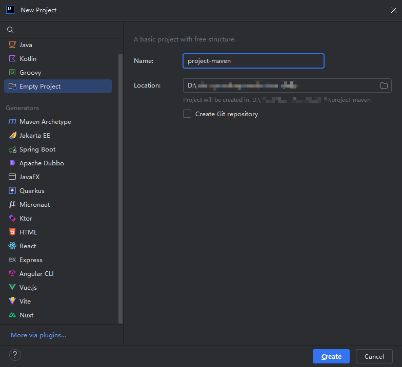

修改`Project Structure`中的Project SDK

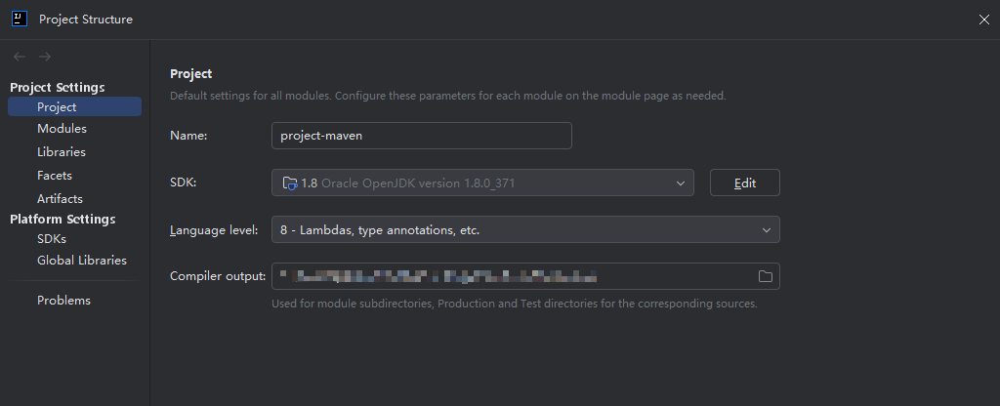

然后在IDEA中配置Maven

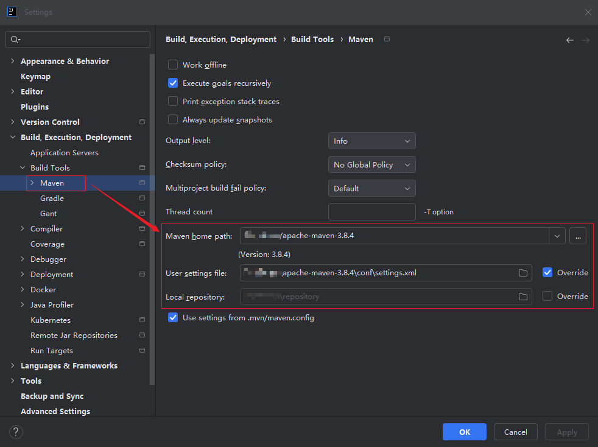

#### 手工创建Java项目

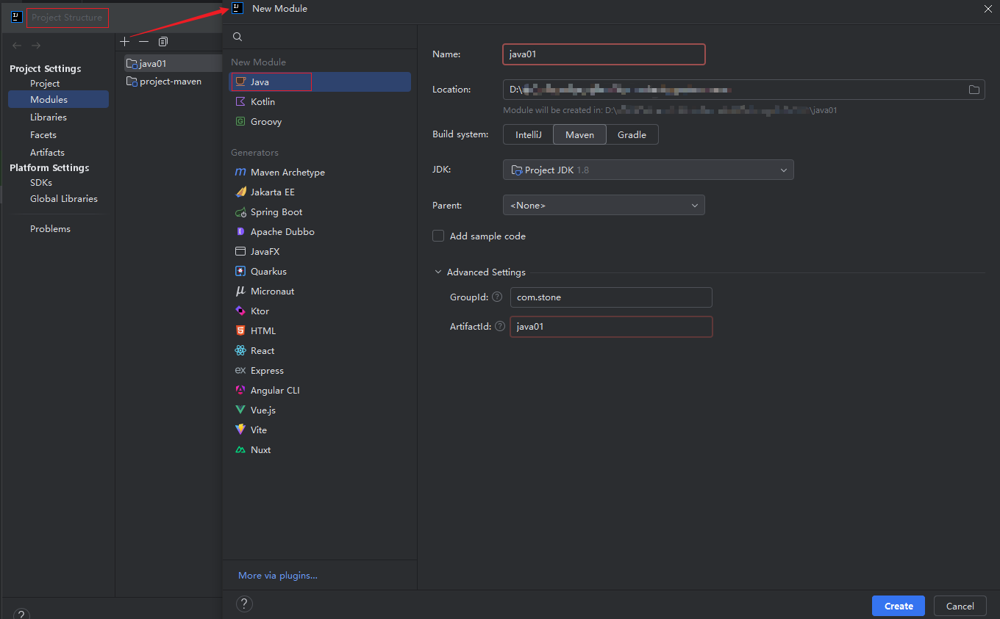

引入依赖

```xml
<?xml version="1.0" encoding="UTF-8"?>
<project xmlns="http://maven.apache.org/POM/4.0.0"
         xmlns:xsi="http://www.w3.org/2001/XMLSchema-instance"
         xsi:schemaLocation="http://maven.apache.org/POM/4.0.0 http://maven.apache.org/xsd/maven-4.0.0.xsd">
    <modelVersion>4.0.0</modelVersion>

    <groupId>com.stone</groupId>
    <artifactId>java01</artifactId>
    <version>1.0-SNAPSHOT</version>

    <properties>
        <maven.compiler.source>8</maven.compiler.source>
        <maven.compiler.target>8</maven.compiler.target>
        <project.build.sourceEncoding>UTF-8</project.build.sourceEncoding>
    </properties>

    <dependencies>
        <dependency>
            <groupId>junit</groupId>
            <artifactId>junit</artifactId>
            <version>4.12</version>
            <scope>test</scope>
        </dependency>
    </dependencies>

</project>
```

编写类和方法


`HelloWorld`

```java
package com.stone;

public class HelloWorld {

    public String sayHello(String name) {
        System.out.println("Hello " + name);
        return "Hello " + name;
    }
}
```

`HelloWorldTest`

```java
package com.stone;

import org.junit.Assert;
import org.junit.Test;

public class HelloWorldTest {

    @Test
    public void testSayHello() {
        HelloWorld helloWorld = new HelloWorld();
        String res = helloWorld.sayHello("World");
        Assert.assertEquals("Hello World", res);
    }
}
```

通过Maven命令去构建项目

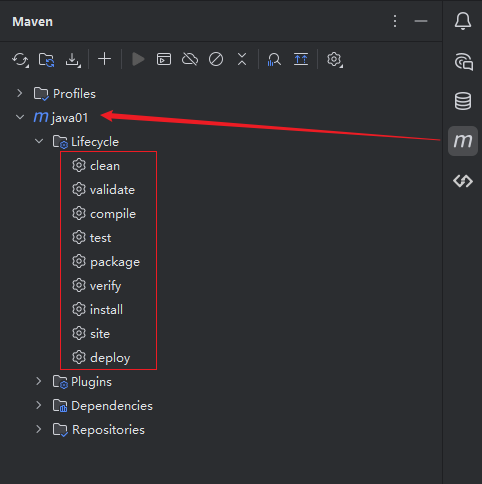

当我们点击Test命令时，Maven会扫描并运行`test`目录下的测试类中的方法


此外我们还可以自定义配置Maven运行环境（<span style="color:red;">方便我们进行Debug调试</span>）

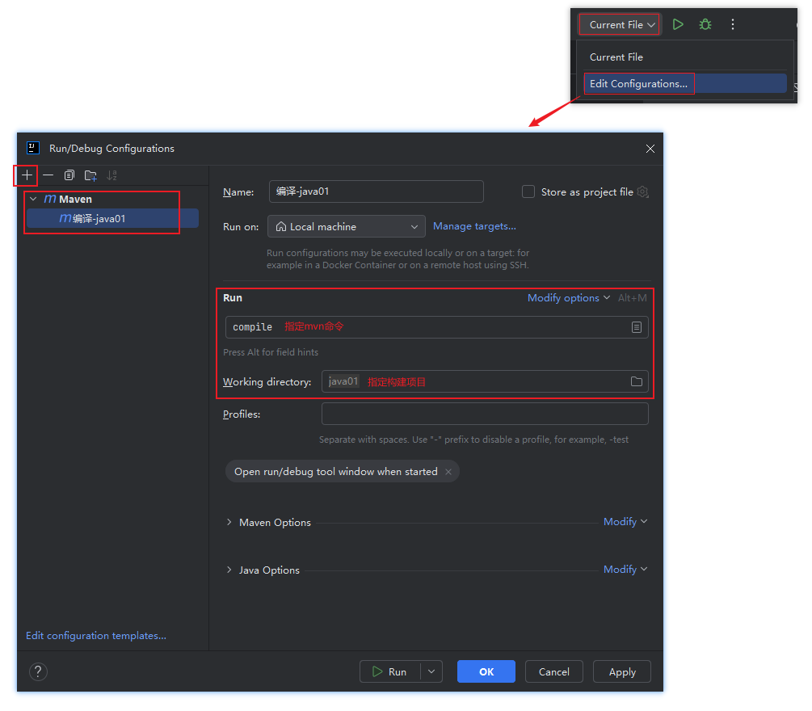

#### 原型创建Java项目

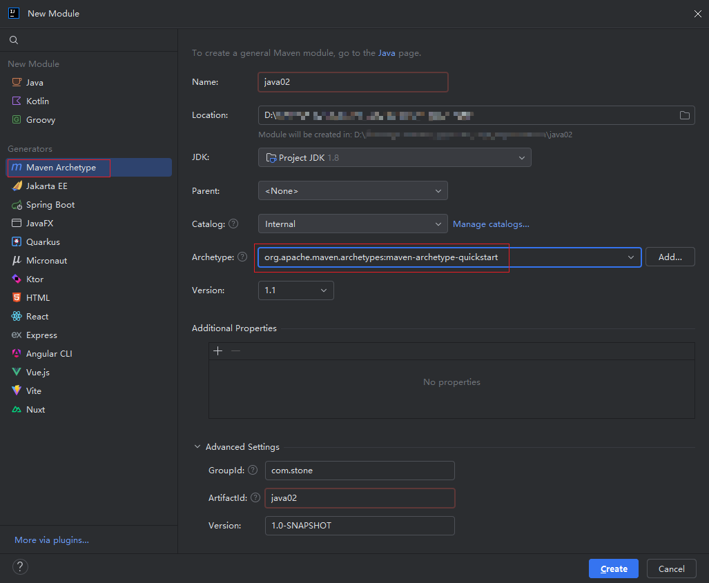

项目工程结构如下

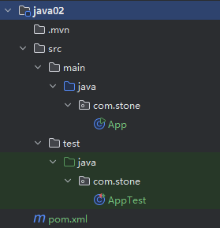

#### 原型创建Web项目

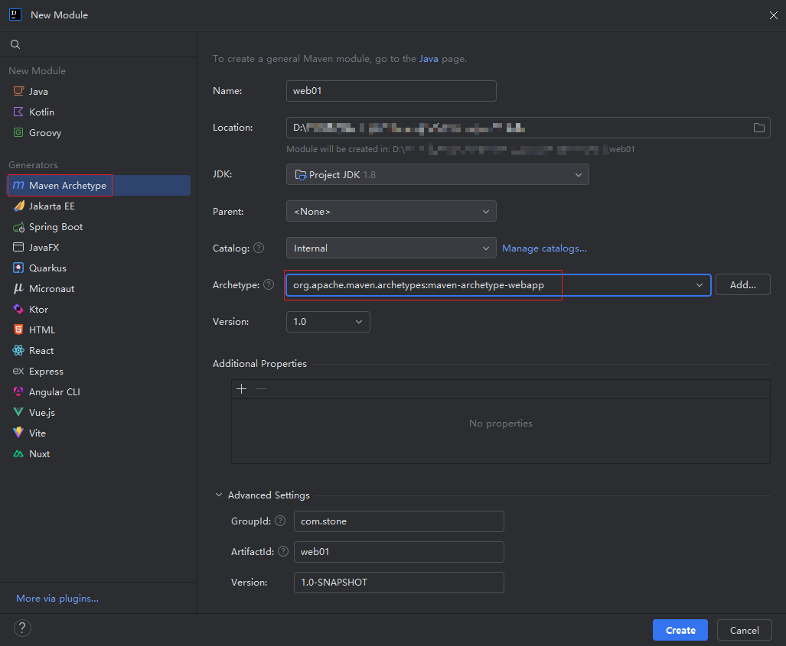

项目工程结构如下，需要我们手动添加`java`目录

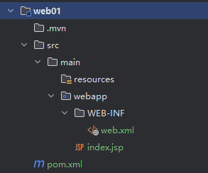

#### 插件

对于Web工程，我们需要安装Tomcat插件，才能启动它

在pom.xml中添加插件配置

```xml
<project xmlns="http://maven.apache.org/POM/4.0.0" xmlns:xsi="http://www.w3.org/2001/XMLSchema-instance"
         xsi:schemaLocation="http://maven.apache.org/POM/4.0.0 http://maven.apache.org/maven-v4_0_0.xsd">
    <!--指定pom的模型版本-->
    <modelVersion>4.0.0</modelVersion>

    <!--项目坐标-->
    <groupId>com.stone</groupId>
    <artifactId>web01</artifactId>
    <!--版本号，SNAPSHOT为快照版本，RELEASE为正式版本-->
    <version>1.0-SNAPSHOT</version>

    <!--打包方式，web工程打war包，java工程打jar包-->
    <packaging>war</packaging>

    <name>web01</name>

    <!--当前项目工程引入的所有依赖-->
    <dependencies>
    </dependencies>

    <!--构建-->
    <build>
        <!--插件配置-->
        <plugins>
            <!--Tomcat插件-->
            <plugin>
                <groupId>org.apache.tomcat.maven</groupId>
                <artifactId>tomcat7-maven-plugin</artifactId>
                <version>2.2</version>
                <!--Tomcat配置-->
                <configuration>
                    <!--路径-->
                    <path>/</path>
                    <!--端口-->
                    <port>8090</port>
                </configuration>
            </plugin>
        </plugins>
    </build>
</project>
```

通过插件命令启动项目

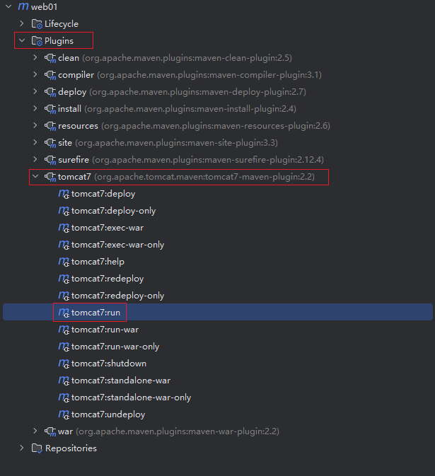

访问地址：http://localhost:8090/


当然，我们也可以在自定义配置运行环境中配置插件的命令

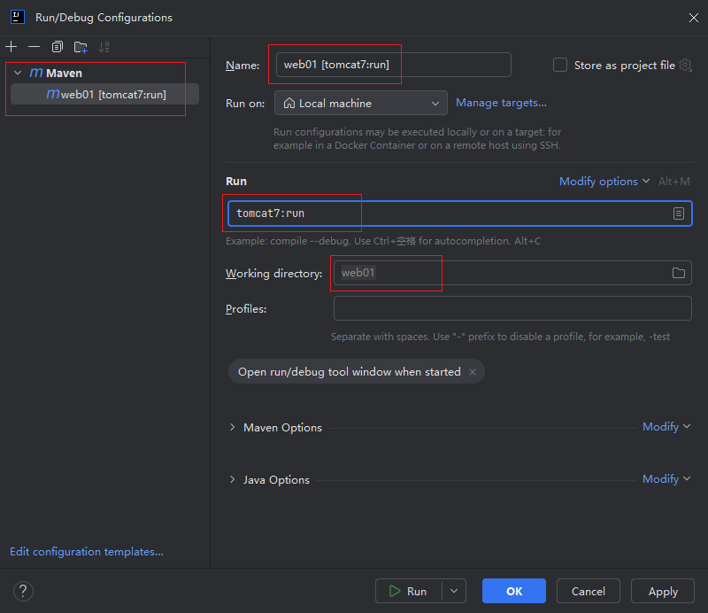


## 依赖管理

**依赖配置**：配置当前项目工程运行所需的jar，一个项目工程可以配置多个依赖

格式如下：

```xml
<!--当前项目工程引入的所有依赖-->
<dependencies>
    <!--每一个具体的依赖-->
    <dependency>
        <!--依赖的群组ID-->
        <groupId>junit</groupId>
        <!--依赖的项目ID-->
        <artifactId>junit</artifactId>
        <!--依赖的版本号-->
        <version>4.12</version>
    </dependency>
</dependencies>
```


**依赖传递**

依赖具有传递性

- 直接依赖：在当前项目工程中通过依赖配置建立的依赖关系
- 简介依赖：被配置的依赖资源如果依赖其他的资源，当前项目间接依赖其他资源

<span style="color:red;">依赖传递冲突问题</span>

- 路径优先：当依赖中出现相同的资源时，层级越深，优先级越低，层级越浅，优先级越高
- 声明优先：当资源在相同层级被依赖时，配置顺序靠前的覆盖配置顺序靠后的
- 特殊优先：当同级配置了相同资源的不同版本，后配置的覆盖先配置的

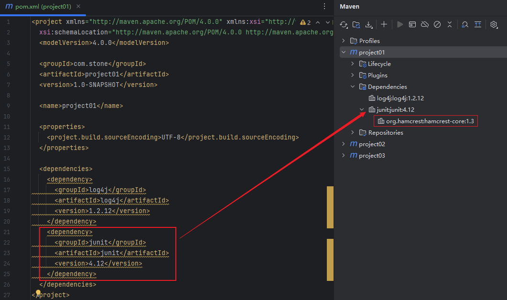

我们在`project01`中依赖`junit`后，`junit`依赖的资源`hamcrest`也可以被间接使用到


**可选依赖**：指对外隐藏当前所依赖的资源——不透明

<span style="color:red;">在目标依赖中配置`optional`选项为 true</span>

```xml
<dependency>
    <groupId>junit</groupId>
    <artifactId>junit</artifactId>
    <version>4.12</version>
    <optional>true</optional>
</dependency>
```

当我们在`project03`中将`junit`设置为可选依赖后，在`project02`中引入`project03`时是看不到`junit`依赖的，这就是可选依赖的<span style="color:red;">不透明性</span>

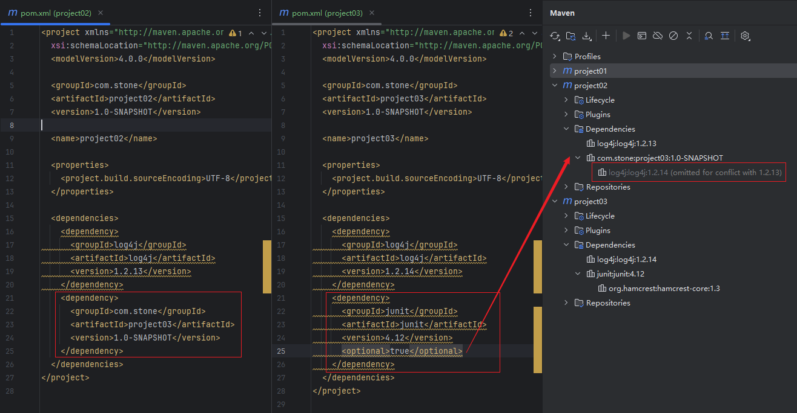


**排除依赖**：指主动断开依赖的资源，被排除的资源无需指定版本——不需要

<span style="color:red;">在引入目标依赖的地方配置`exclusions`选项</span>

```xml
<dependency>
    <groupId>junit</groupId>
    <artifactId>junit</artifactId>
    <version>4.12</version>
    <exclusions>
        <exclusion>
            <groupId>org.hamcrest</groupId>
            <artifactId>hamcrest-core</artifactId>
        </exclusion>
    </exclusions>
</dependency>
```

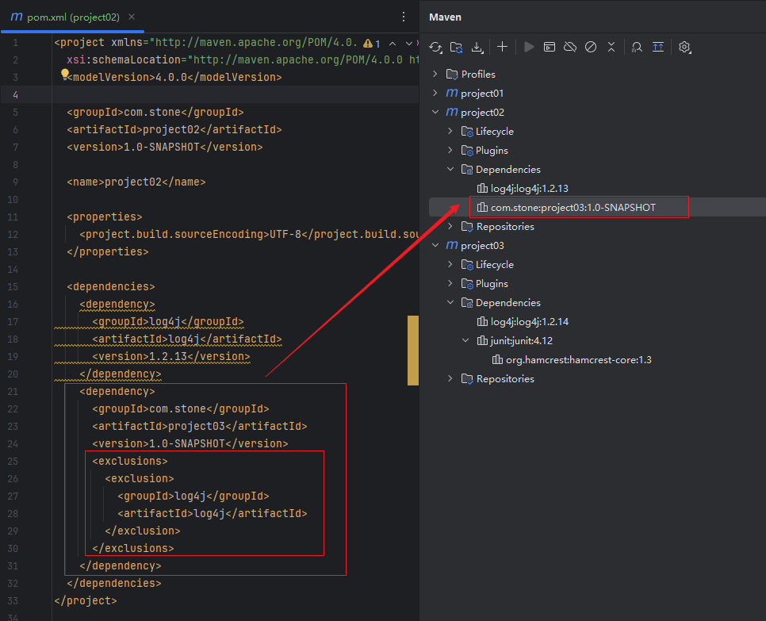


**依赖范围**：依赖的jar默认情况可以在任何地方使用，可以通过`scope`标签设定其作用范围

作用范围

- 主程序范围有效（main文件夹范围内）
- 测试程序范围有效（test文件夹范围内）
- 是否参与打包（package指令范围内）

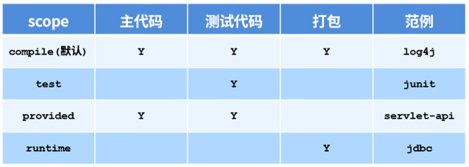

依赖范围的传递性

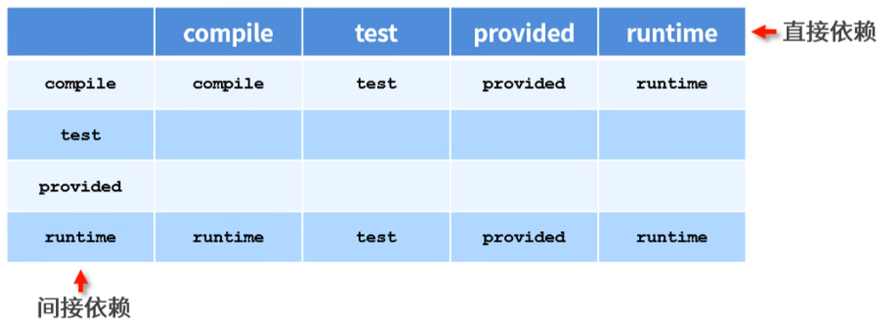


## 生命周期与插件

### 生命周期

Maven的生命周期描述的是一次构建过程经历了多少个事件


Maven对项目构建的生命周期划分为3套方案

- **clean**：清理工作

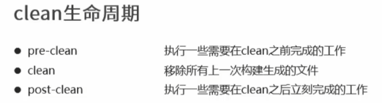

- **default**：核心工作，如编译、测试、打包、部署等

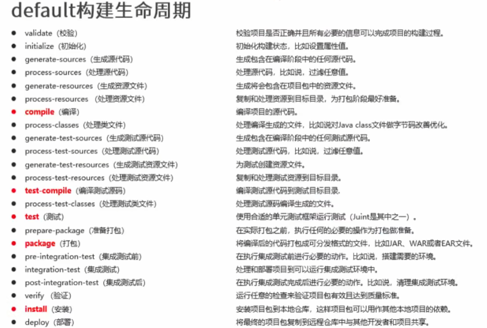

- **site**：产生报告，发布站点等

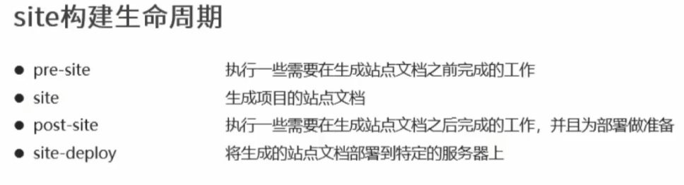

### 插件

插件与生命周期内的阶段绑定，在执行到对应生命周期时执行对应的插件功能

<span style="color:red;">默认Maven在各个生命周期上绑定有预设的功能</span>

通过插件可以自定义其他功能，语法格式如下：

```xml
<build>
    <plugins>
        <plugin>
            <groupId>org.apache.maven.plugins</groupId>
            <artifactId>maven-source-plugin</artifactId>
            <version>2.2.1</version>
            <executions>
                <execution>
                    <goals>
                        <goal>jar</goal>
                    </goals>
                    <phase>generate-test-resources</phase>
                </execution>
            </executions>
        </plugin>
    </plugins>
</build>
```

插件可以在Maven官网的`Maven Plugins`菜单页面查看&复制依赖


## Maven高级

### 分模块开发与设计

<span style="color:blue;">一个项目工程的目录结构可以被划分成多个相互独立的子模块（子工程）</span>

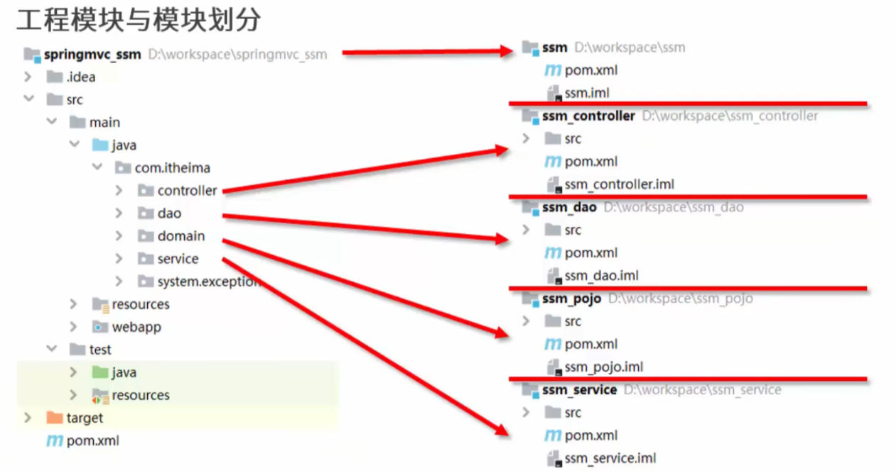

<span style="color:red;">接下来，我们就尝试以模块划分的形式来创建一个SSM整合项目</span>

#### POJO拆分

首先创建一个空项目`ssm_multi_modules`

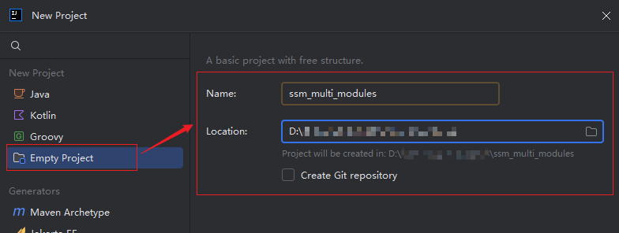

然后创建一个Maven模块`ssm_pojo`

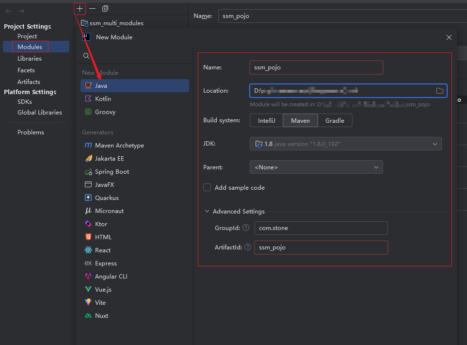

删改后项目结构如下：

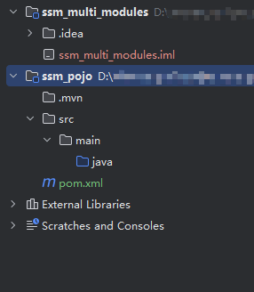

在`pom.xml`中引入如下依赖

```xml
<?xml version="1.0" encoding="UTF-8"?>
<project xmlns="http://maven.apache.org/POM/4.0.0"
         xmlns:xsi="http://www.w3.org/2001/XMLSchema-instance"
         xsi:schemaLocation="http://maven.apache.org/POM/4.0.0 http://maven.apache.org/xsd/maven-4.0.0.xsd">
    <modelVersion>4.0.0</modelVersion>

    <groupId>com.stone</groupId>
    <artifactId>ssm_pojo</artifactId>
    <version>1.0-SNAPSHOT</version>

    <properties>
        <maven.compiler.source>8</maven.compiler.source>
        <maven.compiler.target>8</maven.compiler.target>
        <project.build.sourceEncoding>UTF-8</project.build.sourceEncoding>
    </properties>

    <dependencies>
        <dependency>
            <groupId>com.fasterxml.jackson.core</groupId>
            <artifactId>jackson-annotations</artifactId>
            <version>2.14.1</version>
        </dependency>
    </dependencies>
</project>
```

创建`User`类

```java
package com.stone.domain;

import com.fasterxml.jackson.annotation.JsonFormat;

import java.io.Serializable;
import java.util.Date;

public class User implements Serializable {
    private static final long serialVersionUID = 1L;
    private Integer uuid;
    private String userName;
    private String password;
    private String realName;
    private Integer gender;
    @JsonFormat(pattern = "yyyy-MM-dd", timezone = "GMT+8")
    private Date birthday;

    public Integer getUuid() {
        return uuid;
    }

    public void setUuid(Integer uuid) {
        this.uuid = uuid;
    }

    public String getUserName() {
        return userName;
    }

    public void setUserName(String userName) {
        this.userName = userName;
    }

    public String getPassword() {
        return password;
    }

    public void setPassword(String password) {
        this.password = password;
    }

    public String getRealName() {
        return realName;
    }

    public void setRealName(String realName) {
        this.realName = realName;
    }

    public Integer getGender() {
        return gender;
    }

    public void setGender(Integer gender) {
        this.gender = gender;
    }

    public Date getBirthday() {
        return birthday;
    }

    public void setBirthday(Date birthday) {
        this.birthday = birthday;
    }

    @Override
    public String toString() {
        return "User{" +
                "uuid=" + uuid +
                ", userName='" + userName + '\'' +
                ", password='" + password + '\'' +
                ", realName='" + realName + '\'' +
                ", gender=" + gender +
                ", birthday=" + birthday +
                '}';
    }
}
```

#### DAO拆分

数据库表结构如下：

```sql
CREATE TABLE `t_user` (
  `uuid` int(11) NOT NULL AUTO_INCREMENT,
  `user_name` varchar(255) COLLATE utf8mb4_general_ci DEFAULT NULL,
  `password` varchar(255) COLLATE utf8mb4_general_ci DEFAULT NULL,
  `real_name` varchar(255) COLLATE utf8mb4_general_ci DEFAULT NULL,
  `gender` char(2) COLLATE utf8mb4_general_ci DEFAULT NULL,
  `birthday` date DEFAULT NULL,
  PRIMARY KEY (`uuid`)
) ENGINE=InnoDB DEFAULT CHARSET=utf8mb4 COLLATE=utf8mb4_general_ci;
```

创建一个Maven模块`ssm_dao`，然后在`pom.xml`中引入如下依赖

```xml
<?xml version="1.0" encoding="UTF-8"?>
<project xmlns="http://maven.apache.org/POM/4.0.0"
         xmlns:xsi="http://www.w3.org/2001/XMLSchema-instance"
         xsi:schemaLocation="http://maven.apache.org/POM/4.0.0 http://maven.apache.org/xsd/maven-4.0.0.xsd">
    <modelVersion>4.0.0</modelVersion>

    <groupId>com.stone</groupId>
    <artifactId>ssm_dao</artifactId>
    <version>1.0-SNAPSHOT</version>

    <properties>
        <maven.compiler.source>8</maven.compiler.source>
        <maven.compiler.target>8</maven.compiler.target>
        <project.build.sourceEncoding>UTF-8</project.build.sourceEncoding>
    </properties>

    <dependencies>
        <!--我们拆分的POJO模块(需要先通过install命令将其安装到Maven本地仓库中才能引入)-->
        <dependency>
            <groupId>com.stone</groupId>
            <artifactId>ssm_pojo</artifactId>
            <version>1.0-SNAPSHOT</version>
        </dependency>

        <!--Spring依赖-->
        <dependency>
            <groupId>org.springframework</groupId>
            <artifactId>spring-context</artifactId>
            <version>5.3.27</version>
        </dependency>
        <!--Spring的JDBC依赖-->
        <dependency>
            <groupId>org.springframework</groupId>
            <artifactId>spring-jdbc</artifactId>
            <version>5.3.27</version>
        </dependency>
        <!--MyBatis依赖-->
        <dependency>
            <groupId>org.mybatis</groupId>
            <artifactId>mybatis</artifactId>
            <version>3.5.9</version>
        </dependency>
        <!--MyBatis和Spring的整合包-->
        <dependency>
            <groupId>org.mybatis</groupId>
            <artifactId>mybatis-spring</artifactId>
            <version>2.0.6</version>
        </dependency>
        <!--MySQL驱动-->
        <dependency>
            <groupId>mysql</groupId>
            <artifactId>mysql-connector-java</artifactId>
            <version>8.0.33</version>
        </dependency>
        <!--Druid连接池-->
        <dependency>
            <groupId>com.alibaba</groupId>
            <artifactId>druid</artifactId>
            <version>1.2.23</version>
        </dependency>
        <!--PageHelper分页插件-->
        <dependency>
            <groupId>com.github.pagehelper</groupId>
            <artifactId>pagehelper</artifactId>
            <version>5.3.2</version>
        </dependency>
    </dependencies>

</project>
```

创建配置文件

`jdbc.properties`

```properties
jdbc.driver=com.mysql.jdbc.Driver
jdbc.url=jdbc:mysql://localhost:3306/spring_stone
jdbc.username=root
jdbc.password=1234
```

`applicationContext-dao.xml`

```xml
<?xml version="1.0" encoding="UTF-8"?>
<beans xmlns="http://www.springframework.org/schema/beans"
       xmlns:context="http://www.springframework.org/schema/context"
       xmlns:xsi="http://www.w3.org/2001/XMLSchema-instance"
       xsi:schemaLocation="http://www.springframework.org/schema/beans http://www.springframework.org/schema/beans/spring-beans.xsd
        http://www.springframework.org/schema/context http://www.springframework.org/schema/context/spring-context.xsd">

    <!--开启Bean注解扫描-->
    <context:component-scan base-package="com.stone"/>
    <!--加载properties文件-->
    <context:property-placeholder location="classpath*:jdbc.properties"/>
    <!--配置数据源-->
    <bean id="dataSource" class="com.alibaba.druid.pool.DruidDataSource">
        <property name="driverClassName" value="${jdbc.driver}"/>
        <property name="url" value="${jdbc.url}"/>
        <property name="username" value="${jdbc.username}"/>
        <property name="password" value="${jdbc.password}"/>
    </bean>
    <!--整合Mybatis到Spring中-->
    <bean class="org.mybatis.spring.SqlSessionFactoryBean">
        <property name="dataSource" ref="dataSource"/>
        <property name="typeAliasesPackage" value="com.stone.domain"/>
        <!--添加配置：开启驼峰命名-->
        <property name="configuration">
            <bean class="org.apache.ibatis.session.Configuration">
                <property name="mapUnderscoreToCamelCase" value="true"/>
            </bean>
        </property>
        <!--分页插件-->
        <property name="plugins">
            <array>
                <bean class="com.github.pagehelper.PageInterceptor">
                    <property name="properties">
                        <props>
                            <prop key="helperDialect">mysql</prop>
                            <prop key="reasonable">true</prop>
                        </props>
                    </property>
                </bean>
            </array>
        </property>
    </bean>
    <!--配置Mapper扫描-->
    <bean class="org.mybatis.spring.mapper.MapperScannerConfigurer">
        <property name="basePackage" value="com.stone.dao"/>
    </bean>
</beans>
```

创建Dao接口`UserDao`

```java
package com.stone.dao;

import com.stone.domain.User;
import org.apache.ibatis.annotations.Param;

import java.util.List;

public interface UserDao {

    /**
     * 添加用户
     * @param user
     * @return
     */
    boolean save(User user);

    /**
     * 修改用户
     * @param user
     * @return
     */
    boolean update(User user);

    /**
     * 删除用户
     * @param uuid
     * @return
     */
    boolean delete(Integer uuid);

    /**
     * 查询单个用户
     * @param uuid
     * @return
     */
    User get(Integer uuid);

    /**
     * 查询所有用户
     * @return
     */
    List<User> getAll();

    /**
     * 根据用户名和密码查询用户
     * @param userName 用户名
     * @param pwd 密码
     * @return
     */
    User getByUserNameAndPwd(@Param("userName") String userName, @Param("pwd") String pwd);
}
```

创建Dao的映射XML文件

```xml
<?xml version="1.0" encoding="UTF-8"?>
<!DOCTYPE mapper
        PUBLIC "-//mybatis.org//DTD Mapper 3.0//EN"
        "http://mybatis.org/dtd/mybatis-3-mapper.dtd">
<mapper namespace="com.stone.dao.UserDao">
    <insert id="save" parameterType="user">
        insert into t_user (user_name, password, real_name, gender, birthday)
        values (#{userName}, #{password}, #{realName}, #{gender}, #{birthday})
    </insert>

    <update id="update" parameterType="user">
        update t_user
        set user_name = #{userName},
            password  = #{password},
            real_name = #{realName},
            gender    = #{gender},
            birthday  = #{birthday}
        where uuid = #{uuid}
    </update>

    <delete id="delete" parameterType="int">
        delete
        from t_user
        where uuid = #{uuid}
    </delete>

    <select id="get" parameterType="int" resultType="user">
        select *
        from t_user
        where uuid = #{uuid}
    </select>

    <select id="getAll" resultType="user">
        select *
        from t_user
    </select>

    <select id="getByUserNameAndPwd" resultType="user">
        select *
        from t_user
        where user_name = #{userName}
          and password = #{pwd}
    </select>
</mapper>
```

#### Service拆分

创建一个Maven模块`ssm_service`，引入依赖

```xml
<?xml version="1.0" encoding="UTF-8"?>
<project xmlns="http://maven.apache.org/POM/4.0.0"
         xmlns:xsi="http://www.w3.org/2001/XMLSchema-instance"
         xsi:schemaLocation="http://maven.apache.org/POM/4.0.0 http://maven.apache.org/xsd/maven-4.0.0.xsd">
    <modelVersion>4.0.0</modelVersion>

    <groupId>com.stone</groupId>
    <artifactId>ssm_service</artifactId>
    <version>1.0-SNAPSHOT</version>

    <properties>
        <maven.compiler.source>8</maven.compiler.source>
        <maven.compiler.target>8</maven.compiler.target>
        <project.build.sourceEncoding>UTF-8</project.build.sourceEncoding>
    </properties>

    <dependencies>
        <!--我们拆分的DAO模块(需要先通过install命令将其安装到Maven本地仓库中才能引入)-->
        <dependency>
            <groupId>com.stone</groupId>
            <artifactId>ssm_dao</artifactId>
            <version>1.0-SNAPSHOT</version>
        </dependency>

        <!--Spring依赖-->
        <dependency>
            <groupId>org.springframework</groupId>
            <artifactId>spring-context</artifactId>
            <version>5.3.27</version>
        </dependency>
        <!--junit依赖-->
        <dependency>
            <groupId>junit</groupId>
            <artifactId>junit</artifactId>
            <version>4.12</version>
        </dependency>
        <!--spring-test依赖-->
        <dependency>
            <groupId>org.springframework</groupId>
            <artifactId>spring-test</artifactId>
            <version>5.3.26</version>
        </dependency>
    </dependencies>
</project>
```

创建配置文件`applicationContext-service.xml`

```xml
<?xml version="1.0" encoding="UTF-8" ?>
<beans xmlns="http://www.springframework.org/schema/beans"
       xmlns:tx="http://www.springframework.org/schema/tx"
       xmlns:context="http://www.springframework.org/schema/context"
       xmlns:xsi="http://www.w3.org/2001/XMLSchema-instance"
       xsi:schemaLocation="http://www.springframework.org/schema/beans
               http://www.springframework.org/schema/beans/spring-beans.xsd
               http://www.springframework.org/schema/tx
               http://www.springframework.org/schema/tx/spring-tx.xsd
               http://www.springframework.org/schema/context
               http://www.springframework.org/schema/context/spring-context.xsd">

    <!--开启Bean注解扫描-->
    <context:component-scan base-package="com.stone"/>
    <!--事务管理器-->
    <bean id="txManager" class="org.springframework.jdbc.datasource.DataSourceTransactionManager">
        <property name="dataSource" ref="dataSource"/>
    </bean>
    <!--开启注解式事务-->
    <tx:annotation-driven transaction-manager="txManager"/>
</beans>
```

创建Service接口和实现类

`UserService`

```java
package com.stone.service;

import com.github.pagehelper.PageInfo;
import com.stone.domain.User;
import org.springframework.transaction.annotation.Transactional;

@Transactional(readOnly = true)
public interface UserService {

    /**
     * 添加用户
     * @param user
     * @return
     */
    @Transactional(readOnly = false)
    boolean save(User user);

    /**
     * 更新用户
     * @param user
     * @return
     */
    @Transactional(readOnly = false)
    boolean update(User user);

    /**
     * 删除用户
     * @param uuid
     * @return
     */
    @Transactional(readOnly = false)
    boolean delete(Integer uuid);

    /**
     * 查询单个用户
     * @param uuid
     * @return
     */
    User get(Integer uuid);

    /**
     * 查询所有用户
     * @param page
     * @param size
     * @return
     */
    PageInfo<User> getAll(int page, int size);

    /**
     * 用户登录
     * @param username
     * @param password
     * @return
     */
    User login(String username, String password);
}
```

`UserServiceImpl`

```java
package com.stone.service.impl;

import com.github.pagehelper.PageHelper;
import com.github.pagehelper.PageInfo;
import com.stone.dao.UserDao;
import com.stone.domain.User;
import com.stone.service.UserService;
import org.springframework.stereotype.Service;

import javax.annotation.Resource;
import java.util.List;

@Service
public class UserServiceImpl implements UserService {

    @Resource
    private UserDao userDao;

    @Override
    public boolean save(User user) {
        return userDao.save(user);
    }

    @Override
    public boolean update(User user) {
        return userDao.update(user);
    }

    @Override
    public boolean delete(Integer uuid) {
        return userDao.delete(uuid);
    }

    @Override
    public User get(Integer uuid) {
        return userDao.get(uuid);
    }

    @Override
    public PageInfo<User> getAll(int page, int size) {
        PageHelper.startPage(page, size);
        List<User> all = userDao.getAll();
        return new PageInfo<>(all);
    }

    @Override
    public User login(String username, String password) {
        return userDao.getByUserNameAndPwd(username, password);
    }
}
```

创建单元测试类和配置文件

`applicationContext-service.xml`内容同上

`UserServiceTest`

```java
package com.stone.service;

import com.stone.domain.User;
import org.junit.Test;
import org.junit.runner.RunWith;
import org.springframework.test.context.ContextConfiguration;
import org.springframework.test.context.junit4.SpringJUnit4ClassRunner;

import javax.annotation.Resource;
import java.util.Date;

@RunWith(SpringJUnit4ClassRunner.class)
@ContextConfiguration(locations = {"classpath*:applicationContext-service.xml", "classpath*:applicationContext-dao.xml"})
public class UserServiceTest {

    @Resource
    private UserService userService;

    @Test
    public void testSave() {
        User user = new User();
        user.setUserName("Stone");
        user.setPassword("1234");
        user.setRealName("张三");
        user.setGender(1);
        user.setBirthday(new Date());
        userService.save(user);
    }
}
```

#### Controller拆分

创建一个Maven模块`ssm_controller`

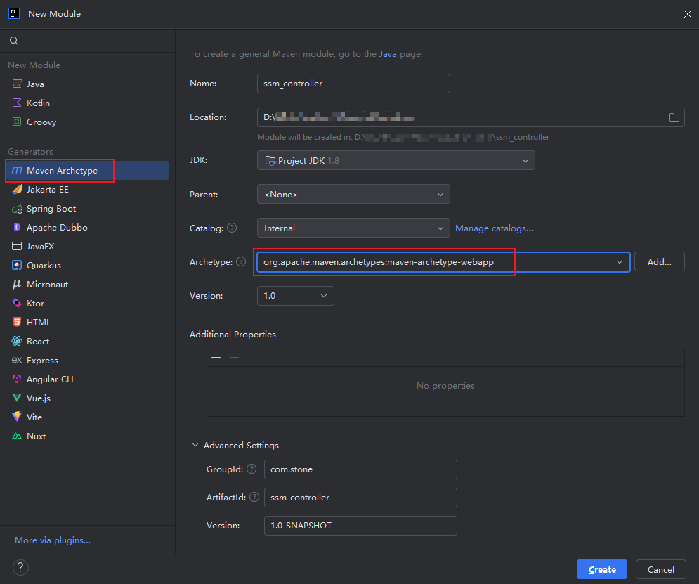

引入依赖

```xml
<project xmlns="http://maven.apache.org/POM/4.0.0" xmlns:xsi="http://www.w3.org/2001/XMLSchema-instance"
  xsi:schemaLocation="http://maven.apache.org/POM/4.0.0 http://maven.apache.org/maven-v4_0_0.xsd">
  <modelVersion>4.0.0</modelVersion>

  <groupId>com.stone</groupId>
  <artifactId>ssm_controller</artifactId>
  <version>1.0-SNAPSHOT</version>

  <packaging>war</packaging>

  <properties>
    <maven.compiler.source>8</maven.compiler.source>
    <maven.compiler.target>8</maven.compiler.target>
    <project.build.sourceEncoding>UTF-8</project.build.sourceEncoding>
  </properties>

  <dependencies>
    <!--我们拆分的Service模块(需要先通过install命令将其安装到Maven本地仓库中才能引入)-->
    <dependency>
      <groupId>com.stone</groupId>
      <artifactId>ssm_service</artifactId>
      <version>1.0-SNAPSHOT</version>
    </dependency>

    <!--SpringMVC的依赖-->
    <dependency>
      <groupId>org.springframework</groupId>
      <artifactId>spring-webmvc</artifactId>
      <version>5.3.27</version>
    </dependency>
    <!--ServletApi依赖(设置为provided是因为Tomcat中存在相同的包)-->
    <dependency>
      <groupId>javax.servlet</groupId>
      <artifactId>javax.servlet-api</artifactId>
      <version>3.1.0</version>
      <scope>provided</scope>
    </dependency>
    <!--Jackson依赖(用于处理Json数据)-->
    <dependency>
      <groupId>com.fasterxml.jackson.core</groupId>
      <artifactId>jackson-databind</artifactId>
      <version>2.14.1</version>
    </dependency>
  </dependencies>

  <build>
    <plugins>
      <plugin>
        <groupId>org.apache.tomcat.maven</groupId>
        <artifactId>tomcat7-maven-plugin</artifactId>
        <version>2.2</version>
        <configuration>
          <port>8888</port>
          <path>/</path>
        </configuration>
      </plugin>
    </plugins>
  </build>
</project>
```

配置`webapp/WEB-INF/web.xml`

```xml
<!DOCTYPE web-app PUBLIC
        "-//Sun Microsystems, Inc.//DTD Web Application 2.3//EN"
        "http://java.sun.com/dtd/web-app_2_3.dtd" >

<web-app>
    <context-param>
        <param-name>contextConfigLocation</param-name>
        <param-value>classpath*:applicationContext-*.xml</param-value>
    </context-param>

    <filter>
        <filter-name>CharacterEncodingFilter</filter-name>
        <filter-class>org.springframework.web.filter.CharacterEncodingFilter</filter-class>
        <init-param>
            <param-name>encoding</param-name>
            <param-value>UTF-8</param-value>
        </init-param>
    </filter>

    <filter-mapping>
        <filter-name>CharacterEncodingFilter</filter-name>
        <url-pattern>/*</url-pattern>
    </filter-mapping>

    <!--启动服务器时，通过监听器加载Spring运行环境-->
    <listener>
        <listener-class>org.springframework.web.context.ContextLoaderListener</listener-class>
    </listener>

    <servlet>
        <servlet-name>DispatcherServlet</servlet-name>
        <servlet-class>org.springframework.web.servlet.DispatcherServlet</servlet-class>
        <init-param>
            <param-name>contextConfigLocation</param-name>
            <param-value>classpath*:spring-mvc.xml</param-value>
        </init-param>
    </servlet>
    <servlet-mapping>
        <servlet-name>DispatcherServlet</servlet-name>
        <url-pattern>/</url-pattern>
    </servlet-mapping>
</web-app>
```

创建配置`spring-mvc.xml`

```xml
<?xml version="1.0" encoding="UTF-8"?>
<beans xmlns="http://www.springframework.org/schema/beans"
       xmlns:context="http://www.springframework.org/schema/context"
       xmlns:mvc="http://www.springframework.org/schema/mvc"
       xmlns:xsi="http://www.w3.org/2001/XMLSchema-instance"
       xsi:schemaLocation="http://www.springframework.org/schema/beans http://www.springframework.org/schema/beans/spring-beans.xsd
        http://www.springframework.org/schema/mvc http://www.springframework.org/schema/mvc/spring-mvc.xsd
        http://www.springframework.org/schema/context http://www.springframework.org/schema/context/spring-context.xsd">

    <mvc:annotation-driven/>

    <context:component-scan base-package="com.stone.controller"/>
</beans>
```

创建异常类

`SystemException`

```java
package com.stone.system.exception;

public class SystemException extends RuntimeException {
    public SystemException() {
    }

    public SystemException(String message) {
        super(message);
    }

    public SystemException(String message, Throwable cause) {
        super(message, cause);
    }

    public SystemException(Throwable cause) {
        super(cause);
    }

    public SystemException(String message, Throwable cause, boolean enableSuppression, boolean writableStackTrace) {
        super(message, cause, enableSuppression, writableStackTrace);
    }
}
```

`BusinessException`

```java
package com.stone.system.exception;

public class BusinessException extends RuntimeException {
    // 自定义异常中封装对应的错误编码，用于异常处理时获取对应的操作编码
    private Integer code;

    public Integer getCode() {
        return code;
    }

    public void setCode(Integer code) {
        this.code = code;
    }

    public BusinessException(Integer code) {
        this.code = code;
    }

    public BusinessException(String message, Integer code) {
        super(message);
        this.code = code;
    }

    public BusinessException(String message, Throwable cause, Integer code) {
        super(message, cause);
        this.code = code;
    }

    public BusinessException(Throwable cause, Integer code) {
        super(cause);
        this.code = code;
    }

    public BusinessException(String message, Throwable cause, boolean enableSuppression, boolean writableStackTrace, Integer code) {
        super(message, cause, enableSuppression, writableStackTrace);
        this.code = code;
    }
}
```

创建结果类

`Code`

```java
package com.stone.controller.results;

public class Code {
    // 操作结果编码
    public static final Integer SAVE_OK = 20011;
    public static final Integer UPDATE_OK = 20021;
    public static final Integer DELETE_OK = 20031;
    public static final Integer GET_OK = 20041;

    public static final Integer SAVE_ERROR = 20010;
    public static final Integer UPDATE_ERROR = 20020;
    public static final Integer DELETE_ERROR = 20030;
    public static final Integer GET_ERROR = 20040;
}
```

`Result`

```java
package com.stone.controller.results;

public class Result {
    // 操作结果编码
    private Integer code;
    // 操作数据结果
    private Object data;
    // 消息
    private String message;

    public Result(Integer code) {
        this.code = code;
    }

    public Result(Integer code, Object data) {
        this.code = code;
        this.data = data;
    }

    @Override
    public String toString() {
        return "Result{" + "code=" + code + ", data=" + data + ", message='" + message + '\'' + '}';
    }

    public Integer getCode() {
        return code;
    }

    public void setCode(Integer code) {
        this.code = code;
    }

    public Object getData() {
        return data;
    }

    public void setData(Object data) {
        this.data = data;
    }

    public String getMessage() {
        return message;
    }

    public void setMessage(String message) {
        this.message = message;
    }
}
```

配置全局异常处理`ProjectExceptionAdvice`

```java
package com.stone.controller.Interceptor;

import com.stone.controller.results.Result;
import com.stone.system.exception.BusinessException;
import org.springframework.stereotype.Component;
import org.springframework.web.bind.annotation.ControllerAdvice;
import org.springframework.web.bind.annotation.ExceptionHandler;
import org.springframework.web.bind.annotation.ResponseBody;

@Component
@ControllerAdvice
public class ProjectExceptionAdvice {

    @ExceptionHandler(BusinessException.class)
    @ResponseBody
    public Result doBusinessException(BusinessException ex) {
        return new Result(ex.getCode(), ex.getMessage());
    }
}
```

创建`UserController`

```java
package com.stone.controller;

import com.github.pagehelper.PageInfo;
import com.stone.controller.results.Code;
import com.stone.controller.results.Result;
import com.stone.domain.User;
import com.stone.service.UserService;
import com.stone.system.exception.BusinessException;
import org.springframework.web.bind.annotation.*;

import javax.annotation.Resource;

@RequestMapping("/users")
@RestController
public class UserController {

    @Resource
    private UserService userService;

    @PostMapping
    public Result save(@RequestBody User user){
        boolean flag = userService.save(user);
        return new Result(flag ? Code.SAVE_OK:Code.SAVE_ERROR);
    }

    @PutMapping
    public Result update(@RequestBody User user){
        boolean flag = userService.update(user);
        return new Result(flag ? Code.UPDATE_OK:Code.UPDATE_ERROR);
    }

    @DeleteMapping("/{uuid}")
    public Result delete(@PathVariable Integer uuid){
        boolean flag = userService.delete(uuid);
        return new Result(flag ? Code.DELETE_OK:Code.DELETE_ERROR);
    }

    @GetMapping("/{uuid}")
    public Result get(@PathVariable Integer uuid){
        User user = userService.get(uuid);
        //模拟出现异常，使用条件控制，便于测试结果
        if (uuid == 10 ) throw new BusinessException("查询出错啦，请重试！",Code.GET_ERROR);
        return new Result(null != user ?Code.GET_OK: Code.GET_ERROR,user);
    }

    @GetMapping("/{page}/{size}")
    public Result getAll(@PathVariable Integer page, @PathVariable Integer size){
        PageInfo<User> all = userService.getAll(page, size);
        return new Result(null != all ?Code.GET_OK: Code.GET_ERROR,all);
    }

    @PostMapping("/login")
    public Result login(String userName,String password){
        User user = userService.login(userName,password);
        return new Result(null != user ?Code.GET_OK: Code.GET_ERROR,user);
    }
}
```

#### 启动项目

综上，我们的模块就拆分完毕，下面我们依次将各个模块通过**install**命令安装到Maven仓库中，

然后启动`ssm_controller`项目，查看项目是否能够成功运行（<span style="color:red;">看到如下结果即表示项目运行成功</span>）

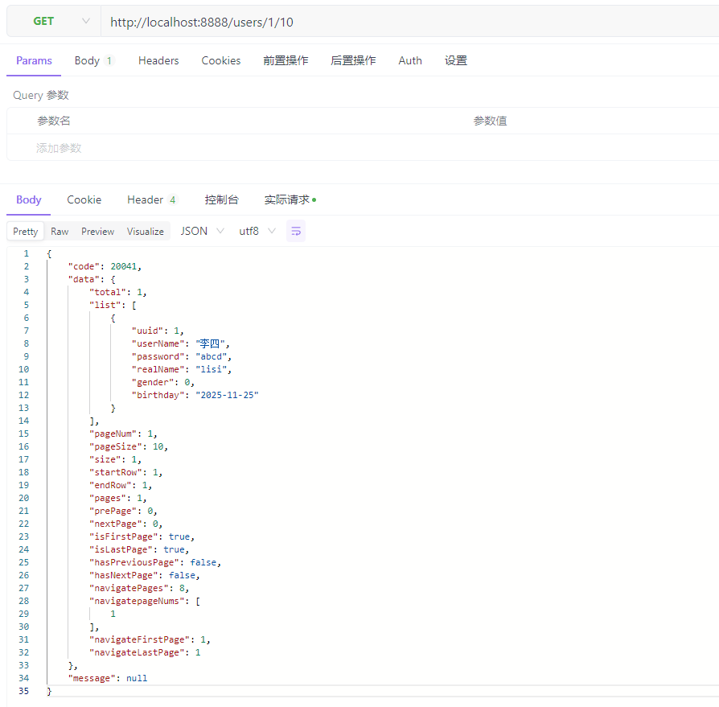


### 继承与聚合

#### 聚合

<span style="color:red;">多模块构建维护问题</span>：在上面我们拆分的模块中，各个模块依次依赖，并且这些模块都会通过`install`命令安装到Maven的本地仓库中。一旦其中某个模块有所改动重新`install`，其他模块很有可能没被通知到，甚至不能正常使用被改动的模块。

<span style="color:red;">因此，我们需要一个模块来统一管理所有的模块，统一执行mvn命令（统一`compile`、`install`等）。这种工作机制称为**聚合**！这个工程模块称为**聚合模块**！</span>


之前我们创建的空项目工程`ssm_multi_modules`可以用来做构建管理，创建一个新的`pom.xml`文件

```xml
<?xml version="1.0" encoding="UTF-8"?>
<project xmlns="http://maven.apache.org/POM/4.0.0"
         xmlns:xsi="http://www.w3.org/2001/XMLSchema-instance"
         xsi:schemaLocation="http://maven.apache.org/POM/4.0.0 http://maven.apache.org/xsd/maven-4.0.0.xsd">
    <modelVersion>4.0.0</modelVersion>

    <groupId>com.stone</groupId>
    <artifactId>ssm_multi_modules</artifactId>
    <version>1.0-SNAPSHOT</version>

    <!--定义该工程用于进行构建管理-->
    <packaging>pom</packaging>

    <properties>
        <maven.compiler.source>8</maven.compiler.source>
        <maven.compiler.target>8</maven.compiler.target>
        <project.build.sourceEncoding>UTF-8</project.build.sourceEncoding>
    </properties>

    <!--管理的模块列表-->
    <modules>
        <module>../ssm_pojo</module>
        <module>../ssm_dao</module>
        <module>../ssm_service</module>
        <module>../ssm_controller</module>
    </modules>

</project>
```

重新加载项目后，可以看到如下结构


通过`ssm_multi_modules`的Maven生命周期命令，就可以统一控制几个模块一起执行命令了，

<span style="color:red;">且每个模块执行命令的顺序是按照依赖顺序来的，与`pom.xml`中配置顺序无关。</span>

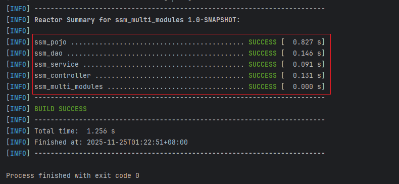

#### 继承

`ssm_multi_modules`模块除了可以做上面的**模块聚合**管理，还可以用来将所有模块的依赖进行统一管理，从而各个模块只需要作为子工程对依赖进行**继承**就可以直接使用，避免了版本冲突的问题。

在`pom.xml`文件中添加<span style="color:red;">dependencyManagement</span>标签来进行依赖管理（<span style="color:red;">我们自己的子模块依赖也可以放在这里管理</span>）

```xml
<?xml version="1.0" encoding="UTF-8"?>
<project xmlns="http://maven.apache.org/POM/4.0.0"
         xmlns:xsi="http://www.w3.org/2001/XMLSchema-instance"
         xsi:schemaLocation="http://maven.apache.org/POM/4.0.0 http://maven.apache.org/xsd/maven-4.0.0.xsd">
    <modelVersion>4.0.0</modelVersion>

    <groupId>com.stone</groupId>
    <artifactId>ssm_multi_modules</artifactId>
    <version>1.0-SNAPSHOT</version>

    <!--定义该工程用于进行构建管理-->
    <packaging>pom</packaging>

    <properties>
        <maven.compiler.source>8</maven.compiler.source>
        <maven.compiler.target>8</maven.compiler.target>
        <project.build.sourceEncoding>UTF-8</project.build.sourceEncoding>
    </properties>

    <!--管理的模块列表-->
    <modules>
        <module>../ssm_pojo</module>
        <module>../ssm_dao</module>
        <module>../ssm_service</module>
        <module>../ssm_controller</module>
    </modules>

    <!--依赖管理-->
    <dependencyManagement>
        <dependencies>
            <!--Spring-->
            <dependency>
                <groupId>org.springframework</groupId>
                <artifactId>spring-context</artifactId>
                <version>5.3.27</version>
            </dependency>
            <!--Mybatis-->
            <dependency>
                <groupId>org.mybatis</groupId>
                <artifactId>mybatis</artifactId>
                    <version>3.5.13</version>
            </dependency>
            <!--Mybatis-Spring-->
            <dependency>
                <groupId>org.mybatis</groupId>
                <artifactId>mybatis-spring</artifactId>
                <version>2.0.6</version>
            </dependency>
            <!--数据库连接驱动-->
            <dependency>
                <groupId>mysql</groupId>
                <artifactId>mysql-connector-java</artifactId>
                <version>8.0.33</version>
            </dependency>
            <!--数据库连接池-->
            <dependency>
                <groupId>com.alibaba</groupId>
                <artifactId>druid</artifactId>
                <version>1.2.23</version>
            </dependency>
            <!--Spring JDBC-->
            <dependency>
                <groupId>org.springframework</groupId>
                <artifactId>spring-jdbc</artifactId>
                <version>5.3.27</version>
            </dependency>
            <!--分页插件-->
            <dependency>
                <groupId>com.github.pagehelper</groupId>
                <artifactId>pagehelper</artifactId>
                <version>5.3.2</version>
            </dependency>
            <!--SpringMVC-->
            <dependency>
                <groupId>org.springframework</groupId>
                <artifactId>spring-webmvc</artifactId>
                <version>5.3.27</version>
            </dependency>
            <!--ServletApi依赖(设置为provided是因为Tomcat中存在相同的包)-->
            <dependency>
                <groupId>javax.servlet</groupId>
                <artifactId>javax.servlet-api</artifactId>
                <version>3.1.0</version>
                <scope>provided</scope>
            </dependency>
            <!--Jackson依赖(用于处理Json数据)-->
            <dependency>
                <groupId>com.fasterxml.jackson.core</groupId>
                <artifactId>jackson-databind</artifactId>
                <version>2.14.1</version>
            </dependency>
            <dependency>
                <groupId>com.fasterxml.jackson.core</groupId>
                <artifactId>jackson-annotations</artifactId>
                <version>2.14.1</version>
            </dependency>
            <!--Spring-JUnit-->
            <dependency>
                <groupId>junit</groupId>
                <artifactId>junit</artifactId>
                <version>4.12</version>
            </dependency>
            <!--Spring-Test-->
            <dependency>
                <groupId>org.springframework</groupId>
                <artifactId>spring-test</artifactId>
                <version>5.3.26</version>
            </dependency>
        </dependencies>
    </dependencyManagement>
</project>
```

然后在各个子模块的`pom.xml`指定父工程坐标，<span style="color:red;">并移除依赖坐标中的版本号，即可继承父工程中管理的依赖版本</span>

```xml
<?xml version="1.0" encoding="UTF-8"?>
<project xmlns="http://maven.apache.org/POM/4.0.0"
         xmlns:xsi="http://www.w3.org/2001/XMLSchema-instance"
         xsi:schemaLocation="http://maven.apache.org/POM/4.0.0 http://maven.apache.org/xsd/maven-4.0.0.xsd">
    <!--指定当前工程的父工程-->
    <parent>
        <groupId>com.stone</groupId>
        <artifactId>ssm_multi_modules</artifactId>
        <version>1.0-SNAPSHOT</version>
        <!--指定父工程的pom文件相对路径-->
        <relativePath>../ssm_multi_modules/pom.xml</relativePath>
    </parent>

    <modelVersion>4.0.0</modelVersion>

    <!--子工程的groupId和version应尽量与父工程一致，故可以省略-->
    <!--<groupId>com.stone</groupId>-->
    <!--注意！！！此处需要改为指定模块的名称-->
    <artifactId>ssm_pojo</artifactId>
    <!--<version>1.0-SNAPSHOT</version>-->

    <!--指定当前工程打包方式（默认为jar）-->
    <!--<packaging>jar</packaging>-->

    <properties>
        <maven.compiler.source>8</maven.compiler.source>
        <maven.compiler.target>8</maven.compiler.target>
        <project.build.sourceEncoding>UTF-8</project.build.sourceEncoding>
    </properties>

    <dependencies>
        <!--略...-->
    </dependencies>
</project>
```

同理，Maven插件也可以在父工程中进行统一管理和配置

```xml
<build>
    <!--插件管理-->
    <pluginManagement>
        <plugins>
            <plugin>
                <groupId>org.apache.tomcat.maven</groupId>
                <artifactId>tomcat7-maven-plugin</artifactId>
                <version>2.2</version>
                <configuration>
                    <port>8888</port>
                    <path>/</path>
                </configuration>
            </plugin>
        </plugins>
    </pluginManagement>
</build>
```

<span style="color:red;">Maven中可以继承的资源如下</span>

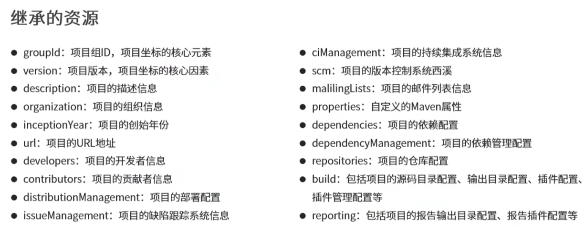


### 属性

在`pom.xml`中，我们可以将依赖的版本号等内容抽成一个属性，用于统一管理和使用，从而可以避免不同依赖键版本冲突的问题

```xml
<properties>
    <spring.version>5.3.27</spring.version>
</properties>

<!--Spring-->
<dependency>
    <groupId>org.springframework</groupId>
    <artifactId>spring-context</artifactId>
    <version>${spring.version}</version>
</dependency>
```

#### 属性类别

- 自定义属性：等同于定义变量，方便统一维护

```xml
<!--定义格式-->
<properties>
    <spring.version>5.3.27</spring.version>
    <junit.version>4.12</junit.version>
</properties>

<!--调用格式-->
<dependency>
    <groupId>org.springframework</groupId>
    <artifactId>spring-context</artifactId>
    <version>${spring.version}</version>
</dependency>
```

- 内置属性：使用Maven内置属性，快速配置

```xml
${basedir}
${version}
```

- Setting属性：使用Maven配置文件`settings.xml`中的标签属性，用于动态配置

```xml
${settings.localRepository}
```

- Java系统属性：读取Java系统属性

```xml
<!--调用格式-->
${user.home}
<!--系统属性查询方式-->
mvn help:system
```

- 环境变量属性：读取环境变量属性

```xml
<!--调用格式-->
${env.JAVA_HOME}
<!--系统属性查询方式-->
mvn help:system
```


### 版本管理

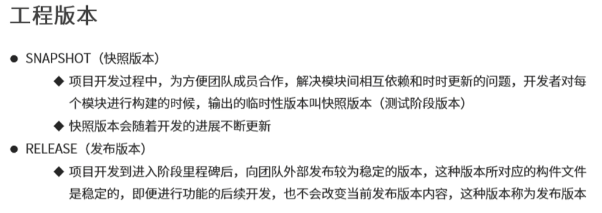

---

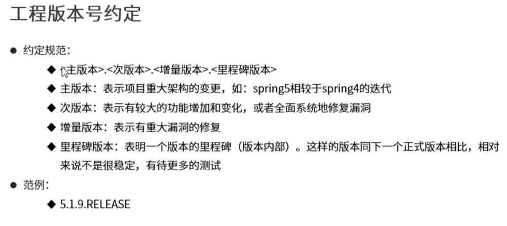


### 多环境配置

`pom.xml`

```xml
<!--创建多环境-->
<profiles>
    <!--生产环境-->
    <profile>
        <id>production</id>
        <properties>
            <jdbc.url>jdbc:mysql://localhost:3306/ssm_produce?useSSL=false&amp;serverTimezone=UTC</jdbc.url>
        </properties>
    </profile>
    <!--开发环境-->
    <profile>
        <id>development</id>
        <properties>
            <jdbc.url>jdbc:mysql://localhost:3306/ssm_dev?useSSL=false&amp;serverTimezone=UTC</jdbc.url>
        </properties>
        <!--设置为默认启动环境-->
        <activation>
            <activeByDefault>true</activeByDefault>
        </activation>
    </profile>
</profiles>
```

<span style="color:red;">加载指定环境配置：mvn 指令 -P 环境id</span>

```shell
$ mvn install -P development
```


**资源管理**：通过在pom.xml中定义属性值，并在资源文件中加载它

```xml
<build>
    ...
    <!--资源管理-->
    <resources>
        <!--配置资源文件-->
        <resource>
            <directory>${project.basedir}/src/main/resources</directory>
            <filtering>true</filtering>
        </resource>
    </resources>
    <testResources>
        <!--配置测试资源文件-->
        <testResource>
            <directory>${project.basedir}/src/test/resources</directory>
            <filtering>true</filtering>
        </testResource>
    </testResources>
</build>
```

`jdbc.properties`

```properties
jdbc.driver=com.mysql.cj.jdbc.Driver
#jdbc.url=jdbc:mysql://localhost:3306/spring_stone
jdbc.url=${jdbc.url}
jdbc.username=root
jdbc.password=1234
```


### 私服

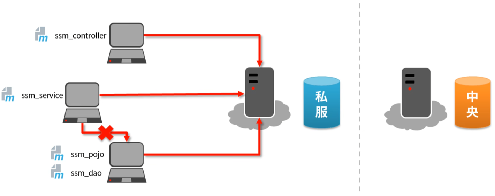

当一个项目工程的不同模块由不同的人负责开发，并且这些模块间存在依赖关系时，Maven的本地仓库就无法满足协作开发的需求了，但是我们又不能将自己的私人依赖直接上传到公网的中央仓库，<span style="color:red;">此时我们就需要搭建一台私服服务器，来实现局域网内的资源共享。</span>

Maven私服搭建产品：Nexus，下载地址 https://help.sonatype.com/repomanager3/download

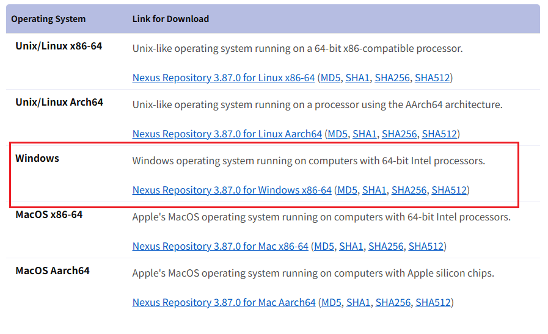

下载后解压目录如下

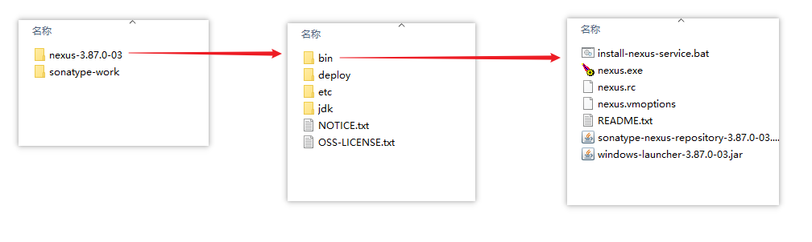

使用cmd命令窗口进入Nexus的bin目录下，依次运行如下命令：

```shell
# 安装Nexus Repository
$ install-nexus-service.bat
# Start the service
$ nexus.exe //ES//SonatypeNexusRepository
```

另有其他命令：

```shell
# Stop the service
$ nexus.exe //SS//SonatypeNexusRepository
# Uninstall the service
$ nexus.exe //DS//SonatypeNexusRepository
```

<b style="color:red;">报错!</b> 如遇服务启动失败，如下报错

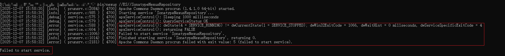

可以在`sonatype-work\nexus3\log`目录下查看启动日志`commons-daemon.yyyy-MM-dd.log`

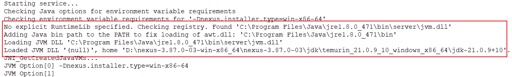


可以看到，Nexus服务本应该用解压目录中自带的jdk21启动，却意外检测到了环境变量中配置的jdk8，因此我们需要执行下面的命令来更正jdk环境

```shell
# 更新服务配置
$ nexus.exe //US/SonatypeNexusRepository 
  --Jvm ${Nexus unpacked directory}\nexus-3.87.0-03\jdk\temurin_21.0.9_10_windows_x86_64\jdk-21.0.9+10\bin\server\jvm.dll
# 重新启动服务
$ nexus.exe //ES//SonatypeNexusRepository
```

[参考文章：关于用 Nexus 创建私服，服务启动失败的坑](https://blog.csdn.net/qq_55545355/article/details/149454966)

然后访问 http://localhost:8081

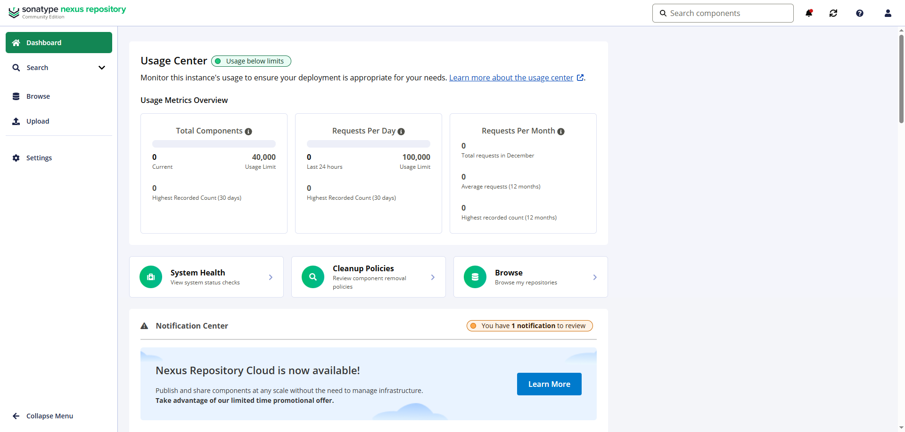

#### 仓库分类

- 宿主仓库hosted：保存无法从中央仓库获取的资源
    - 自主研发
    - 第三方非开源项目
- 代理仓库proxy
    - 代理远程仓库，通过Nexus访问其他公共仓库，例如中央仓库
- 仓库组group
    - 将若干个仓库组成一个群组，简化配置
    - 仓库组不能保存资源，属于设计型仓库

#### 手动上传组件

**创建宿主仓库**

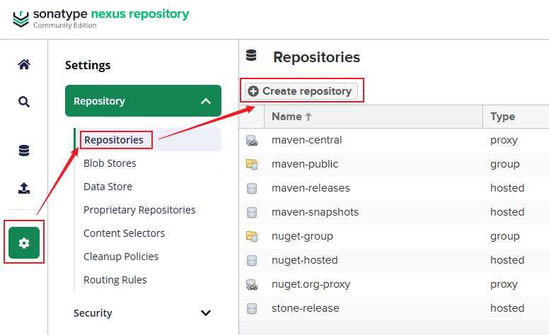

---

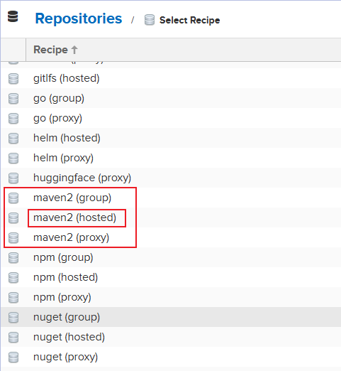

---

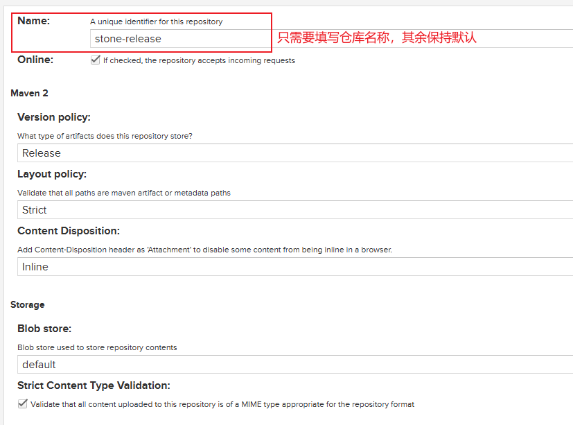

**配置仓库分组**

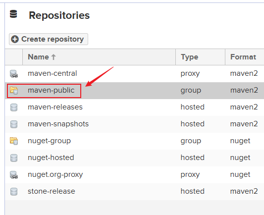

---

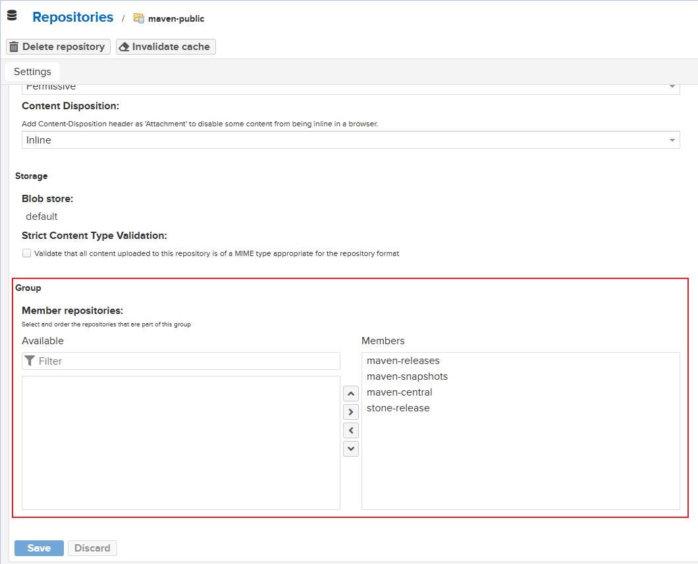

**手动上传组件**

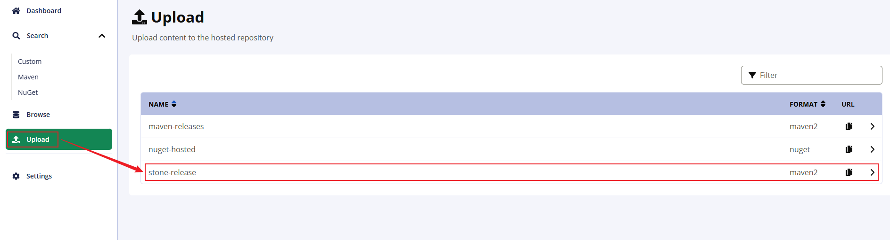

---

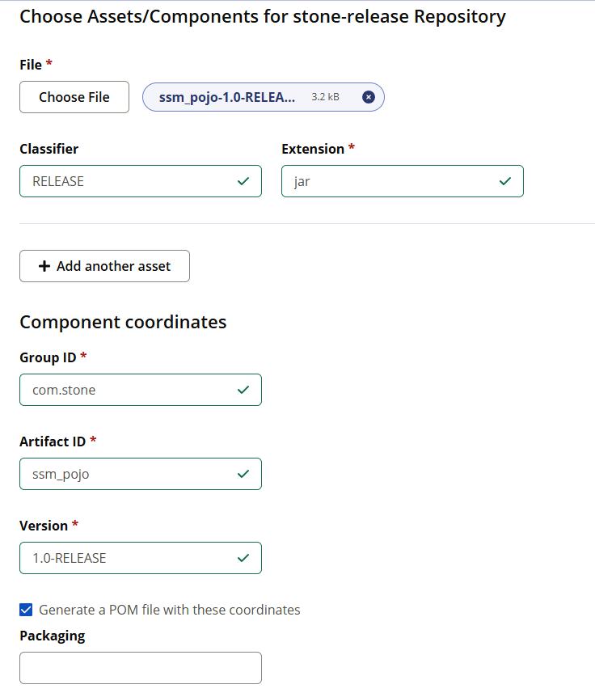

---

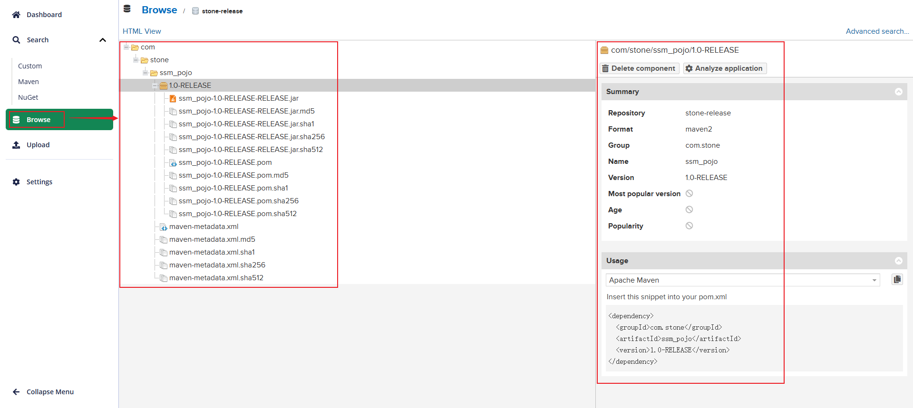

#### IDEA环境中资源上传与下载

https://www.bilibili.com/video/BV1Ah411S7ZE?spm_id_from=333.788.player.switch&vd_source=71b23ebd2cd9db8c137e17cdd381c618&p=28
