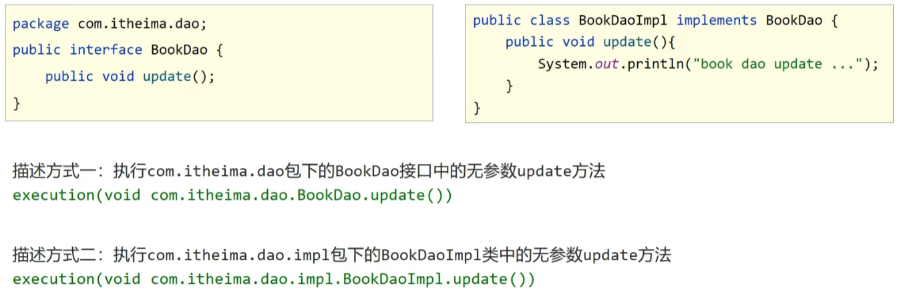
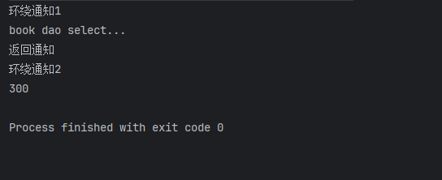
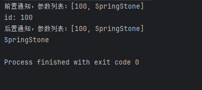
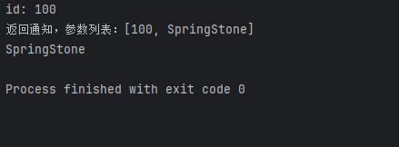
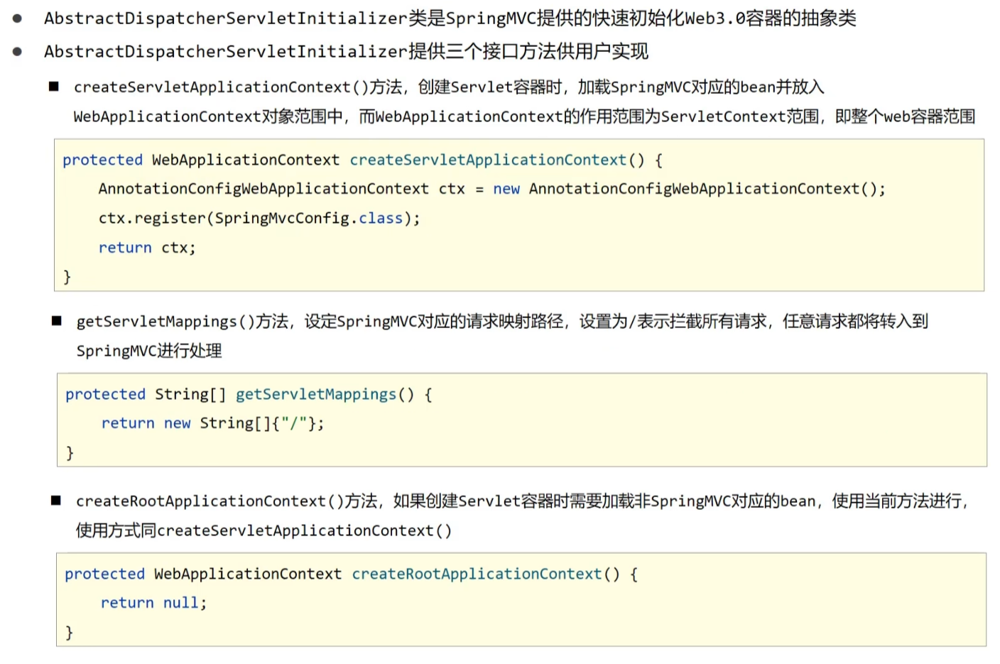
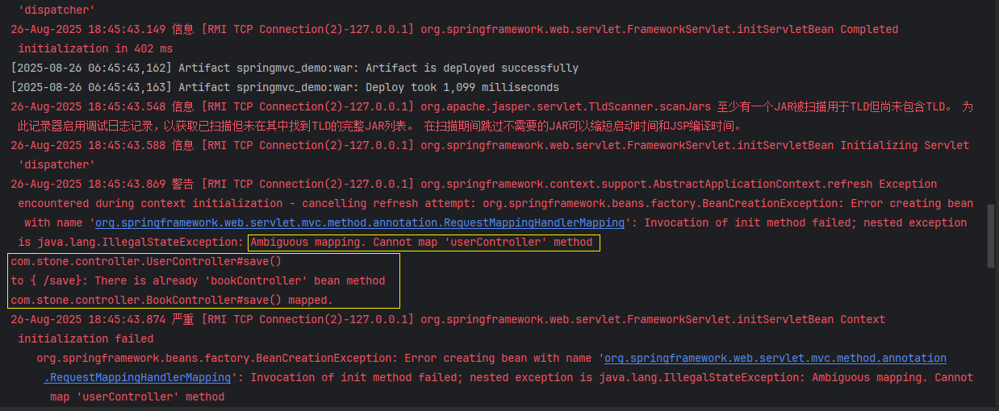
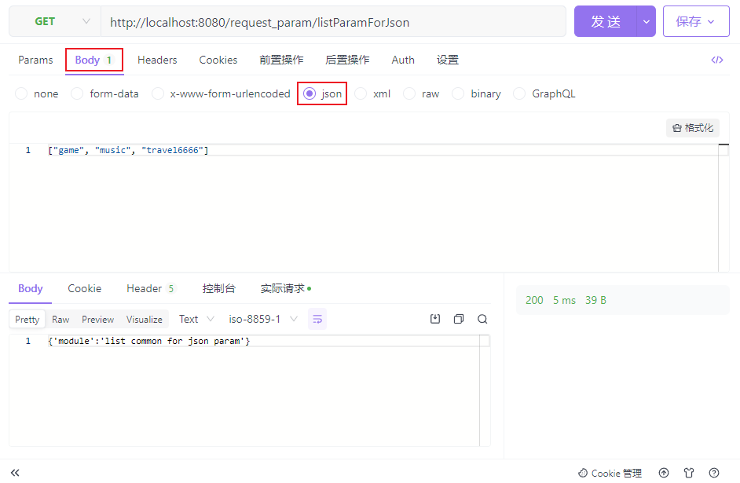
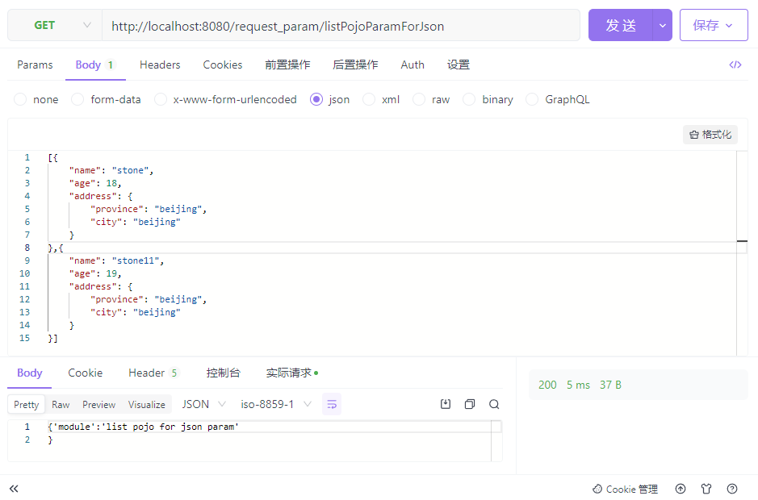

# mySSM笔记


## Spring

官网：https://spring.io/

**Spring Framework系统架构**


**Spring Framework学习线路**


### 核心概念

代码书写现状：<span style="color:blue;">由于在类中写了其他类的实现，导致代码耦合度偏高，每次改动代码都需要重新编译、测试、部署和发布</span>


解决方案：（<span style="color:red;">解耦合</span>）使用对象时，在程序中不要主动使用new产生对象，转为由<span style="color:red;">外部</span>提供对象

---

<b style="color:red;">IoC（Inversion of Control）控制反转</b>

- 使用对象时，由主动new产生对象转换为由<span style="color:red;">外部</span>提供对象，此过程中对象创建控制权由程序转移到<span style="color:red;">外部</span>，此思想称为控制反转

**Spring技术对IoC思想进行了实现**

- Spring提供了一个容器，称为<b style="color:red;">IoC容器</b>，用来充当IoC思想中的“<span style="color:red;">外部</span>”（对应Spring Framework系统架构中的**Core Container**）
- IoC容器负责对象的创建、初始化等一系列工作，被创建或被管理的对象在IoC容器中统称为<b style="color:red;">Bean</b>

<b style="color:red;">DI（Dependency Injection）依赖注入</b>

- 在容器中建立Bean与Bean之间的依赖关系的整个过程，称为依赖注入

---

<span style="color:blue;">将对象交由IoC容器管理，需要使用时由IoC容器代为创建对象实例</span>

<span style="color:blue;">除了dao层对象，service层对象同样可以交给IoC容器进行管理，此时IoC容器中就管理着大量的对象（IoC容器管理着它们的创建和初始化的过程）</span>

<span style="color:blue;">由于service层对象依赖dao层对象运行，并且这两种对象都交给了IoC容器管理，所以可以更进一步的将二者的依赖关系也交给IoC容器来维护</span>

<span style="color:red;">最终实现效果：当我们需要使用service层对象时，IoC容器会为我们创建并初始化好对象实例，同时其依赖的dao层对象也会被一并创建好，并绑定好依赖关系</span>


---

**总结**

最终目标：<span style="color:red;">充分解耦</span>

- 使用IoC容器管理Bean（IoC）
- 在IoC容器内将所有依赖关系的Bean进行关系绑定（DI）

最终效果：<span style="color:red;">使用对象时不仅可以直接从Ioc容器中获取，并且获取到的Bean已经绑定了所有的依赖关系</span>


### 入门案例

#### 1、IoC入门案例

<b style="color:red;">案例思路分析：</b>

- 管理什么：Service与Dao
- 如何将被管理的对象告知IoC容器：配置
- 被管理的对象交给IoC容器，如何获取到IoC容器：接口
- IoC容器得到后，如何从中获取Bean：（接口方法）
- 使用Spring导入哪些（依赖）坐标：pom.xml


##### ①创建项目


##### ②引入依赖坐标

主要导入`spring-context`

```xml
<project xmlns="http://maven.apache.org/POM/4.0.0" xmlns:xsi="http://www.w3.org/2001/XMLSchema-instance"
         xsi:schemaLocation="http://maven.apache.org/POM/4.0.0 http://maven.apache.org/xsd/maven-4.0.0.xsd">
    <modelVersion>4.0.0</modelVersion>

    <groupId>com.stone</groupId>
    <artifactId>ioc_demo</artifactId>
    <version>1.0-SNAPSHOT</version>

    <name>ioc_demo</name>
    <dependencies>
        <!--spring-->
        <dependency>
            <groupId>org.springframework</groupId>
            <artifactId>spring-context</artifactId>
            <version>5.3.27</version>
        </dependency>
        <!--junit-->
        <dependency>
            <groupId>junit</groupId>
            <artifactId>junit</artifactId>
            <version>4.12</version>
            <scope>test</scope>
        </dependency>
    </dependencies>
</project>
```


##### ③创建配置文件

<span style="color:red;">需要先创建 `resources` 目录</span>


```xml
<?xml version="1.0" encoding="UTF-8"?>
<beans xmlns="http://www.springframework.org/schema/beans"
       xmlns:xsi="http://www.w3.org/2001/XMLSchema-instance"
       xsi:schemaLocation="http://www.springframework.org/schema/beans http://www.springframework.org/schema/beans/spring-beans.xsd">

    <!--配置Bean-->
    <!--
    bean标签表示配置Bean
    id属性表示Bean在IoC容器中的唯一标识
    class属性指定Bean的类型
    -->
    <bean id="bookService" class="com.stone.service.impl.BookServiceImpl"/>
    <bean id="bookDao" class="com.stone.dao.impl.BookDaoImpl"/>
</beans>
```


##### ④获取IoC容器和Bean

任意创建一个类用来获取IoC容器和Bean，其中的main方法如下：

```java
public static void main(String[] args) {
    // 获取IoC容器
    ApplicationContext context = new ClassPathXmlApplicationContext("applicationContext.xml");
    // 从容器中获取Bean对象
    //BookDao bookDao = (BookDao) context.getBean("bookDao");
    //bookDao.save();
    BookService bookService = (BookService) context.getBean("bookService");
    bookService.save();
}
```


##### ⑤Service层&Dao层代码

`BookService`

```java
package com.stone.service;

public interface BookService {

    void save();
}
```

`BookServiceImpl`

```java
package com.stone.service.impl;

import com.stone.dao.BookDao;
import com.stone.dao.impl.BookDaoImpl;
import com.stone.service.BookService;

public class BookServiceImpl implements BookService {

    private BookDao bookDao = new BookDaoImpl();

    public void save() {
        System.out.println("book service save...");
        bookDao.save();
    }
}
```

`BookDao`

```java
package com.stone.dao;

public interface BookDao {

    void save();
}
```

`BookDaoImpl`

```java
package com.stone.dao.impl;

import com.stone.dao.BookDao;

public class BookDaoImpl implements BookDao {
    public void save() {
        System.out.println("book dao save...");
    }
}
```


##### ⑥执行main方法，查看运行结果


#### 2、DI入门案例

<b style="color:red;">案例思路分析：</b>

- 基于IoC管理Bean
- Service中不再使用new形式创建Dao对象
- Service中需要的Dao对象如何创建获取：提供方法
- Service与Dao间的关系如何描述：配置


##### ①改造Service层代码

删除Service中使用new的方式创建Dao对象的代码；提供依赖的Dao对象对应的setter方法。

`BookServiceImpl.java`

```java
package com.stone.service.impl;

import com.stone.dao.BookDao;
import com.stone.service.BookService;

public class BookServiceImpl implements BookService {

    // 移除new方式创建的对象
    private BookDao bookDao;

    public void save() {
        System.out.println("book service save...");
        bookDao.save();
    }

    // 提供dao对象对应的setter方法
    public void setBookDao(BookDao bookDao) {
        this.bookDao = bookDao;
    }
}
```


##### ②配置service与dao之间的关系

`applicationContext.xml`

```xml
<?xml version="1.0" encoding="UTF-8"?>
<beans xmlns="http://www.springframework.org/schema/beans"
       xmlns:xsi="http://www.w3.org/2001/XMLSchema-instance"
       xsi:schemaLocation="http://www.springframework.org/schema/beans http://www.springframework.org/schema/beans/spring-beans.xsd">

    <!--配置Bean-->
    <!--
    bean标签表示配置Bean
    id属性表示Bean在IoC容器中的唯一标识
    class属性指定Bean的类型
    -->
    <bean id="bookDao" class="com.stone.dao.impl.BookDaoImpl"/>
    <bean id="bookService" class="com.stone.service.impl.BookServiceImpl">
        <!--配置Service与Dao的关系-->
        <!--
        property标签表示配置当前Bean的属性
        name属性表示配置Bean中哪一个具体的属性
        ref属性表示参照哪一个bean标签
        -->
        <property name="bookDao" ref="bookDao"/>
    </bean>
</beans>
```

property标签中两种属性的含义：


##### ③重新执行main方法


#### 3、Bean的配置

首先创建一个新的项目工程，代码内容与入门案例工程一样，后续配置的修改基于这个新项目


**Bean基础配置**


**Bean别名配置**：为Bean设置多个别名


在配置文件中为Bean设置别名

```xml
<bean id="bookService" name="bookService2 bookService3 bookService4 "
          class="com.stone.service.impl.BookServiceImpl" />
```

修改`main`方法中获取Bean的方法

```java
public static void main(String[] args) {
    ApplicationContext context = new ClassPathXmlApplicationContext("applicationContext.xml");
    BookService bookService = (BookService) context.getBean("bookService2");
    bookService.save();
}
```

当我们通过指定一个从未定义过的别名来获取Bean时，会报错：<b style="color:red;">NoSuchBeanDefinitionException</b>

```java
BookService bookService = (BookService) context.getBean("myBookService2");
```


**Bean作用范围配置**：通过Spring创建的Bean对象是单例的还是非单例的


通过IoC容器创建两个相同的Bean对象，并打印查看它们的内存地址，会发现它们的内存地址是一样的，这就意味着Spring为我们创建的Bean对象默认是单例的

```java
public static void main(String[] args) {
    ApplicationContext context = new ClassPathXmlApplicationContext("applicationContext.xml");
    BookDao bookDao1 = (BookDao) context.getBean("bookDao");
    BookDao bookDao2 = (BookDao) context.getBean("bookDao");
    System.out.println(bookDao1);
    System.out.println(bookDao2);
}
```


<span style="color:red;">通过配置，我们可以让Spring创建两个非单例的Bean对象</span>

```xml
<bean id="bookDao" class="com.stone.dao.impl.BookDaoImpl" scope="prototype"/>
```


<b style="color:blue;">为什么Spring中的Bean默认为单例的？</b>

对于Spring来说，它帮我们管理的Bean需要放到IoC容器中，如果创建的Bean对象非单例的，那么在每次使用时都会创建一个Bean对象，这会导致IoC容器中的Bean对象越来越多，造成不必要的资源浪费。<span style="color:red;">由此可见，并非所有对象都适合交给Spring作为Bean去管理！</span>

- 适合交给容器进行管理的Bean：可以重复使用的对象
    - 表现层对象
    - 业务层对象
    - 数据层对象
    - 工具对象
- 不适合交给容器进行管理的对象：有状态的对象（如domain对象，其中记录着属性的状态值）
    - 封装实体的域对象


#### 4、Bean的实例化

创建一个新的项目工程`bean_instance`


<span style="color:red;">Bean是如何创建的：Bean本质上就是对象，Spring默认调用构造方法来创建Bean对象。</span>

我们在项目中创建一个Dao对象并把它交给Spring去管理：

`BookDao`

```java
package com.stone.dao;

public interface BookDao {

    void save();
}
```

`BookDaoImpl`

```java
package com.stone.dao.impl;

import com.stone.dao.BookDao;

public class BookDaoImpl implements BookDao {

    /**
     * Spring是通过构造方法来创建Bean对象的
     * 并且无论构造方法是public还是private，Spring都可以执行
     * 可见Spring底层是通过反射来获取构造方法的！！！
     */
    public BookDaoImpl() {
        System.out.println("book dao constructor is running ...");
    }

    public void save() {
        System.out.println("book dao save ...");
    }
}
```

`applicationContext.xml`

```xml
<?xml version="1.0" encoding="UTF-8"?>
<beans xmlns="http://www.springframework.org/schema/beans"
       xmlns:xsi="http://www.w3.org/2001/XMLSchema-instance"
       xsi:schemaLocation="http://www.springframework.org/schema/beans http://www.springframework.org/schema/beans/spring-beans.xsd">
    <!--方式一：通过构造方法实例化Bean-->
    <bean id="bookDao" class="com.stone.dao.impl.BookDaoImpl"/>
</beans>
```

main方法

```java
package com.stone;

import com.stone.dao.BookDao;
import org.springframework.context.ApplicationContext;
import org.springframework.context.support.ClassPathXmlApplicationContext;

public class AppForInstanceBook {
    public static void main(String[] args) {
        ApplicationContext context = new ClassPathXmlApplicationContext("applicationContext.xml");
        BookDao bookDao = (BookDao) context.getBean("bookDao");
        bookDao.save();
    }
}
```

执行main方法后查看控制台打印结果


<span style="color:red;">如果我们将构造方法稍作改动，Spring还能调用它吗？</span>

```java
public BookDaoImpl(int i) {
    System.out.println("book dao constructor is running ...");
}
```

会发现报错了：


<b style="color:blue;">由此可知：Spring只能调用无参构造方法来创建Bean对象！</b>


##### 实例化Bean的三种方式

**①构造方法（常用）**

- 提供可访问的构造方法（无参构造方法默认提供，可以缺省）

```java
public class BookDaoImpl implements BookDao {

    //public BookDaoImpl() {
    //    System.out.println("book dao constructor is running ...");
    //}

    public void save() {
        System.out.println("book dao save ...");
    }
}
```

- 配置Bean

```java
<bean id="bookDao" class="com.stone.dao.impl.BookDaoImpl"/>
```


**②静态工厂（了解）**

新建一个Dao对象

`OrderDao`

```java
package com.stone.dao;

public interface OrderDao {

    void save();
}
```

`OrderDaoImpl`

```java
package com.stone.dao.impl;

import com.stone.dao.OrderDao;

public class OrderDaoImpl implements OrderDao {

    public void save() {
        System.out.println("order dao save ...");
    }
}
```

<span style="color:red;">我们再创建一个静态工厂类，用来创建OrderDao对象实例</span>

```java
package com.stone.factory;

import com.stone.dao.OrderDao;
import com.stone.dao.impl.OrderDaoImpl;

public class OrderDaoFactory {

    public static OrderDao getOrderDaoInstance() {
        return new OrderDaoImpl();
    }
}
```

于是我们可以在main方法中这样编写：

```java
public static void main(String[] args) {
    // 通过静态工厂创建对象
    OrderDao orderDao = OrderDaoFactory.getOrderDaoInstance();
    orderDao.save();
}
```

那么如何在Spring中使用静态工厂实例化Bean呢？<span style="color:red;">我们可以在配置文件中做如下配置</span>：

```xml
<!--方式二：通过静态工厂实例化Bean-->
<bean id="orderDao" class="com.stone.factory.OrderDaoFactory" factory-method="getOrderDaoInstance"/>
```

修改main方法：

```java
public static void main(String[] args) {
    // 通过静态工厂创建对象
    //OrderDao orderDao = OrderDaoFactory.getOrderDaoInstance();
    //orderDao.save();

    // 通过Spring调用静态工厂创建对象
    ApplicationContext context = new ClassPathXmlApplicationContext("applicationContext.xml");
    OrderDao orderDao = (OrderDao) context.getBean("orderDao");
    orderDao.save();
}
```

最终控制台的打印结果如下：


**③实例工厂与FactoryBean（了解）**

同样创建一个Dao对象

`UserDao`

```java
package com.stone.dao;

public interface UserDao {

    void save();
}
```

`UserDaoImpl`

```java
package com.stone.dao.impl;

import com.stone.dao.UserDao;

public class UserDaoImpl implements UserDao {

    public void save() {
        System.out.println("user dao save ...");
    }
}
```

<span style="color:red;">我们再创建一个实例工厂类，用来创建UserDao对象实例（实例工厂与静态工厂的区别在于它的方法非静态的）</span>

```java
package com.stone.factory;

import com.stone.dao.UserDao;
import com.stone.dao.impl.UserDaoImpl;

public class UserDaoFactory {

    public UserDao getUserDao() {
        return new UserDaoImpl();
    }
}
```

在main方法中编写代码如下：

```java
public static void main(String[] args) {
    // 创建实例工厂对象
    UserDaoFactory userDaoFactory = new UserDaoFactory();
    // 通过实力工厂对象创建Dao对象实例
    UserDao userDao = userDaoFactory.getUserDao();
    userDao.save();
}
```

要在Spring中使用实例工厂来实例化Bean，<span style="color:red;">我们可以在配置文件中做如下配置</span>：

```xml
<!--方式三：通过实例工厂实例化Bean-->
<!--首先 创建实例工厂Bean-->
<bean id="userDaoFactory" class="com.stone.factory.UserDaoFactory"/>
<!--其次 指定实例工厂Bean来创建Dao对象Bean-->
<bean id="userDao" factory-bean="userDaoFactory" factory-method="getUserDao"/>
```

修改main方法：

```java
public static void main(String[] args) {
    // 创建实例工厂对象
    //UserDaoFactory userDaoFactory = new UserDaoFactory();
    // 通过实力工厂对象创建Dao对象实例
    //UserDao userDao = userDaoFactory.getUserDao();
    //userDao.save();

    // 通过Spring创建实例工厂对象
    ApplicationContext context = new ClassPathXmlApplicationContext("applicationContext.xml");
    UserDao userDao = (UserDao) context.getBean("userDao");
    userDao.save();
}
```

最终控制台打印结果如下：


<b style="color:red;">对于第三种方式，需要创建两种Bean，显然有点鸡肋，因此Spring专门针对其进行了改良（重要）</b>

首先我们需要创建一个 `UserDaoFactoryBean` 并实现 `FactoryBean` 接口及其中的方法

```java
package com.stone.factory;

import com.stone.dao.UserDao;
import com.stone.dao.impl.UserDaoImpl;
import org.springframework.beans.factory.FactoryBean;

public class UserDaoFactoryBean implements FactoryBean<UserDao> {

    // 代替原始实例工厂中创建对象的方法
    public UserDao getObject() throws Exception {
        return new UserDaoImpl();
    }

    // 获取Bean对象类型
    public Class<?> getObjectType() {
        return UserDao.class;
    }
}
```

其次我们只需要在配置文件中配置一个上述的 `FactoryBean` 即可

```xml
<!--方式四：通过FactoryBean实例化Bean-->
<bean id="userDao2" class="com.stone.factory.UserDaoFactoryBean"/>
```

其他代码不需要改动，再次运行main方法，控制台依旧可以打印出同上的结果（图略）


**此时我们需要思考，通过这种改良方式创建出来的Bean对象实例是否是单例的**

可以在main方法中验证一下

```java
public static void main(String[] args) {
    // 创建实例工厂对象
    //UserDaoFactory userDaoFactory = new UserDaoFactory();
    // 通过实力工厂对象创建Dao对象实例
    //UserDao userDao = userDaoFactory.getUserDao();
    //userDao.save();

    // 通过Spring创建实例工厂对象
    ApplicationContext context = new ClassPathXmlApplicationContext("applicationContext.xml");
    UserDao userDao = (UserDao) context.getBean("userDao2");
    userDao.save();

    UserDao userDao2 = (UserDao) context.getBean("userDao2");
    System.out.println(userDao);
    System.out.println(userDao2);

}
```

从控制台打印结果来看，Bean对象任然是单例的


通过实现 `FactoryBean` 中的 *isSingleton* 方法，可以配置创建的Bean对象是否为单例的

```java
// 配置Bean对象是否为单例
public boolean isSingleton() {
    return false;
}
```

重新执行main方法，查看控制台打印


#### 5、Bean的生命周期

生命周期：从创建到消亡的完整过程

Bean生命周期：Bean从创建到销毁的整体过程

Bean生命周期控制：在Bean创建后到销毁前做一些事情


创建一个新的项目工程`bean_lifecycle`


项目基本代码内容如下：

`BookDao`

```java
package com.stone.dao;

public interface BookDao {

    void save();
}
```

`BookDaoImpl`

```java
package com.stone.dao.impl;

import com.stone.dao.BookDao;

public class BookDaoImpl implements BookDao {

    public void save() {
        System.out.println("book dao save ...");
    }
}
```

`BookService`

```java
package com.stone.service;

public interface BookService {

    void save();
}
```

`BookServiceImpl`

```java
package com.stone.service.impl;

import com.stone.dao.BookDao;
import com.stone.service.BookService;

public class BookServiceImpl implements BookService {

    private BookDao bookDao;

    public void setBookDao(BookDao bookDao) {
        this.bookDao = bookDao;
    }

    public void save() {
        bookDao.save();
        System.out.println("book service save ...");
    }
}
```

`applicationContext.xml`

```xml
<?xml version="1.0" encoding="UTF-8"?>
<beans xmlns="http://www.springframework.org/schema/beans"
       xmlns:xsi="http://www.w3.org/2001/XMLSchema-instance"
       xsi:schemaLocation="http://www.springframework.org/schema/beans http://www.springframework.org/schema/beans/spring-beans.xsd">

    <!--配置Bean-->
    <bean id="bookDao" class="com.stone.dao.impl.BookDaoImpl"/>
    <bean id="bookService" class="com.stone.service.impl.BookServiceImpl">
        <property name="bookDao" ref="bookDao"/>
    </bean>
</beans>
```

main方法：只引入了Dao对象，并未引入Service对象

```java
public static void main(String[] args) {
    ApplicationContext context = new ClassPathXmlApplicationContext("applicationContext.xml");
    BookDao bookDao = (BookDao) context.getBean("bookDao");
    bookDao.save();
}
```


##### 配置形式控制生命周期

我们尝试一下控制Dao对象的生命周期，在`BookDaoImpl`中新建两个方法

```java
// 表示Bean初始化对应的操作
public void init() {
    System.out.println("init...");
}

// 表示Bean销毁前对应的操作
public void destroy() {
    System.out.println("destroy...");
}
```

并将这两个方法配置到`applicationContext.xml`中

```xml
<bean id="bookDao" class="com.stone.dao.impl.BookDaoImpl" init-method="init" destroy-method="destroy"/>
```

执行main方法后，结果如下


显然，*destroy()* 方法并未被执行，这是因为在上面的代码中，程序执行完成后，JVM虚拟机会直接退出，并没有给Bean留出销毁的时间。

因此，如果想让 *destroy()* 方法执行，我们可以在虚拟机退出之前将IoC容器关闭：

修改main方法中的代码，将 `ApplicationContext` 类型替换为 `ClassPathXmlApplicationContext` 类型，并调用其 *close()* 方法

```java
public static void main(String[] args) {
    // 转换IoC容器的接收类型
    ClassPathXmlApplicationContext context = new ClassPathXmlApplicationContext("applicationContext.xml");
    BookDao bookDao = (BookDao) context.getBean("bookDao");
    bookDao.save();
    // 手动关闭IoC容器
    context.close();
}
```

重新执行main方法后，结果如下


上面的关闭容器操作是一种**暴力关闭**的方式，我们还有一种更优雅的方式来关闭IoC容器：在main方法中<i style="color:red;">设置关闭钩子</i>

```java
package com.stone;

import com.stone.dao.BookDao;
import org.springframework.context.support.ClassPathXmlApplicationContext;

public class AppForLifeCycle {

    public static void main(String[] args) {
        // 转换IoC容器的接收类型
        ClassPathXmlApplicationContext context = new ClassPathXmlApplicationContext("applicationContext.xml");
        BookDao bookDao = (BookDao) context.getBean("bookDao");
        bookDao.save();
        // 注册关闭钩子
        context.registerShutdownHook(); // 在创建context后，随时都可以调用
        // 手动关闭IoC容器
        //context.close(); // 只能在代码执行的最后调用
    }
}
```


##### 接口形式控制生命周期

为了简化配置，Spring还提供了接口的形式来控制Bean的生命周期。接下来，我们尝试一下用这种形式来控制Service对象的生命周期。

在`BookServiceImpl`中实现两个接口 `InitializingBean` 和 `DisposableBean` 并分别实现其中的方法 **destroy()** 和 **afterPropertiesSet()**：

```java
package com.stone.service.impl;

import com.stone.dao.BookDao;
import com.stone.service.BookService;
import org.springframework.beans.factory.DisposableBean;
import org.springframework.beans.factory.InitializingBean;

public class BookServiceImpl implements BookService, InitializingBean, DisposableBean {

    private BookDao bookDao;

    public void setBookDao(BookDao bookDao) {
        this.bookDao = bookDao;
    }

    public void save() {
        bookDao.save();
        System.out.println("book service save ...");
    }

    public void destroy() throws Exception {
        System.out.println("service destroy ...");
    }

    public void afterPropertiesSet() throws Exception {
        System.out.println("service init ...");
    }
}
```

main方法中的内容保持不变，重新执行，结果如下


<span style="color:red;">注意：虽然Service对象并没有在main方法中被调用，但是会被加载到IoC容器中，所以它的生命周期方法也会执行</span>


<span style="color:red;">关于方法 **afterPropertiesSet()** 的细节</span>：从名字上就可以看出，它会在Bean对象中的属性全部设置好之后再运行。

修改 `BookServiceImpl` 类中的 Dao对象setter方法

```java
public void setBookDao(BookDao bookDao) {
    System.out.println("setBookDao...");
    this.bookDao = bookDao;
}
```

重新执行main方法后，结果如下


##### 生命周期中各阶段操作

- 初始化容器

    1.创建对象（内存分配）

    2.执行构造方法

    3.执行属性输入（set操作）

    <span style="color:blue;">4.执行Bean初始化方法</span>

- 使用Bean

    1.执行业务操作

- 关闭/销毁容器

    <span style="color:blue;">1.执行Bean销毁方法</span>


#### 6、依赖注入方式

思考：向一个类中传递数据的方式有几种？

- 普通方法（setter）
- 构造方法

思考：依赖注入描述了在容器中建立Bean与Bean之间依赖关系的过程，如果Bean运行需要的是数字或字符串呢？

将依赖注入的数据按类型进行分类：

- 引用类型
- 简单类型（包括基本类型和String）


<span style="color:red;">综上，依赖注入的方式有以下几种：</span>

- setter注入
    - 简单类型
    - 引用类型（之前使用的都是这种方法）
- 构造器注入
    - 简单类型
    - 引用类型


##### setter注入

创建一个新的项目工程`di_set`


项目基本代码内容如下：

`BookDao`

```java
package com.stone.dao;

public interface BookDao {

    void save();
}
```

`BookDaoImpl`

```java
package com.stone.dao.impl;

import com.stone.dao.BookDao;

public class BookDaoImpl implements BookDao {

    @Override
    public void save() {
        System.out.println("book dao save...");
    }
}
```

`BookService`

```java
package com.stone.service;

public interface BookService {

    void save();
}
```

`BookServiceImpl`

```java
package com.stone.service.impl;

import com.stone.dao.BookDao;
import com.stone.dao.UserDao;
import com.stone.service.BookService;

public class BookServiceImpl implements BookService {

    private BookDao bookDao;

    public void setBookDao(BookDao bookDao) {
        this.bookDao = bookDao;
    }

    @Override
    public void save() {
        System.out.println("book service save...");
        bookDao.save();
    }
}
```

`applicationContext.xml`

```xml
<?xml version="1.0" encoding="UTF-8"?>
<beans xmlns="http://www.springframework.org/schema/beans"
       xmlns:xsi="http://www.w3.org/2001/XMLSchema-instance"
       xsi:schemaLocation="http://www.springframework.org/schema/beans http://www.springframework.org/schema/beans/spring-beans.xsd">

    <bean id="bookDao" class="com.stone.dao.impl.BookDaoImpl"/>
    <bean id="bookService" class="com.stone.service.impl.BookServiceImpl">
        <property name="bookDao" ref="bookDao"/>
    </bean>
</beans>
```

main方法：

```java
package com.stone;

import com.stone.service.BookService;
import org.springframework.context.ApplicationContext;
import org.springframework.context.support.ClassPathXmlApplicationContext;

public class AppForDISet
{
    public static void main(String[] args) {
        ApplicationContext context = new ClassPathXmlApplicationContext("applicationContext.xml");
        BookService bookService = (BookService) context.getBean("bookService");
        bookService.save();
    }
}
```


**setter注入引用类型**：向`BookService`中注入`UserDao`

`UserDao`

```java
package com.stone.dao;

public interface UserDao {

    void save();
}
```

`UserDaoImpl`

```java
package com.stone.dao.impl;

import com.stone.dao.UserDao;

public class UserDaoImpl implements UserDao {

    @Override
    public void save() {
        System.out.println("user dao save...");
    }
}
```

`BookServiceImpl`

```java
package com.stone.service.impl;

import com.stone.dao.BookDao;
import com.stone.dao.UserDao;
import com.stone.service.BookService;

public class BookServiceImpl implements BookService {

    private BookDao bookDao;
    private UserDao userDao;

    public void setBookDao(BookDao bookDao) {
        this.bookDao = bookDao;
    }

    public void setUserDao(UserDao userDao) {
        this.userDao = userDao;
    }

    @Override
    public void save() {
        System.out.println("book service save...");
        bookDao.save();
        userDao.save();
    }
}
```

`applicationContext.xml`

```xml
<?xml version="1.0" encoding="UTF-8"?>
<beans xmlns="http://www.springframework.org/schema/beans"
       xmlns:xsi="http://www.w3.org/2001/XMLSchema-instance"
       xsi:schemaLocation="http://www.springframework.org/schema/beans http://www.springframework.org/schema/beans/spring-beans.xsd">

    <bean id="userDao" class="com.stone.dao.impl.UserDaoImpl"/>
    <bean id="bookDao" class="com.stone.dao.impl.BookDaoImpl"/>

    <bean id="bookService" class="com.stone.service.impl.BookServiceImpl">
        <property name="bookDao" ref="bookDao"/>
        <property name="userDao" ref="userDao"/>
    </bean>
</beans>
```

最终运行结果如下：


**setter注入简单类型**：向`BookDao`中注入简单类型

`BookDaoImpl`

```java
package com.stone.dao.impl;

import com.stone.dao.BookDao;

public class BookDaoImpl implements BookDao {

    private int connectionNum;

    private String databaseName;

    public void setConnectionNum(int connectionNum) {
        this.connectionNum = connectionNum;
    }

    public void setDatabaseName(String databaseName) {
        this.databaseName = databaseName;
    }

    @Override
    public void save() {
        System.out.println("book dao save..." + connectionNum + "; " + databaseName);
    }
}
```

`applicationContext.xml`

```xml
<?xml version="1.0" encoding="UTF-8"?>
<beans xmlns="http://www.springframework.org/schema/beans"
       xmlns:xsi="http://www.w3.org/2001/XMLSchema-instance"
       xsi:schemaLocation="http://www.springframework.org/schema/beans http://www.springframework.org/schema/beans/spring-beans.xsd">

    <bean id="userDao" class="com.stone.dao.impl.UserDaoImpl"/>
    <bean id="bookDao" class="com.stone.dao.impl.BookDaoImpl">
        <!--使用value属性向Bean中注入简单类型依赖-->
        <property name="connectionNum" value="10"/>
        <property name="databaseName" value="mysql"/>
    </bean>

    <bean id="bookService" class="com.stone.service.impl.BookServiceImpl">
        <property name="bookDao" ref="bookDao"/>
        <property name="userDao" ref="userDao"/>
    </bean>
</beans>
```

最终运行结果如下：


##### 构造器注入

创建一个新的项目工程`di_constructor`


项目基本代码内容如下：

`BookDao`

```java
package com.stone.dao;

public interface BookDao {

    void save();
}
```

`BookDaoImpl`

```java
package com.stone.dao.impl;

import com.stone.dao.BookDao;

public class BookDaoImpl implements BookDao {

    private int connectionNum;

    private String databaseName;

    @Override
    public void save() {
        System.out.println("book dao save...");
    }
}
```

`UserDao`

```java
package com.stone.dao;

public interface UserDao {

    void save();
}
```

`UserDaoImpl`

```java
package com.stone.dao.impl;

import com.stone.dao.UserDao;

public class UserDaoImpl implements UserDao {

    @Override
    public void save() {
        System.out.println("user dao save...");
    }
}
```

`BookService`

```java
package com.stone.service;

public interface BookService {

    void save();
}
```

`BookServiceImpl`

```java
package com.stone.service.impl;

import com.stone.dao.BookDao;
import com.stone.service.BookService;

public class BookServiceImpl implements BookService {

    private BookDao bookDao;

    public void setBookDao(BookDao bookDao) {
        this.bookDao = bookDao;
    }

    @Override
    public void save() {
        System.out.println("book service save...");
        bookDao.save();
    }
}
```

`applicationContext.xml`

```xml
<?xml version="1.0" encoding="UTF-8"?>
<beans xmlns="http://www.springframework.org/schema/beans"
       xmlns:xsi="http://www.w3.org/2001/XMLSchema-instance"
       xsi:schemaLocation="http://www.springframework.org/schema/beans http://www.springframework.org/schema/beans/spring-beans.xsd">

    <bean id="bookDao" class="com.stone.dao.impl.BookDaoImpl"/>

    <bean id="bookService" class="com.stone.service.impl.BookServiceImpl">
        <property name="bookDao" ref="bookDao"/>
    </bean>
</beans>
```

main方法

```java
package com.stone;

import com.stone.service.BookService;
import org.springframework.context.ApplicationContext;
import org.springframework.context.support.ClassPathXmlApplicationContext;

public class AppForConstructor {

    public static void main(String[] args) {
        ApplicationContext context = new ClassPathXmlApplicationContext("applicationContext.xml");
        BookService bookService = context.getBean("bookService", BookService.class);
        bookService.save();
    }
}
```


**使用构造器注入方法注入两种类型的依赖**：

1、修改`BookServiceImpl`类，将set方法替换为带参构造方法

```java
package com.stone.service.impl;

import com.stone.dao.BookDao;
import com.stone.service.BookService;

public class BookServiceImpl implements BookService {

    private BookDao bookDao;

    //public void setBookDao(BookDao bookDao) {
    //    this.bookDao = bookDao;
    //}

    public BookServiceImpl(BookDao bookDao) {
        this.bookDao = bookDao;
    }

    @Override
    public void save() {
        System.out.println("book service save...");
        bookDao.save();
    }
}
```


2、修改`applicationContext.xml`，使用<span style="color:red;">`constructor-arg`</span>标签进行依赖注入

<span style="color:red;">注意</span>：`constructor-tag`标签中的`name`属性值映射的是构造方法中的**形参名**！<span style="color:red;">由此可见，构造器注入方式和代码的耦合度较高</span>

```xml
<?xml version="1.0" encoding="UTF-8"?>
<beans xmlns="http://www.springframework.org/schema/beans"
       xmlns:xsi="http://www.w3.org/2001/XMLSchema-instance"
       xsi:schemaLocation="http://www.springframework.org/schema/beans http://www.springframework.org/schema/beans/spring-beans.xsd">

    <bean id="bookDao" class="com.stone.dao.impl.BookDaoImpl"/>

    <bean id="bookService" class="com.stone.service.impl.BookServiceImpl">
        <constructor-arg name="bookDao" ref="bookDao"/>
    </bean>
</beans>
```


3、如果要继续注入其他依赖的话，则需要重新修改构造方法和配置文件

`BookServiceImpl`

```java
package com.stone.service.impl;

import com.stone.dao.BookDao;
import com.stone.dao.UserDao;
import com.stone.service.BookService;

public class BookServiceImpl implements BookService {

    private BookDao bookDao;

    private UserDao userDao;

    public BookServiceImpl(BookDao bookDao, UserDao userDao) {
        this.bookDao = bookDao;
        this.userDao = userDao;
    }

    @Override
    public void save() {
        System.out.println("book service save...");
        bookDao.save();
        userDao.save();
    }
}
```

`applicationContext.xml`

```xml
<?xml version="1.0" encoding="UTF-8"?>
<beans xmlns="http://www.springframework.org/schema/beans"
       xmlns:xsi="http://www.w3.org/2001/XMLSchema-instance"
       xsi:schemaLocation="http://www.springframework.org/schema/beans http://www.springframework.org/schema/beans/spring-beans.xsd">

    <bean id="bookDao" class="com.stone.dao.impl.BookDaoImpl"/>
    <bean id="userDao" class="com.stone.dao.impl.UserDaoImpl"/>

    <bean id="bookService" class="com.stone.service.impl.BookServiceImpl">
        <constructor-arg name="bookDao" ref="bookDao"/>
        <constructor-arg name="userDao" ref="userDao"/>
    </bean>
</beans>
```

最终运行结果如下：


4、使用构造器注入简单类型

`BookDaoImpl`

```java
package com.stone.dao.impl;

import com.stone.dao.BookDao;

public class BookDaoImpl implements BookDao {

    private final int connectionNum;

    private final String databaseName;

    public BookDaoImpl(int connectionNum, String databaseName) {
        this.connectionNum = connectionNum;
        this.databaseName = databaseName;
    }

    @Override
    public void save() {
        System.out.println("book dao save..." + connectionNum + "; " + databaseName);
    }
}
```

`applicationContext.xml`

```xml
<?xml version="1.0" encoding="UTF-8"?>
<beans xmlns="http://www.springframework.org/schema/beans"
       xmlns:xsi="http://www.w3.org/2001/XMLSchema-instance"
       xsi:schemaLocation="http://www.springframework.org/schema/beans http://www.springframework.org/schema/beans/spring-beans.xsd">

    <bean id="bookDao" class="com.stone.dao.impl.BookDaoImpl">
        <constructor-arg name="connectionNum" value="10"/>
        <constructor-arg name="databaseName" value="mysql"/>
    </bean>

    <bean id="userDao" class="com.stone.dao.impl.UserDaoImpl"/>

    <bean id="bookService" class="com.stone.service.impl.BookServiceImpl">
        <constructor-arg name="bookDao" ref="bookDao"/>
        <constructor-arg name="userDao" ref="userDao"/>
    </bean>
</beans>
```

最终运行结果如下：


<span style="color:red;">拓展Tips：通过调整`applicationContext.xml`文件中`constructor-arg`标签的顺序位置并不会影响程序的运行。</span>


###### 解耦合（了解）

通过构造器注入依赖的方式与代码耦合度较高，因为是通过**形参**进行属性值映射的。

一旦形参名被更改，配置就会失效。为了解耦合，现有以下两种方式：

1、**用参数类型代替参数名**

```xml
<!--解耦合：指定形参类型-->
<bean id="bookDao" class="com.stone.dao.impl.BookDaoImpl">
    <constructor-arg type="int" value="10"/>
    <constructor-arg type="java.lang.String" value="mysql"/>
</bean>
```

**这种方式的缺点**：当出现重复的参数类型时，无法准确映射


2、**用参数索引代替参数名**

```xml
<!--解耦合：指定形参索引-->
<bean id="bookDao" class="com.stone.dao.impl.BookDaoImpl">
    <constructor-arg index="0" value="10"/>
    <constructor-arg index="1" value="mysql"/>
</bean>
```


##### 方式选择

两种依赖注入的方式我们应该如何选择使用？

1、强制依赖（Bean所必须的依赖）使用构造器注入，使用setter注入有概率不进行注入导致null对象出现

2、可选依赖使用setter进行注入，灵活性强

3、Spring框架倡导使用构造器，第三方框架内部大多数采用构造器注入的形式进行Bean的初始化，相对严谨

4、如果有必要可以两者同时使用，使用构造器注入完成强制依赖的注入，使用setter注入完成可选依赖的注入

5、实际开发过程中还要根据实际情况具体分析，如果受控对象没有提供setter方法就必须使用构造器注入

6、<span style="color:red;">自己开发的模块推荐使用setter注入</span>


### 依赖自动装配

IoC容器根据Bean所依赖的资源在容器中自动查找并注入到Bean中的过程称为**自动装配**。

自动装配方式

- <span style="color:red;">按类型（常用）</span>
- 按名称
- 按构造方法
- 不使用自动装配


创建一个新的项目工程`di_autoware`


项目基本代码内容如下：

`BookDao`

```java
package com.stone.dao;

public interface BookDao {

    void save();
}
```

`BookDaoImpl`

```java
package com.stone.dao.impl;

import com.stone.dao.BookDao;

public class BookDaoImpl implements BookDao {

    @Override
    public void save() {
        System.out.println("book dao save...");
    }
}
```

`BookService`

```java
package com.stone.service;

public interface BookService {

    void save();
}
```

`BookServiceImpl`

```java
package com.stone.service.impl;

import com.stone.dao.BookDao;
import com.stone.service.BookService;

public class BookServiceImpl implements BookService {

    private BookDao bookDao;

    public void setBookDao(BookDao bookDao) {
        this.bookDao = bookDao;
    }

    @Override
    public void save() {
        System.out.println("book service save...");
        bookDao.save();
    }
}
```

`applicationContext.xml`

```xml
<?xml version="1.0" encoding="UTF-8"?>
<beans xmlns="http://www.springframework.org/schema/beans"
       xmlns:xsi="http://www.w3.org/2001/XMLSchema-instance"
       xsi:schemaLocation="http://www.springframework.org/schema/beans http://www.springframework.org/schema/beans/spring-beans.xsd">

    <bean id="bookDao" class="com.stone.dao.impl.BookDaoImpl"/>

    <bean id="bookService" class="com.stone.service.impl.BookServiceImpl"/>
</beans>
```

<span style="color:red;">可以注意到：这次的配置文件中并没有直接声明两个bean的依赖关系，**接下来将使用自动装配实现依赖的自动注入**</span>

main方法

```java
package com.stone;

import com.stone.dao.BookDao;
import org.springframework.context.ApplicationContext;
import org.springframework.context.support.ClassPathXmlApplicationContext;

public class AppForDIAutoware {

    public static void main(String[] args) {
        ApplicationContext context = new ClassPathXmlApplicationContext("applicationContext.xml");
        BookDao bookDao = (BookDao) context.getBean("bookDao");
        bookDao.save();
    }
}
```


<span style="color:red;">实现自动装配的方式就是在bean标签中使用`autowire`属性</span>：

```xml
<bean id="bookService" class="com.stone.service.impl.BookServiceImpl" autowire="byType"/>
```

最终运行结果如下：


其中 `autowire` 属性有两个常用的值：

- **byType**：根据类型自动装配
- **byName**：根据setter名称自动装配


<span style="color:red;">依赖自动装配的特征</span>：

- 自动装配用于引用类型的依赖注入，不能对简单类型进行操作
- 使用按类型装配时（byType）必须保障容器中相同类型的bean唯一，推荐使用
- 使用按名称装配时（byName）必须保障容器中具有指定名称的bean，因变量名与配置耦合，不推荐使用
- <span style="color:blue;">自动装配优先级低于setter注入和构造器注入，同时出现时自动装配配置失效</span>


### 集合注入

<span style="color:red;">集合主要有：数组、List、Set、Map、Properties</span>

创建一个新的项目工程`di_collection`


项目基本代码内容如下：

`BookDao`

```java
package com.stone.dao;

public interface BookDao {
    void save();
}
```

`BookDaoImpl`

```java
package com.stone.dao.impl;

import com.stone.dao.BookDao;

import java.util.*;

public class BookDaoImpl implements BookDao {

    private int[] arr;

    private List<String> list;

    private Set<String> set;

    private Map<String, String> map;

    private Properties properties;

    public void setArr(int[] arr) {
        this.arr = arr;
    }

    public void setList(List<String> list) {
        this.list = list;
    }

    public void setSet(Set<String> set) {
        this.set = set;
    }

    public void setMap(Map<String, String> map) {
        this.map = map;
    }

    public void setProperties(Properties properties) {
        this.properties = properties;
    }

    @Override
    public void save() {
        System.out.println("book dao save...");

        System.out.println("遍历 数组：" + Arrays.toString(arr));
        System.out.println("遍历 List：" + list);
        System.out.println("遍历 Set：" + set);
        System.out.println("遍历 Map：" + map);
        System.out.println("遍历 Properties：" + properties);
    }
}
```

`applicationContext.xml`

```xml
<?xml version="1.0" encoding="UTF-8"?>
<beans xmlns="http://www.springframework.org/schema/beans"
       xmlns:xsi="http://www.w3.org/2001/XMLSchema-instance"
       xsi:schemaLocation="http://www.springframework.org/schema/beans http://www.springframework.org/schema/beans/spring-beans.xsd">

    <bean id="bookDao" class="com.stone.dao.impl.BookDaoImpl"/>
</beans>
```

main方法

```java
package com.stone;

import com.stone.dao.BookDao;
import org.springframework.context.ApplicationContext;
import org.springframework.context.support.ClassPathXmlApplicationContext;

public class AppForDICollection {
    public static void main(String[] args) {
        ApplicationContext context = new ClassPathXmlApplicationContext("applicationContext.xml");

        BookDao bookDao = context.getBean("bookDao", BookDao.class);

        bookDao.save();
    }
}
```


<b style="color:red;">接下来需要到配置文件中配置几种类型的注入：</b>

```xml
<?xml version="1.0" encoding="UTF-8"?>
<beans xmlns="http://www.springframework.org/schema/beans"
       xmlns:xsi="http://www.w3.org/2001/XMLSchema-instance"
       xsi:schemaLocation="http://www.springframework.org/schema/beans http://www.springframework.org/schema/beans/spring-beans.xsd">

    <bean id="bookDao" class="com.stone.dao.impl.BookDaoImpl">
        <property name="arrName">
            <array>
                <value>100</value>
                <value>200</value>
                <value>300</value>
                <!--对于引用类型的集合对象如User数组，使用ref标签注入User-->
                <!--<ref bean="bookDao"/>-->
            </array>
        </property>
        <property name="listName">
            <list>
                <value>SKT</value>
                <value>RNG</value>
                <value>FPX</value>
            </list>
        </property>
        <property name="setName">
            <set>
                <!--Set会自动去重-->
                <value>Faker</value>
                <value>Faker</value>
                <value>MLXG</value>
                <value>Doinb</value>
            </set>
        </property>
        <property name="mapName">
            <map>
                <entry key="country" value="China"/>
                <entry key="province" value="JiangSu"/>
                <entry key="city" value="NanJing"/>
            </map>
        </property>
        <property name="propertiesName">
            <props>
                    <prop key="username">root</prop>
                    <prop key="password">123456</prop>
            </props>
        </property>
    </bean>
</beans>
```

最终运行结果如下：


### 案例：数据源对象管理

<span style="color:red;">在项目配置文件中管理第三方的Bean</span>

创建一个新的项目工程`datasource_manage`


项目代码基本内容如下：

`applicationContext.xml`

```xml
<?xml version="1.0" encoding="UTF-8"?>
<beans xmlns="http://www.springframework.org/schema/beans"
       xmlns:xsi="http://www.w3.org/2001/XMLSchema-instance"
       xsi:schemaLocation="http://www.springframework.org/schema/beans http://www.springframework.org/schema/beans/spring-beans.xsd">

</beans>
```

main方法

```java
package com.stone;

import org.springframework.context.ApplicationContext;
import org.springframework.context.support.ClassPathXmlApplicationContext;

public class AppForDatasourceManage {
    public static void main(String[] args) {
        ApplicationContext context = new ClassPathXmlApplicationContext("applicationContext.xml");
    }
}
```


#### Druid

首先要在项目中引入第三方的依赖

`pom.xml`

```xml
<!--Druid数据源-->
<dependency>
    <groupId>com.alibaba</groupId>
    <artifactId>druid</artifactId>
    <version>1.2.23</version>
</dependency>
```

然后在项目的配置文件中配置第三方的Bean

```xml
<?xml version="1.0" encoding="UTF-8"?>
<beans xmlns="http://www.springframework.org/schema/beans"
       xmlns:xsi="http://www.w3.org/2001/XMLSchema-instance"
       xsi:schemaLocation="http://www.springframework.org/schema/beans http://www.springframework.org/schema/beans/spring-beans.xsd">

    <bean id="dataSource" class="com.alibaba.druid.pool.DruidDataSource">
        <property name="driverClassName" value="com.mysql.cj.jdbc.Driver"/>
        <property name="url" value="jdbc:mysql:///test"/>
        <property name="username" value="root"/>
        <property name="password" value="1234"/>
    </bean>
</beans>
```

最后在main方法中获取Bean对象并打印

```java
package com.stone;

import org.springframework.context.ApplicationContext;
import org.springframework.context.support.ClassPathXmlApplicationContext;

import javax.sql.DataSource;

public class AppForDatasourceManage {
    public static void main(String[] args) {
        ApplicationContext context = new ClassPathXmlApplicationContext("applicationContext.xml");
        DataSource dataSource = context.getBean("dataSource", DataSource.class);
        System.out.println(dataSource);
    }
}
```

最终运行结果如下：


#### C3P0

先引入依赖

```xml
<!--C3P0数据源-->
<dependency>
    <groupId>c3p0</groupId>
    <artifactId>c3p0</artifactId>
    <version>0.9.1.2</version>
</dependency>
<!--MySQL驱动-->
<dependency>
    <groupId>mysql</groupId>
    <artifactId>mysql-connector-java</artifactId>
    <version>8.0.33</version>
</dependency>
```

再修改配置文件

```xml
<?xml version="1.0" encoding="UTF-8"?>
<beans xmlns="http://www.springframework.org/schema/beans"
       xmlns:xsi="http://www.w3.org/2001/XMLSchema-instance"
       xsi:schemaLocation="http://www.springframework.org/schema/beans http://www.springframework.org/schema/beans/spring-beans.xsd">

    <bean id="dataSource" class="com.alibaba.druid.pool.DruidDataSource">
        <property name="driverClassName" value="com.mysql.cj.jdbc.Driver"/>
        <property name="url" value="jdbc:mysql:///test"/>
        <property name="username" value="root"/>
        <property name="password" value="1234"/>
    </bean>

    <bean id="c3p0DataSource" class="com.mchange.v2.c3p0.ComboPooledDataSource">
        <property name="driverClass" value="com.mysql.cj.jdbc.Driver"/>
        <property name="jdbcUrl" value="jdbc:mysql:///c3p0-test"/>
        <property name="user" value="root"/>
        <property name="password" value="1234"/>
    </bean>
</beans>
```

再修改main方法

```java
package com.stone;

import org.springframework.context.ApplicationContext;
import org.springframework.context.support.ClassPathXmlApplicationContext;

import javax.sql.DataSource;

public class AppForDatasourceManage {
    public static void main(String[] args) {
        ApplicationContext context = new ClassPathXmlApplicationContext("applicationContext.xml");
        //DataSource dataSource = context.getBean("dataSource", DataSource.class);
        //System.out.println(dataSource);
        DataSource c3poDataSource = context.getBean("c3poDataSource", DataSource.class);
        System.out.println(c3poDataSource);
    }
}
```

最终运行结果如下：


#### 加载properties配置信息

<span style="color:red;">我们尝试加载properties文件，并从中读取配置的属性值</span>

首先在`applicationContext.xml`中开启context命名空间；

然后使用context命名标签加载指定的properties文件，并使用`${}`读取加载的属性值；

`jdbc.properties`

```properties
jdbc.driver=com.mysql.cj.jdbc.Driver
jdbc.url=jdbc:mysql:///test
jdbc.username=root
jdbc.password=1234
```

`applicationContext.xml`

```xml
<?xml version="1.0" encoding="UTF-8"?>
<beans xmlns="http://www.springframework.org/schema/beans"
       xmlns:xsi="http://www.w3.org/2001/XMLSchema-instance"
       xmlns:context="http://www.springframework.org/schema/context"
       xsi:schemaLocation="http://www.springframework.org/schema/beans
       http://www.springframework.org/schema/beans/spring-beans.xsd
       http://www.springframework.org/schema/context
       http://www.springframework.org/schema/context/spring-context.xsd">

    <!--1.开启context命名空间-->
    <!--2.使用context空间加载properties文件-->
    <!--3.使用属性占位符${}读取properties文件中的属性-->
    <context:property-placeholder location="jdbc.properties"/>

    <bean id="bookDao" class="com.stone.dao.impl.BookDaoImpl">
        <property name="driverClassName" value="${jdbc.driver}"/>
        <property name="url" value="${jdbc.url}"/>
        <property name="username" value="${jdbc.username}"/>
        <property name="password" value="${jdbc.password}"/>
    </bean>

    <!--<bean id="dataSource" class="com.alibaba.druid.pool.DruidDataSource">-->
    <!--    <property name="driverClassName" value="com.mysql.cj.jdbc.Driver"/>-->
    <!--    <property name="url" value="jdbc:mysql:///test"/>-->
    <!--    <property name="username" value="root"/>-->
    <!--    <property name="password" value="1234"/>-->
    <!--</bean>-->

    <!--<bean id="c3p0DataSource" class="com.mchange.v2.c3p0.ComboPooledDataSource">-->
    <!--    <property name="driverClass" value="com.mysql.cj.jdbc.Driver"/>-->
    <!--    <property name="jdbcUrl" value="jdbc:mysql:///c3p0-test"/>-->
    <!--    <property name="user" value="root"/>-->
    <!--    <property name="password" value="1234"/>-->
    <!--</bean>-->
</beans>
```

接着修改main方法，验证properties中的属性值是否读取成功：

```java
package com.stone;

import com.stone.dao.BookDao;
import org.springframework.context.ApplicationContext;
import org.springframework.context.support.ClassPathXmlApplicationContext;

import javax.sql.DataSource;

public class AppForDatasourceManage {
    public static void main(String[] args) {
        ApplicationContext context = new ClassPathXmlApplicationContext("applicationContext.xml");
        //DataSource dataSource = context.getBean("dataSource", DataSource.class);
        //System.out.println(dataSource);

        //DataSource c3poDataSource = context.getBean("c3p0DataSource", DataSource.class);
        //System.out.println(c3poDataSource);

        BookDao bookDao = context.getBean("bookDao", BookDao.class);
        bookDao.save();
    }
}
```

`BookDao`

```java
package com.stone.dao;

public interface BookDao {
    void save();
}
```

`BookDaoImpl`

```java
package com.stone.dao.impl;

import com.stone.dao.BookDao;

public class BookDaoImpl implements BookDao {

    private String driverClassName;
    private String url;
    private String username;
    private String password;

    public void setDriverClassName(String driverClassName) {
        this.driverClassName = driverClassName;
    }

    public void setUrl(String url) {
        this.url = url;
    }

    public void setUsername(String username) {
        this.username = username;
    }

    public void setPassword(String password) {
        this.password = password;
    }

    @Override
    public void save() {
        System.out.println("book dao save...");
        System.out.println("driverClassName: " + driverClassName);
        System.out.println("url: " + url);
        System.out.println("username: " + username);
        System.out.println("password: " + password);
    }
}
```

最终运行结果如下：


**注意：**

- 不加载系统属性

```xml
<context:property-placeholder location="jdbc.properties" system-properties-mode="NEVER"/>
```


- 加载多个properties文件

```xml
<!--逗号写法-->
<context:property-placeholder location="jdbc.properties, jdbc2.properties"/>
<!--规范写法-->
<context:property-placeholder location="*.properties"/>
```


- 加载所有properties文件

```xml
<context:property-placeholder location="classpath:*.properties" system-properties-mode="NEVER"/>
```


- 从类路径或jar包中搜索并加载properties文件

```xml
<context:property-placeholder location="classpath*:*.properties" system-properties-mode="NEVER"/>
```


### 容器操作

创建一个新的项目工程`container`


项目代码基本内容如下：

`BookDao`

```java
package com.stone.dao;

public interface BookDao {
    void save();
}
```

`BookDaoImpl`

```java
package com.stone.dao.impl;

import com.stone.dao.BookDao;

public class BookDaoImpl implements BookDao {
    @Override
    public void save() {
        System.out.println("book dao save ...");
    }
}
```

`applicationContext.xml`

```xml
<?xml version="1.0" encoding="UTF-8"?>
<beans xmlns="http://www.springframework.org/schema/beans"
       xmlns:xsi="http://www.w3.org/2001/XMLSchema-instance"
       xsi:schemaLocation="http://www.springframework.org/schema/beans http://www.springframework.org/schema/beans/spring-beans.xsd">

    <bean id="bookDao" class="com.stone.dao.impl.BookDaoImpl"/>
</beans>
```

main方法

```java
package com.stone;

import com.stone.dao.BookDao;
import org.springframework.context.ApplicationContext;
import org.springframework.context.support.ClassPathXmlApplicationContext;

public class AppForContainer {
    public static void main(String[] args) {
        ApplicationContext context = new ClassPathXmlApplicationContext("applicationContext.xml");
        BookDao bookDao = context.getBean("bookDao", BookDao.class);
        bookDao.save();
    }
}
```


有关容器的两个常用操作：

```java
package com.stone;

import com.stone.dao.BookDao;
import org.springframework.context.ApplicationContext;
import org.springframework.context.support.ClassPathXmlApplicationContext;
import org.springframework.context.support.FileSystemXmlApplicationContext;

public class AppForContainer {
    public static void main(String[] args) {
        //加载配置文件（创建容器）
        //1.加载类路径下的配置文件
        ApplicationContext context = new ClassPathXmlApplicationContext("applicationContext.xml");
        //2.加载文件系统下的配置文件
        //ApplicationContext context = new FileSystemXmlApplicationContext("D:\\...\\applicationContext.xml");
        //3.加载多个配置文件
        //ApplicationContext context = new ClassPathXmlApplicationContext("bean1.xml", "bean2.xml");
        //ApplicationContext context = new FileSystemXmlApplicationContext("...", "...");

        //获取bean
        //1.使用Bean名称获取
        BookDao bookDao = (BookDao) context.getBean("bookDao");
        //2.使用Bean名称获取并指定类型
        //BookDao bookDao = context.getBean("bookDao", BookDao.class);
        //3.使用Bean类型获取（需保证容器中对应类型的Bean是唯一的）
        //BookDao bookDao = context.getBean(BookDao.class);

        bookDao.save();
    }
}
```


#### 容器类层次结构

关于`ApplicationContext`类的结构分析：通过IDEA的**Hierarchy**功能可以看到`ApplicationContext`类的结构层次如下


其中：

- `BeanFactory`是最顶层的接口
- `ApplicationContext`是常用的接口
- `ConfigurableApplicationContext`提供了关闭容器功能`close()`方法
- `ClassPathXmlApplicationContext`是常用实现类


#### BeanFactory

`BeanFactory`是Spring最早期的容器初始化方案，它与`ApplicationContext`的区别见如下代码：

```java
package com.stone;

import com.stone.dao.BookDao;
import org.springframework.beans.factory.BeanFactory;
import org.springframework.beans.factory.xml.XmlBeanFactory;
import org.springframework.core.io.ClassPathResource;
import org.springframework.core.io.Resource;

public class AppForBeanFactory {
    public static void main(String[] args) {
        Resource resource = new ClassPathResource("applicationContext.xml");
        BeanFactory bf = new XmlBeanFactory(resource);
        BookDao bookDao = bf.getBean(BookDao.class);
        bookDao.save();
    }
}
```

<span style="color:red;">BeanFactory与ApplicationContext的区别在于：两者加载Bean的时机不同。</span>

我们在`BookDao`中设置构造函数，并查看`ApplicationContext`和`BeanFactory`调用它的时机：

```java
package com.stone.dao.impl;

import com.stone.dao.BookDao;

public class BookDaoImpl implements BookDao {

    public BookDaoImpl() {
        System.out.println("constructor");
    }

    @Override
    public void save() {
        System.out.println("book dao save ...");
    }
}
```

main方法

```java
package com.stone;

import com.stone.dao.BookDao;
import org.springframework.context.ApplicationContext;
import org.springframework.context.support.ClassPathXmlApplicationContext;
import org.springframework.context.support.FileSystemXmlApplicationContext;

public class AppForContainer {
    public static void main(String[] args) {
        ApplicationContext context = new ClassPathXmlApplicationContext("applicationContext.xml");
    }
}
```

运行结果如下：


main方法

```java
package com.stone;

import com.stone.dao.BookDao;
import org.springframework.beans.factory.BeanFactory;
import org.springframework.beans.factory.xml.XmlBeanFactory;
import org.springframework.core.io.ClassPathResource;
import org.springframework.core.io.Resource;

public class AppForBeanFactory {
    public static void main(String[] args) {
        Resource resource = new ClassPathResource("applicationContext.xml");
        BeanFactory bf = new XmlBeanFactory(resource);
    }
}
```

运行结果如下：


<span style="color:red;">由此可见 BeanFactory 是延迟加载Bean，即Bean只有在被获取使用的时候才会被初始化；而 ApplicationContext 是立即加载Bean，即在启动容器的时候Bean就已经被初始化好了。</span>


通过在配置文件中设置`lazy-init`，也可以让`ApplicationContext`实现延迟加载Bean：

```xml
<?xml version="1.0" encoding="UTF-8"?>
<beans xmlns="http://www.springframework.org/schema/beans"
       xmlns:xsi="http://www.w3.org/2001/XMLSchema-instance"
       xsi:schemaLocation="http://www.springframework.org/schema/beans http://www.springframework.org/schema/beans/spring-beans.xsd">

    <bean id="bookDao" class="com.stone.dao.impl.BookDaoImpl" lazy-init="true"/>
</beans>
```


### 核心容器总结

#### 容器相关

> BeanFactory是IoC容器的顶层接口，初始化BeanFactory对象时，加载的Bean是延时加载
>
> ApplicationContext接口是Spring容器的核心接口，初始化时Bean立即加载
>
> ApplicationContext接口提供基础的Bean操作相关方法，通过其他接口扩展其功能
>
> ApplicationContext接口常用初始化类
>
> - ClassPathXmlApplicationContext
> - FileSystemXmlApplicationContext


#### Bean相关


#### 依赖注入相关


### 注解开发

<span style="color:red;">在Spring中，使用注解可以简化配置，加快开发速度。</span>

从Spring2.0开始逐步提供了各种各样的注解，到Spring2.5注解已经基本完善。到了Spring3.0推出了纯注解开发。

#### 注解开发定义Bean

创建一个新的项目工程`annotation_bean`


项目代码基本内容如下：

`BookDao`

```java
package com.stone.dao;

public interface BookDao {
    void save();
}
```

`BookDaoImpl`

```java
package com.stone.dao.impl;

import com.stone.dao.BookDao;

public class BookDaoImpl implements BookDao {
    public void save() {
        System.out.println("book dao save...");
    }
}
```

`BookService`

```java
package com.stone.service;

public interface BookService {
    void save();
}
```

`BookServiceImpl`

```java
package com.stone.service.impl;

import com.stone.dao.BookDao;
import com.stone.service.BookService;

public class BookServiceImpl implements BookService {
    private BookDao bookDao;

    public void setBookDao(BookDao bookDao) {
        this.bookDao = bookDao;
    }

    public void save() {
        System.out.println("book service save...");
        bookDao.save();
    }
}
```

`applicationContext.xml`

```xml
<?xml version="1.0" encoding="UTF-8"?>
<beans xmlns="http://www.springframework.org/schema/beans"
       xmlns:xsi="http://www.w3.org/2001/XMLSchema-instance"
       xsi:schemaLocation="http://www.springframework.org/schema/beans http://www.springframework.org/schema/beans/spring-beans.xsd">

    <bean id="bookDao" class="com.stone.dao.impl.BookDaoImpl"/>

</beans>
```

main方法

```java
package com.stone;

import com.stone.dao.BookDao;
import org.springframework.context.ApplicationContext;
import org.springframework.context.support.ClassPathXmlApplicationContext;

public class App {
    public static void main(String[] args) {
        ApplicationContext context = new ClassPathXmlApplicationContext("applicationContext.xml");
        BookDao bookDao = context.getBean("bookDao", BookDao.class);
        bookDao.save();
    }
}
```


首先将配置文件中的Bean配置改造成注解的形式：<span style="color:red;">在类上添加相应的注解，并在配置文件中配置注解扫描区</span>

`BookDaoImpl`

```java
package com.stone.dao.impl;

import com.stone.dao.BookDao;
import org.springframework.stereotype.Component;

@Component("bookDao")
public class BookDaoImpl implements BookDao {
    public void save() {
        System.out.println("book dao save...");
    }
}
```

`applicationContext.xml`

```java
<?xml version="1.0" encoding="UTF-8"?>
<beans xmlns="http://www.springframework.org/schema/beans"
       xmlns:xsi="http://www.w3.org/2001/XMLSchema-instance"
       xmlns:context="http://www.springframework.org/schema/context"
       xsi:schemaLocation="http://www.springframework.org/schema/beans
        http://www.springframework.org/schema/beans/spring-beans.xsd
        http://www.springframework.org/schema/context
        http://www.springframework.org/schema/context/spring-context.xsd">

    <!--<bean id="bookDao" class="com.stone.dao.impl.BookDaoImpl"/>-->

    <!--扫描指定包及其子包中的类，将类中添加了注解的类作为bean对象进行管理-->
    <context:component-scan base-package="com.stone"/>
</beans>
```

接着如法炮制，将`BookService`也利用注解注册成Bean：

`BookServiceImpl`

```java
package com.stone.service.impl;

import com.stone.dao.BookDao;
import com.stone.service.BookService;
import org.springframework.stereotype.Component;

@Component // 这里没有指定Bean的名称
public class BookServiceImpl implements BookService {
    private BookDao bookDao;

    public void setBookDao(BookDao bookDao) {
        this.bookDao = bookDao;
    }

    public void save() {
        System.out.println("book service save...");
        bookDao.save();
    }
}
```

main方法

```java
package com.stone;

import com.stone.dao.BookDao;
import com.stone.service.BookService;
import org.springframework.context.ApplicationContext;
import org.springframework.context.support.ClassPathXmlApplicationContext;

public class App {
    public static void main(String[] args) {
        ApplicationContext context = new ClassPathXmlApplicationContext("applicationContext.xml");
        BookDao bookDao = context.getBean("bookDao", BookDao.class);
        bookDao.save();

        // 由于没有在注解中设置Bean的名称，所以这里应该通过类型类获取Bean
        BookService bookService = context.getBean(BookService.class);
        System.out.println(bookService);
    }
}
```

最终运行结果如下：


##### 衍生注解

Spring提供了@Component注解的三个衍生注解：

- @Controller：用于表现层Bean定义
- @Service：用于业务层Bean定义
- @Repository：用于数据层Bean定义

```java
@Repository("bookDao")
public class BookDaoImpl implements BookDao {}

@Service
public class BookServiceImpl implements BookService {}
```


#### Spring纯注解开发

Spring3.0升级了纯注解开发模式，使用Java类替代配置文件，开启了Spring快速开发赛道。

<span style="color:red;">通过以下配置类即可实现之前的配置文件效果</span>

```java
package com.stone.config;

import org.springframework.context.annotation.ComponentScan;
import org.springframework.context.annotation.Configuration;

@Configuration // 声明这是一个Spring配置类
@ComponentScan(basePackages = {"com.stone"}) // 配置注解扫描包
public class SpringConfig {
}
```

同时修改main方法

```java
package com.stone;

import com.stone.config.SpringConfig;
import com.stone.dao.BookDao;
import org.springframework.context.ApplicationContext;
import org.springframework.context.annotation.AnnotationConfigApplicationContext;

public class AppForAnnotation {
    public static void main(String[] args) {
        ApplicationContext context = new AnnotationConfigApplicationContext(SpringConfig.class);
        BookDao bookDao = context.getBean("bookDao", BookDao.class);
        bookDao.save();
    }
}
```

最终运行结果如下：


#### Bean的管理

创建一个新的项目工程`annotation_bean_manager`


项目代码基本内容如下：（<span style="color:red;">本项目不再创建xml配置文件</span>）

`BookDao`

```java
package com.stone.dao;

public interface BookDao {
    void save();
}
```

`BookDaoImpl`

```java
package com.stone.dao.impl;

import com.stone.dao.BookDao;
import org.springframework.stereotype.Repository;

@Repository
public class BookDaoImpl implements BookDao {
    public void save() {
        System.out.println("book dao save...");
    }
}
```

`SpringConfig`

```java
package com.stone.config;

import org.springframework.context.annotation.ComponentScan;
import org.springframework.context.annotation.Configuration;

@Configuration
@ComponentScan(basePackages = {"com.stone"})
public class SpringConfig {
}
```

main方法

```java
package com.stone;

import com.stone.config.SpringConfig;
import com.stone.dao.BookDao;
import org.springframework.context.ApplicationContext;
import org.springframework.context.annotation.AnnotationConfigApplicationContext;

public class App {
    public static void main(String[] args) {
        ApplicationContext context = new AnnotationConfigApplicationContext(SpringConfig.class);
        BookDao bookDao1 = context.getBean(BookDao.class);
        BookDao bookDao2 = context.getBean(BookDao.class);
        System.out.println(bookDao1);
        System.out.println(bookDao2);
    }
}
```


**Bean作用范围**

运行程序可知容器中的Bean是**单例**的：


<span style="color:red;">通过在BookDaoImpl类中添加@Scope注解来控制容器中的Bean是否为单例模式</span>

```java
package com.stone.dao.impl;

import com.stone.dao.BookDao;
import org.springframework.context.annotation.Scope;
import org.springframework.stereotype.Repository;

@Repository
@Scope("prototype")
public class BookDaoImpl implements BookDao {
    public void save() {
        System.out.println("book dao save...");
    }
}
```

最终运行结果如下：


**Bean生命周期**

<span style="color:red;">通过在自定义方法上添加@PostConstructor注解和@PreDestroy注解来控制Bean的生命周期</span>

```java
package com.stone.dao.impl;

import com.stone.dao.BookDao;
import org.springframework.context.annotation.Scope;
import org.springframework.stereotype.Repository;

import javax.annotation.PostConstruct;
import javax.annotation.PreDestroy;

@Repository
// @Scope("prototype")
public class BookDaoImpl implements BookDao {
    public void save() {
        System.out.println("book dao save...");
    }

    @PostConstruct
    public void customInit() {
        System.out.println("book dao init...");
    }

    @PreDestroy
    public void customDestroy() {
        System.out.println("book dao destroy...");
    }
}
```

同时修改main方法，调用容器的关闭钩子方法

```java
package com.stone;

import com.stone.config.SpringConfig;
import com.stone.dao.BookDao;
import org.springframework.context.ApplicationContext;
import org.springframework.context.annotation.AnnotationConfigApplicationContext;

public class App {
    public static void main(String[] args) {
        // ApplicationContext context = new AnnotationConfigApplicationContext(SpringConfig.class);
        AnnotationConfigApplicationContext context = new AnnotationConfigApplicationContext(SpringConfig.class);

        BookDao bookDao1 = context.getBean(BookDao.class);
        BookDao bookDao2 = context.getBean(BookDao.class);
        System.out.println(bookDao1);
        System.out.println(bookDao2);

        context.close();
    }
}
```

最终运行结果如下：


#### 依赖注入

**自动装配**

创建一个新的项目工程`annotation_di`


项目代码基本内容如下：（<span style="color:red;">本项目不再创建xml配置文件</span>）

`SpringConfig`

```java
package com.stone.config;

import org.springframework.context.annotation.ComponentScan;
import org.springframework.context.annotation.Configuration;

@Configuration
@ComponentScan(basePackages = "com.stone")
public class SpringConfig {
}
```

`BookDao`

```java
package com.stone.dao;

public interface BookDao {
    void save();
}
```

`BookDaoImpl`

```java
package com.stone.dao.impl;

import com.stone.dao.BookDao;
import org.springframework.stereotype.Repository;

@Repository
public class BookDaoImpl implements BookDao {
    public void save() {
        System.out.println("book dao save...");
    }
}
```

`BookService`

```java
package com.stone.service;

public interface BookService {
    void save();
}
```

`BookServiceImpl`

```java
package com.stone.service.impl;

import com.stone.dao.BookDao;
import com.stone.service.BookService;
import org.springframework.stereotype.Service;

@Service
public class BookServiceImpl implements BookService {
    private BookDao bookDao;

    public void setBookDao(BookDao bookDao) {
        this.bookDao = bookDao;
    }

    public void save() {
        System.out.println("service save...");
        bookDao.save();
    }
}
```

main方法

```java
package com.stone;

import com.stone.config.SpringConfig;
import com.stone.service.BookService;
import org.springframework.context.ApplicationContext;
import org.springframework.context.annotation.AnnotationConfigApplicationContext;

public class App {
    public static void main(String[] args) {
        ApplicationContext context = new AnnotationConfigApplicationContext(SpringConfig.class);
        BookService bookService = context.getBean(BookService.class);
        bookService.save();
    }
}
```

初次运行项目会得到如下结果：<span style="color:red;">这是因为没有了配置文件，就没有了两个Bean之间依赖关系的声明</span>


##### 根据类型注入

<b style="color:red;">要想解决这个问题，就需要用到@Autowired注解</b>

```java
package com.stone.service.impl;

import com.stone.dao.BookDao;
import com.stone.service.BookService;
import org.springframework.beans.factory.annotation.Autowired;
import org.springframework.stereotype.Service;

@Service
public class BookServiceImpl implements BookService {
    @Autowired
    private BookDao bookDao;

    // 由于@Autowired注解是用反射机制中的暴力反射直接给属性赋值，所以不再需要setter方法
    // public void setBookDao(BookDao bookDao) {
    //     this.bookDao = bookDao;
    // }

    public void save() {
        System.out.println("service save...");
        bookDao.save();
    }
}
```

再次运行项目会得到如下结果：


##### 根据名称注入

<b style="color:red;">当BookDao接口存在多个实现类时，此时通过注解根据类型自动注入就会报错，因此要改为根据名称注入</b>


`BookDaoImpl`

```java
package com.stone.dao.impl;

import com.stone.dao.BookDao;
import org.springframework.stereotype.Repository;

@Repository("bookDao")
public class BookDaoImpl implements BookDao {
    public void save() {
        System.out.println("book dao save...");
    }
}
```

`BookDaoImpl2`

```java
package com.stone.dao.impl;

import com.stone.dao.BookDao;
import org.springframework.stereotype.Repository;

@Repository("bookDao2")
public class BookDaoImpl2 implements BookDao {
    public void save() {
        System.out.println("book dao save...2");
    }
}
```

再次运行项目会得到如下结果：


**拓展**：

①：

自动装配基于<span style="color:blue;">反射设计</span>创建对象，并暴力反射对应属性，为私有属性初始化数据，因此无需提供setter方法；

自动装配建议使用<span style="color:blue;">无参构造方法</span>创建对象（默认），如果不提供对应构造方法，请提供唯一的构造方法；

②：

除了可以通过**更改属性名称**来切换注入的Bean类型之外，还可以通过**@Qualifier**注解来实现

```java
package com.stone.service.impl;

import com.stone.dao.BookDao;
import com.stone.service.BookService;
import org.springframework.beans.factory.annotation.Autowired;
import org.springframework.beans.factory.annotation.Qualifier;
import org.springframework.stereotype.Service;

@Service
public class BookServiceImpl implements BookService {
    @Autowired
    @Qualifier("bookDao2")
    private BookDao bookDao;

    // 由于@Autowired注解是用反射机制暴力反射直接给私有属性赋值，所以不再需要setter方法
    // public void setBookDao(BookDao bookDao) {
    //     this.bookDao = bookDao;
    // }

    public void save() {
        System.out.println("service save...");
        bookDao.save();
    }
}
```


##### 简单类型注入

使用**@Value**注解可以实现简单类型的注入

```java
package com.stone.dao.impl;

import com.stone.dao.BookDao;
import org.springframework.beans.factory.annotation.Value;
import org.springframework.stereotype.Repository;

@Repository("bookDao")
public class BookDaoImpl implements BookDao {
    @Value("SpringStone")
    private String name;

    public void save() {
        System.out.println("book dao save..." + name);
    }
}
```


##### 加载properties文件

在`resources`目录下新建jdbc.properties文件

```properties
name=SpringStone
```

在配置类中配置加载properties文件（<span style="color:red;">注意：路径仅支持单一文件配置，多文件请使用逗号隔开；不允许使用通配符*</span>）

```java
package com.stone.config;

import org.springframework.context.annotation.ComponentScan;
import org.springframework.context.annotation.Configuration;
import org.springframework.context.annotation.PropertySource;

@Configuration
@ComponentScan(basePackages = "com.stone")
@PropertySource({"classpath:jdbc.properties"}) // 加载项目路径下的properties文件
public class SpringConfig {
}
```

在类中使用占位符`${}`注入属性

```java
package com.stone.dao.impl;

import com.stone.dao.BookDao;
import org.springframework.beans.factory.annotation.Value;
import org.springframework.stereotype.Repository;

@Repository("bookDao")
public class BookDaoImpl implements BookDao {
    @Value("${name}")
    private String name;

    public void save() {
        System.out.println("book dao save..." + name);
    }
}
```


#### 第三方Bean管理

创建一个新的项目工程`annotation_third_bean_manager`


项目代码基本内容如下：

`SpringConfig`

```java
package com.stone.config;

import org.springframework.context.annotation.Configuration;

@Configuration
public class SpringConfig {
}
```

main方法

```java
package com.stone;

import com.stone.config.SpringConfig;
import org.springframework.context.annotation.AnnotationConfigApplicationContext;

public class App {
    public static void main(String[] args) {
        AnnotationConfigApplicationContext context = new AnnotationConfigApplicationContext(SpringConfig.class);
    }
}
```


##### 三方Bean管理

<span style="color:red;">由于无法直接把Bean的管理注解写在第三方类中，所以我们需要在配置类中间接管理</span>

首先导入三方依赖：

```xml
<!--Druid数据源-->
<dependency>
    <groupId>com.alibaba</groupId>
    <artifactId>druid</artifactId>
    <version>1.2.23</version>
</dependency>
```

然后在配置类中编码：

```java
package com.stone.config;

import com.alibaba.druid.pool.DruidDataSource;
import org.springframework.context.annotation.Bean;
import org.springframework.context.annotation.Configuration;

import javax.sql.DataSource;

@Configuration
public class SpringConfig {

    // 1.定义一个方法获得要管理的对象
    // 2.通过@Bean注解将方法的返回值注册成Bean对象
    @Bean
    public DataSource dataSource() {
        DruidDataSource ds = new DruidDataSource();
        ds.setDriverClassName("com.cj.mysql.jdbc.Driver");
        ds.setUrl("jdbc:mysql:///test");
        ds.setUsername("root");
        ds.setPassword("1234");
        return ds;
    }
}
```

最后在main方法中获取Bean：

```java
package com.stone.config;

import com.alibaba.druid.pool.DruidDataSource;
import org.springframework.context.annotation.Bean;
import org.springframework.context.annotation.Configuration;

import javax.sql.DataSource;

@Configuration
public class SpringConfig {

    // 1.定义一个方法获得要管理的对象
    // 2.通过@Bean注解将方法的返回值注册成Bean对象
    @Bean
    public DataSource dataSource() {
        DruidDataSource ds = new DruidDataSource();
        ds.setDriverClassName("com.cj.mysql.jdbc.Driver");
        ds.setUrl("jdbc:mysql:///test");
        ds.setUsername("root");
        ds.setPassword("1234");
        return ds;
    }
}
```

最终运行结果如下：


<span style="color:red;">如果所有的三方Bean都放在Spring的配置类中管理，就会让这个类变得臃肿，所以我们可以将这些部分抽离出来</span>

首先抽离出`JdbcConfig`

```java
package com.stone.config;

import com.alibaba.druid.pool.DruidDataSource;
import org.springframework.context.annotation.Bean;

import javax.sql.DataSource;

public class JdbcConfig {

    // 1.定义一个方法获得要管理的对象
    // 2.通过@Bean注解将方法的返回值注册成Bean对象
    @Bean
    public DataSource dataSource() {
        DruidDataSource ds = new DruidDataSource();
        ds.setDriverClassName("com.cj.mysql.jdbc.Driver");
        ds.setUrl("jdbc:mysql:///test");
        ds.setUsername("root");
        ds.setPassword("1234");
        return ds;
    }

}
```

然后利用**@Import**注解在Spring配置类中导入`JdbcConfig`

```java
package com.stone.config;

import org.springframework.context.annotation.Configuration;
import org.springframework.context.annotation.Import;

@Configuration
@Import({JdbcConfig.class})
public class SpringConfig {
}
```


##### 注入属性值

简单类型属性值注入：使用**@Value**注解

```java
package com.stone.config;

import com.alibaba.druid.pool.DruidDataSource;
import org.springframework.beans.factory.annotation.Value;
import org.springframework.context.annotation.Bean;

import javax.sql.DataSource;

public class JdbcConfig {

    // 简单类型属性值注入
    @Value("com.cj.mysql.jdbc.Driver")
    private String driver;
    @Value("jdbc:mysql:///test")
    private String url;
    @Value("root")
    private String username;
    @Value("1234")
    private String password;

    // 1.定义一个方法获得要管理的对象
    // 2.通过@Bean注解将方法的返回值注册成Bean对象
    @Bean
    public DataSource dataSource() {
        DruidDataSource ds = new DruidDataSource();
        ds.setDriverClassName(driver);
        ds.setUrl(url);
        ds.setUsername(username);
        ds.setPassword(password);
        return ds;
    }

}
```


引用类型属性值注入：使用**自动装配**搭配方法**形参**

`BookDao`

```java
package com.stone.dao;

public interface BookDao {
    void save();
}
```

`BookDaoImpl`

```java
package com.stone.dao.impl;

import com.stone.dao.BookDao;
import org.springframework.stereotype.Repository;

@Repository("bookDao")
public class BookDaoImpl implements BookDao {
    public void save() {
        System.out.println("book dao save...");
    }
}
```

`SpringConfig`

```java
package com.stone.config;

import org.springframework.context.annotation.ComponentScan;
import org.springframework.context.annotation.Configuration;
import org.springframework.context.annotation.Import;

@Configuration
@Import({JdbcConfig.class})
@ComponentScan(basePackages = {"com.stone"})
public class SpringConfig {
}
```

`JdbcConfig`

```java
package com.stone.config;

import com.alibaba.druid.pool.DruidDataSource;
import com.stone.dao.BookDao;
import org.springframework.beans.factory.annotation.Value;
import org.springframework.context.annotation.Bean;

import javax.sql.DataSource;

public class JdbcConfig {

    // 通过成员变量注入简单类型
    @Value("com.cj.mysql.jdbc.Driver")
    private String driver;
    @Value("jdbc:mysql:///test")
    private String url;
    @Value("root")
    private String username;
    @Value("1234")
    private String password;

    // 1.定义一个方法获得要管理的对象
    // 2.通过@Bean注解将方法的返回值注册成Bean对象
    @Bean
    public DataSource dataSource(BookDao bookDao) {
        // 通过自动装配注入引用类型
        System.out.println(bookDao);
        DruidDataSource ds = new DruidDataSource();
        ds.setDriverClassName(driver);
        ds.setUrl(url);
        ds.setUsername(username);
        ds.setPassword(password);
        return ds;
    }

}
```

最终运行结果如下：


#### 总结

xml配置对比注解配置


## Spring整合MyBatis

首先创建一个新的项目工程`spring_mybatis`


项目代码基本内容如下：<span style="color:red;">是关于Mybatis独立开发的内容</span>

`t_account.sql`

```sql
CREATE TABLE `t_account` (
  `id` int(11) NOT NULL AUTO_INCREMENT,
  `name` varchar(255) DEFAULT NULL,
  `money` int(255) DEFAULT NULL,
  PRIMARY KEY (`id`)
) ENGINE=InnoDB DEFAULT CHARSET=utf8;

insert into `t_account` (name, money) value ('Tom', 1000);
insert into `t_account` (name, money) value ('Jerry', 500);
```

`pom.xml`

```xml
<project xmlns="http://maven.apache.org/POM/4.0.0" xmlns:xsi="http://www.w3.org/2001/XMLSchema-instance"
  xsi:schemaLocation="http://maven.apache.org/POM/4.0.0 http://maven.apache.org/xsd/maven-4.0.0.xsd">
  <modelVersion>4.0.0</modelVersion>

  <groupId>com.stone</groupId>
  <artifactId>spring_mybatis</artifactId>
  <version>1.0-SNAPSHOT</version>

  <name>spring_mybatis</name>

  <dependencies>
    <dependency>
      <groupId>org.mybatis</groupId>
      <artifactId>mybatis</artifactId>
      <version>3.5.7</version>
    </dependency>
    <dependency>
      <groupId>mysql</groupId>
      <artifactId>mysql-connector-java</artifactId>
      <version>8.0.16</version>
    </dependency>
  </dependencies>
</project>
```

`jdbc.properties`

```properties
jdbc.driver=com.mysql.cj.jdbc.Driver
jdbc.url=jdbc:mysql:///spring_stone?useUnicode=true&characterEncoding=utf-8&useSSL=false&serverTimezone=Asia/Shanghai
jdbc.username=root
jdbc.password=1234
```

`SqlMapConfig.xml`

```xml
<?xml version="1.0" encoding="UTF-8"?>
<!DOCTYPE configuration
        PUBLIC "-//mybatis.org//DTD Config 3.0//EN"
        "http://mybatis.org/dtd/mybatis-3-config.dtd">
<configuration>
    <properties resource="jdbc.properties"/>
    <typeAliases>
        <package name="com.stone.domain"/>
    </typeAliases>
    <!--配置环境-->
    <environments default="mysql">
        <environment id="mysql">
            <!--事务管理器-->
            <transactionManager type="JDBC"/>
            <!--数据源-->
            <dataSource type="POOLED">
                <property name="driver" value="${jdbc.driver}"/>
                <property name="url" value="${jdbc.url}"/>
                <property name="username" value="${jdbc.username}"/>
                <property name="password" value="${jdbc.password}"/>
            </dataSource>
        </environment>
    </environments>
    <!--映射文件-->
    <mappers>
        <package name="com.stone.dao"/>
    </mappers>
</configuration>
```

`Account`

```java
package com.stone.domain;

public class Account {

    private Integer id;
    private String name;
    private Double money;

    public Integer getId() {
        return id;
    }
    public void setId(Integer id) {
        this.id = id;
    }
    public String getName() {
        return name;
    }
    public void setName(String name) {
        this.name = name;
    }
    public Double getMoney() {
        return money;
    }
    public void setMoney(Double money) {
        this.money = money;
    }

    @Override
    public String toString() {
        return "Account{" +
                "id=" + id +
                ", name='" + name + '\'' +
                ", money=" + money +
                '}';
    }
}
```

`AccountDao`

```java
package com.stone.dao;

import com.stone.domain.Account;
import org.apache.ibatis.annotations.Delete;
import org.apache.ibatis.annotations.Insert;
import org.apache.ibatis.annotations.Select;
import org.apache.ibatis.annotations.Update;

import java.util.List;

public interface AccountDao {

    @Insert("insert into t_account(name,money) values(#{name},#{money})")
    void save(Account account);

    @Update("update t_account set name=#{name},money=#{money} where id=#{id}")
    void update(Account account);

    @Delete("delete from t_account where id=#{id}")
    void delete(Integer id);

    @Select("select * from t_account")
    List<Account> findAll();

    @Select("select * from t_account where id=#{id}")
    Account findById(Integer id);
}
```

main方法

```java
package com.stone;

import com.stone.dao.AccountDao;
import com.stone.domain.Account;
import org.apache.ibatis.io.Resources;
import org.apache.ibatis.session.SqlSession;
import org.apache.ibatis.session.SqlSessionFactory;
import org.apache.ibatis.session.SqlSessionFactoryBuilder;

import java.io.IOException;
import java.io.InputStream;

public class App {
    public static void main(String[] args) throws IOException {
        // 1. 创建 SqlSessionFactoryBuilder 对象
        SqlSessionFactoryBuilder builder = new SqlSessionFactoryBuilder();
        // 2. 加载配置文件 SqlMapConfig.xml
        InputStream inputStream = Resources.getResourceAsStream("SqlMapConfig.xml");
        // 3. 创建 SqlSessionFactory 对象
        SqlSessionFactory sqlSessionFactory = builder.build(inputStream);
        // 4. 创建 SqlSession 对象
        SqlSession sqlSession = sqlSessionFactory.openSession();
        // 5. 执行操作
        AccountDao accountDao = sqlSession.getMapper(AccountDao.class);
        Account account = accountDao.findById(1);
        System.out.println(account);
        // 6. 释放资源
        sqlSession.close();
    }
}
```


<b style="color:red;">从上面的代码分析应该将Mybatis的哪些对象交给Spring管理成Bean</b>


由上图可知，初始化并加载了`SqlMapConfig.xml`中配置信息的`SqlSessionFactory`对象是**核心对象**，应该交给Spring统一管理！

而`SqlMapConfig.xml`中的配置信息分析如下：


### 整合

首先添加相关依赖

```xml
<!--spring-->
<dependency>
    <groupId>org.springframework</groupId>
    <artifactId>spring-context</artifactId>
    <version>5.3.27</version>
</dependency>
<!--druid连接池-->
<dependency>
    <groupId>com.alibaba</groupId>
    <artifactId>druid</artifactId>
    <version>1.2.23</version>
</dependency>
<!--spring-jdbc依赖-->
<dependency>
    <groupId>org.springframework</groupId>
    <artifactId>spring-jdbc</artifactId>
    <version>5.3.27</version>
</dependency>
<!--spring整合mybatis-->
<dependency>
    <groupId>org.mybatis</groupId>
    <artifactId>mybatis-spring</artifactId>
    <version>2.0.0</version>
</dependency>
```

然后做好Spring注解开发的相关配置

`SpringConfig`

```java
package com.stone.config;

import org.springframework.context.annotation.ComponentScan;
import org.springframework.context.annotation.Configuration;
import org.springframework.context.annotation.Import;
import org.springframework.context.annotation.PropertySource;

@Configuration
@ComponentScan(basePackages = {"com.stone"})
@PropertySource({"classpath:jdbc.properties"})
@Import(JdbcConfig.class)
public class SpringConfig {
}
```

`JdbcConfig`

```java
package com.stone.config;

import com.alibaba.druid.pool.DruidDataSource;
import org.springframework.beans.factory.annotation.Value;
import org.springframework.context.annotation.Bean;

import javax.sql.DataSource;

public class JdbcConfig {

    @Value("${jdbc.driver}")
    private String driver;
    @Value("${jdbc.url}")
    private String url;
    @Value("${jdbc.username}")
    private String username;
    @Value("${jdbc.password}")
    private String password;

    @Bean
    public DataSource dataSource() {
        DruidDataSource ds = new DruidDataSource();
        ds.setDriverClassName(driver);
        ds.setUrl(url);
        ds.setUsername(username);
        ds.setPassword(password);
        return ds;
    }
}
```

`AccountService`

```java
package com.stone.service;

import com.stone.domain.Account;

import java.util.List;

public interface AccountService {
    void save();

    void update(Account account);

    void delete(Integer id);

    Account findById(Integer id);

    List<Account> findAll();
}
```

`AccountServiceImpl`

```java
package com.stone.service.impl;

import com.stone.dao.AccountDao;
import com.stone.domain.Account;
import com.stone.service.AccountService;
import org.springframework.beans.factory.annotation.Autowired;
import org.springframework.stereotype.Service;

import java.util.List;

@Service
public class AccountServiceImpl implements AccountService {

    @Autowired
    private AccountDao accountDao;

    public List<Account> findAll() {
        return accountDao.findAll();
    }

    public Account findById(Integer id) {
        return accountDao.findById(id);
    }

    public void delete(Integer id) {
        accountDao.delete(id);
    }

    public void update(Account account) {
        accountDao.update(account);
    }

    public void save(Account account) {
        accountDao.save(account);
    }
}
```

<span style="color:red;">接下来就要配置MyBatis的Bean管理，并抽离成`MybatisConfig`类</span>

```java
package com.stone.config;

import org.mybatis.spring.SqlSessionFactoryBean;
import org.mybatis.spring.mapper.MapperScannerConfigurer;
import org.springframework.context.annotation.Bean;

import javax.sql.DataSource;

public class MybatisConfig {

    @Bean
    public SqlSessionFactoryBean sqlSessionFactoryBean(DataSource dataSource) {
        //spring整合mybatis依赖中提供了SqlSessionFactoryBean对象，可以让我们快速地创建SqlSessionFactory对象。
        //通过查看SqlSessionFactoryBean的源码，发现该类实现了FactoryBean接口，且泛型为SqlSessionFactory。
        SqlSessionFactoryBean ssfBean = new SqlSessionFactoryBean();
        ssfBean.setTypeAliasesPackage("com.stone.domain");
        ssfBean.setDataSource(dataSource);
        return ssfBean;
    }

    @Bean
    public MapperScannerConfigurer mapperScannerConfigurer() {
        //MapperScannerConfigurer是mybatis-spring提供的，用于扫描指定包下的Mapper接口，
        //并自动创建MapperFactoryBean对象，将Mapper接口注入到Spring容器中。
        MapperScannerConfigurer msc = new MapperScannerConfigurer();
        msc.setBasePackage("com.stone.dao");
        return msc;
    }
}
```


在`SpringConfig`中导入`MybatisConfig`

```java
package com.stone.config;

import org.springframework.context.annotation.ComponentScan;
import org.springframework.context.annotation.Configuration;
import org.springframework.context.annotation.Import;
import org.springframework.context.annotation.PropertySource;

@Configuration
@ComponentScan(basePackages = {"com.stone"})
@PropertySource({"classpath:jdbc.properties"})
@Import({JdbcConfig.class, MybatisConfig.class})
public class SpringConfig {
}
```

重新编写main方法

```java
package com.stone;

import com.stone.config.SpringConfig;
import com.stone.domain.Account;
import com.stone.service.AccountService;
import org.springframework.context.ApplicationContext;
import org.springframework.context.annotation.AnnotationConfigApplicationContext;

public class App2 {
    public static void main(String[] args) {
        ApplicationContext context = new AnnotationConfigApplicationContext(SpringConfig.class);
        AccountService accountService = context.getBean(AccountService.class);
        Account account = accountService.findById(1);
        System.out.println(account);
    }
}
```

最终运行结果如下：


## Spring整合JUnit

<span style="color:blue;">在之前的`spring_mybatis`项目工程中，继续整合JUnit</span>

首先导入依赖

```xml
<!--junit-->
<dependency>
    <groupId>junit</groupId>
    <artifactId>junit</artifactId>
    <version>4.12</version>
    <scope>test</scope>
</dependency>
<!--spring整合junit-->
<dependency>
    <groupId>org.springframework</groupId>
    <artifactId>spring-test</artifactId>
    <version>5.3.16</version>
</dependency>
```

然后在`test`目录下创建测试类

`AccountServiceTest`

```java
package com.stone.service;

import com.stone.config.SpringConfig;
import org.junit.Test;
import org.junit.runner.RunWith;
import org.springframework.beans.factory.annotation.Autowired;
import org.springframework.test.context.ContextConfiguration;
import org.springframework.test.context.junit4.SpringJUnit4ClassRunner;

@RunWith(SpringJUnit4ClassRunner.class) //设定类运行器，告诉junit使用spring的测试框架
@ContextConfiguration(classes = SpringConfig.class) //加载spring配置文件
public class AccountServiceTest {

    @Autowired
    private AccountService accountService;

    @Test
    public void testFindById() {
        System.out.println(accountService.findById(2));
    }

    @Test
    public void testFindAll() {
        System.out.println(accountService.findAll());
    }
}
```

最终运行结果如下：


## AOP

### 核心概念

AOP（Aspect Oriented Programming）面向切面编程，一种编程范式，知道开发者如何组织程序结构

- OOP（Object Oriented Programming）面向对象编程

<span style="color:red;">作用：在**不改动原始设计的基础上**为其进行**功能增强**</span>

<span style="color:red;">Spring理念：**无侵入式编程**</span>

实例代码：首先创建一个新的项目工程`aop_demo`


项目代码基本内容如下：

`pom.xml`

```xml
<project xmlns="http://maven.apache.org/POM/4.0.0" xmlns:xsi="http://www.w3.org/2001/XMLSchema-instance"
  xsi:schemaLocation="http://maven.apache.org/POM/4.0.0 http://maven.apache.org/xsd/maven-4.0.0.xsd">
  <modelVersion>4.0.0</modelVersion>

  <groupId>com.stone</groupId>
  <artifactId>aop_demo</artifactId>
  <version>1.0-SNAPSHOT</version>

  <name>aop_demo</name>

  <dependencies>
    <dependency>
      <groupId>org.springframework</groupId>
      <artifactId>spring-context</artifactId>
      <version>5.3.27</version>
    </dependency>
    <!--切面编程相关依赖-->
    <dependency>
      <groupId>org.aspectj</groupId>
      <artifactId>aspectjweaver</artifactId>
      <version>1.9.24</version>
    </dependency>
  </dependencies>
</project>
```

`SpringConfig`

```java
package com.stone.config;

import org.springframework.context.annotation.ComponentScan;
import org.springframework.context.annotation.Configuration;
import org.springframework.context.annotation.EnableAspectJAutoProxy;

@Configuration
@ComponentScan(basePackages = {"com.stone"})
@EnableAspectJAutoProxy // 开启AOP注解支持
public class SpringConfig {
}
```

`BookDao`

```java
package com.stone.dao;

public interface BookDao {
    void save();

    void update();

    void delete();

    void select();
}
```

`BookDaoImpl`

```java
package com.stone.dao.impl;

import com.stone.dao.BookDao;
import org.springframework.stereotype.Repository;

@Repository
public class BookDaoImpl implements BookDao {

    public void save() {
        // 记录程序执行开始时间
        Long startTime = System.currentTimeMillis();
        // 业务执行
        for (int i = 0; i < 10000; i++) {
            System.out.println("book dao save...");
        }
        // 记录程序执行结束时间
        Long endTime = System.currentTimeMillis();
        // 计算程序执行时间
        System.out.println("程序执行时间：" + (endTime - startTime) + "ms");
    }

    public void select() {
        System.out.println("book dao select...");
    }

    public void delete() {
        System.out.println("book dao delete...");
    }

    public void update() {
        System.out.println("book dao update...");
    }
}
```

`MyAdvice`

```java
package com.stone.aop;

import org.aspectj.lang.ProceedingJoinPoint;
import org.aspectj.lang.annotation.Around;
import org.aspectj.lang.annotation.Aspect;
import org.aspectj.lang.annotation.Pointcut;
import org.springframework.stereotype.Component;

@Component // 将该类交给Spring作为Bean管理
@Aspect // 声明该类是一个切面类
public class MyAdvice {

    // 定义通知
    @Around("pt()") // 定义切面，绑定切入点和通知的关系
    public Object calculateTime(ProceedingJoinPoint point) throws Throwable {
        // 记录程序执行开始时间
        Long startTime = System.currentTimeMillis();

        // 业务执行
        Object object = null;
        for (int i = 0; i < 10000; i++) {
            object = point.proceed();
        }

        // 记录程序执行结束时间
        Long endTime = System.currentTimeMillis();
        // 计算程序执行时间
        System.out.println("程序执行时间：" + (endTime - startTime) + "ms");

        return object;
    }

    // 定义切入点
    @Pointcut("execution(void com..*Dao.*te())")
    private void pt(){
    }
}
```

main方法

```java
package com.stone;

import com.stone.config.SpringConfig;
import com.stone.dao.BookDao;
import org.springframework.context.ApplicationContext;
import org.springframework.context.annotation.AnnotationConfigApplicationContext;

public class App {
    public static void main(String[] args) {
        ApplicationContext context = new AnnotationConfigApplicationContext(SpringConfig.class);
        BookDao bookDao = context.getBean(BookDao.class);
        //bookDao.save();
        //bookDao.update();
        //bookDao.delete();
        bookDao.select();
    }
}
```

最终运行结果如下：


可以看到，**AOP**让我们可以在不改动源代码的情况下，给其他方法也加上了“计算执行时间”的操作。

从上面的代码，我们可以分析出**AOP的核心概念**：


#### 总结

<b style="color:red;">连接点（JoinPoint）：程序执行过程中的任意位置，粒度为执行方法、抛出异常、设置变量等</b>

- 在SpringAOP中，理解为方法的执行

<b style="color:red;">切入点（PointCut）：匹配连接点的式子</b>

- 在SpringAOP中，一个切入点可以只描述一个具体方法，也可以匹配多个方法
    - 一个具体方法：com.xxx.xxx包下的**BookDao**接口中定义的无形参、无返回值的**save**方法
    - 匹配多个方法：所有的**save**方法；所有的get开头的方法；所有以Dao结尾的接口中定义的任意方法；所有只有一个形参的方法...

<b style="color:red;">通知（Advice）：在切入点处执行的操作，也就是共性功能</b>

- 在SpringAOP中，功能最终以方法的形式呈现

<b style="color:red;">通知类：定义通知的类</b>

<b style="color:red;">切面（Aspect）：描述通知与切入点的对应关系</b>


### 入门案例

需求：通过AOP实现在接口方法执行前输出当前系统时间

<span style="color:blue;">思路分析</span>：使用**注解**开发

1.导入依赖

2.制作连接点方法：Dao接口与实现类

3.制作共性功能：通知类与通知

4.定义切入点

5.绑定切入点与通知的关系（切面）


<span style="color:blue;">具体实现</span>：

创建一个新的项目工程`aop_quickstart`


项目代码基本内容如下：

`pom.xml`

```xml
<project xmlns="http://maven.apache.org/POM/4.0.0" xmlns:xsi="http://www.w3.org/2001/XMLSchema-instance"
  xsi:schemaLocation="http://maven.apache.org/POM/4.0.0 http://maven.apache.org/xsd/maven-4.0.0.xsd">
  <modelVersion>4.0.0</modelVersion>

  <groupId>com.stone</groupId>
  <artifactId>aop_quickstart</artifactId>
  <version>1.0-SNAPSHOT</version>

  <name>aop_quickstart</name>

  <dependencies>
    <dependency>
      <groupId>org.springframework</groupId>
      <artifactId>spring-context</artifactId>
      <version>5.3.27</version>
    </dependency>
  </dependencies>
</project>
```

`SpringConfig`

```java
package com.stone.config;

import org.springframework.context.annotation.ComponentScan;
import org.springframework.context.annotation.Configuration;

@Configuration
@ComponentScan(basePackages = "com.stone")
public class SpringConfig {
}
```

`BookDao`

```java
package com.stone.dao;

public interface BookDao {
    void save();

    void update();
}
```

`BookDaoImpl`

```java
package com.stone.dao.impl;

import com.stone.dao.BookDao;
import org.springframework.stereotype.Repository;

@Repository
public class BookDaoImpl implements BookDao {
    public void update() {
        System.out.println("book dao update...");
    }

    public void save() {
        System.out.println(System.currentTimeMillis());
        System.out.println("book dao save...");
    }
}
```

main方法

```java
package com.stone;

import com.stone.config.SpringConfig;
import com.stone.dao.BookDao;
import org.springframework.context.ApplicationContext;
import org.springframework.context.annotation.AnnotationConfigApplicationContext;

public class App {
    public static void main(String[] args) {
        ApplicationContext context = new AnnotationConfigApplicationContext(SpringConfig.class);
        BookDao bookDao = context.getBean(BookDao.class);
        bookDao.save();
        bookDao.update();
    }
}
```


首先，需要导入AOP相关的依赖：<span style="color:red;">由于Spring中已经内置了AOP的核心依赖，所以我们只需要导入`aspectjweaver`依赖即可</span>


```xml
<!--切面编程相关依赖-->
<dependency>
    <groupId>org.aspectj</groupId>
    <artifactId>aspectjweaver</artifactId>
    <version>1.9.24</version>
</dependency>
```

然后我们需要定义一个通知类`MyAdvice`

```java
package com.stone.aop;

import org.aspectj.lang.annotation.Aspect;
import org.aspectj.lang.annotation.Before;
import org.aspectj.lang.annotation.Pointcut;
import org.springframework.stereotype.Component;

@Component // 将该类交给Spring作为Bean管理
@Aspect // 声明该类是一个切面类
public class MyAdvice {

    // 定义通知（前置通知）
    @Before("pointcut()") // 定义切面，绑定切入点和通知的关系
    public void getSysTime() {
        System.out.println("系统时间：" + System.currentTimeMillis());
    }

    // 定义切入点
    @Pointcut("execution(void com.stone.dao.BookDao.update())")
    private void pointcut() {}
}
```

接着需要在`SpringConfig`中开启AOP注解支持

```java
package com.stone.config;

import org.springframework.context.annotation.ComponentScan;
import org.springframework.context.annotation.Configuration;
import org.springframework.context.annotation.EnableAspectJAutoProxy;

@Configuration
@ComponentScan(basePackages = "com.stone")
@EnableAspectJAutoProxy // 开启AOP注解支持
public class SpringConfig {
}
```

最终运行结果如下：


### AOP工作流程

1.Spring容器启动

2.读取所有**切面**中配置的**切入点**

3.初始化Bean，判断Bean对应的类中的方法是否匹配到任意**切入点**

- 匹配失败，直接创建对象
- 匹配成功，创建原始对象（<span style="color:red;">目标对象</span>）的<span style="color:red;">代理对象</span>

4.获取Bean执行方法

- 获取Bean，调用方法执行，完成操作
- 获取Bean的代理对象，根据代理对象的运行模式运行原始方法与增强内容，完成操作


通过在main方法中查看`BookDao`的**运行时类**来观察Bean被切入点匹配与否的区别

```java
package com.stone;

import com.stone.config.SpringConfig;
import com.stone.dao.BookDao;
import org.springframework.context.ApplicationContext;
import org.springframework.context.annotation.AnnotationConfigApplicationContext;

public class App {
    public static void main(String[] args) {
        ApplicationContext context = new AnnotationConfigApplicationContext(SpringConfig.class);
        BookDao bookDao = context.getBean(BookDao.class);
        // bookDao.save();
        // bookDao.update();
        System.out.println(bookDao);
        System.out.println(bookDao.getClass());
    }
}
```

当Bean没有匹配到切入点时（此时我们将切入点注释掉）运行结果如下：


当Bean匹配到切入点时，运行结果如下：


#### 核心概念

<span style="color:red;">目标对象（Target）</span>：原始功能去掉共性功能对应的类产生的对象，这种对象是无法直接完成最终工作的。

<span style="color:red;">代理（Proxy）</span>：目标对象无法直接完成工作，需要对其进行功能回填，通过原始对象的代理对象实现。


#### SpringAOP本质

<b style="color:red;">SpringAOP的本质：代理模式</b>

详情参考 `JDK的代理模式`


### 切入点表达式

**切入点**：要进行增强的方法；

<b style="color:red;">切入点表达式</b>：要进行增强的方法的描述方式；

对于任何一个接口或类中的方法，它的描述形式是多种多样的，只要最终能够准确表达即可。例如：




<b style="color:red;">切入点表达式的标准格式如下：</b>

> <span style="color:blue;">动作关键字 ( 访问修饰符 返回值 包名.接口/类名.方法名( 参数 ) 异常名 )</span>
>
> <span style="color:#5bae23;">例：execution ( public User com.stone.service.UserService.findById( int ) )</span>

- 动作关键字：描述切入点的行为动作，例如`execution`表示执行到指定切入点
- 访问修饰符：public, private等，可以省略
- 返回值
- 包名
- 接口/类名
- 方法名
- 参数
- 异常名：方法定义中抛出指定异常，可以省略


我们还可以使用**通配符**来编写切入点表达式，进行快速批量描述

- `*`：单个独立的任意符号，可以独立出现，也可以作为前后缀的匹配符出现

```java
//匹配com.stone包下的任意包中的UserService类或接口中所有find开头且只带有一个参数的方法
execution ( public * com.stone.*.UserService.find*(*) )
```

- `..`：多个连续的任意符号，可以独立出现，常用于简化包名与参数的书写

```java
//匹配com包下的任意包中的UserService类或接口中所有名称为findById的方法，方法参数任意
execution ( public User com..UserService.findById(..) )
```

- `+`：专用于匹配子类类型

```java
//匹配任意返回值类型，任意包下，名称含Service的类或接口中的任意方法，方法参数任意
execution ( * *..*Service+.*(..) )
```


<b style="color:#ff9900;">表达式书写技巧</b>：


### 通知类型

<span style="color:#ef632b;">AOP通知描述了抽取的共性功能，根据共性功能抽取的位置不同，最终运行代码时要将其加入到合理的位置</span>

AOP通知共分为5中类型：

- 前置通知
- 后置通知
- <span style="color:red;">环绕通知</span>（重点）
- 返回后通知（了解）
- 抛出异常后通知（了解）


创建一个新的项目工程`aop_advice_type`


项目代码基本内容如下：

`pom.xml`

```xml
<project xmlns="http://maven.apache.org/POM/4.0.0" xmlns:xsi="http://www.w3.org/2001/XMLSchema-instance"
  xsi:schemaLocation="http://maven.apache.org/POM/4.0.0 http://maven.apache.org/xsd/maven-4.0.0.xsd">
  <modelVersion>4.0.0</modelVersion>

  <groupId>com.stone</groupId>
  <artifactId>aop_advice_type</artifactId>
  <version>1.0-SNAPSHOT</version>

  <name>aop_advice_type</name>

  <dependencies>
    <dependency>
      <groupId>org.springframework</groupId>
      <artifactId>spring-context</artifactId>
      <version>5.3.27</version>
    </dependency>
    <!--切面编程相关依赖-->
    <dependency>
      <groupId>org.aspectj</groupId>
      <artifactId>aspectjweaver</artifactId>
      <version>1.9.24</version>
    </dependency>
  </dependencies>
</project>
```

`SpringConfig`

```java
package com.stone.config;

import org.springframework.context.annotation.ComponentScan;
import org.springframework.context.annotation.Configuration;
import org.springframework.context.annotation.EnableAspectJAutoProxy;

@Configuration
@ComponentScan(basePackages = "com.stone")
@EnableAspectJAutoProxy
public class SpringConfig {
}
```

`BookDao`

```java
package com.stone.dao;

public interface BookDao {

    void update();

    int select();
}
```

`BookDaoImpl`

```java
package com.stone.dao.impl;

import com.stone.dao.BookDao;
import org.springframework.stereotype.Repository;

@Repository
public class BookDaoImpl implements BookDao {
    public int select() {
        System.out.println("book dao select...");
        return 100;
    }

    public void update() {
        System.out.println("book dao update...");
    }
}
```

`MyAdvice`

```java
package com.stone.advice;

import org.aspectj.lang.annotation.Aspect;
import org.aspectj.lang.annotation.Before;
import org.aspectj.lang.annotation.Pointcut;
import org.springframework.stereotype.Component;

@Component
@Aspect
public class MyAdvice {

    @Before("pt()")
    public void before() {
        System.out.println("前置通知");
    }

    public void after() {
        System.out.println("后置通知");
    }

    public void afterReturning() {
        System.out.println("返回通知");
    }

    public void afterThrowing() {
        System.out.println("异常通知");
    }

    public void around() {
        System.out.println("环绕通知");
    }

    @Pointcut("execution(void com.stone.dao.BookDao.update())")
    public void pt() {}
}
```

main方法

```java
package com.stone;

import com.stone.config.SpringConfig;
import com.stone.dao.BookDao;
import org.springframework.context.ApplicationContext;
import org.springframework.context.annotation.AnnotationConfigApplicationContext;

public class App {
    public static void main(String[] args) {
        ApplicationContext context = new AnnotationConfigApplicationContext(SpringConfig.class);
        BookDao bookDao = context.getBean(BookDao.class);
        bookDao.update();
        // int select = bookDao.select();
        // System.out.println(select);
    }
}
```


现在，我们尝试一下其他几个通知类型，分别在对应的**通知**方法上使用注解定义**切面**，并查看运行结果

#### <span style="color:#f9c116;">后置通知</span>

```java
package com.stone.advice;

import org.aspectj.lang.annotation.After;
import org.aspectj.lang.annotation.Aspect;
import org.aspectj.lang.annotation.Before;
import org.aspectj.lang.annotation.Pointcut;
import org.springframework.stereotype.Component;

@Component
@Aspect
public class MyAdvice {

    @Before("pt()")
    public void before() {
        System.out.println("前置通知");
    }

    @After("pt()")
    public void after() {
        System.out.println("后置通知");
    }

    ...

    @Pointcut("execution(void com.stone.dao.BookDao.update())")
    public void pt() {}
}
```


#### <span style="color:red;">环绕通知</span>

```java
package com.stone.advice;

import org.aspectj.lang.ProceedingJoinPoint;
import org.aspectj.lang.annotation.*;
import org.springframework.stereotype.Component;

@Component
@Aspect
public class MyAdvice {

    ...

    @Around("pt()")
    public void around(ProceedingJoinPoint pjp) throws Throwable {
        System.out.println("环绕通知1");
        // 表示对原始操作的调用
        pjp.proceed();
        System.out.println("环绕通知2");
    }

    @Pointcut("execution(void com.stone.dao.BookDao.update())")
    public void pt() {}
}
```


如果环绕通知的切入点是有返回值的，应该如何处理呢？我们尝试给**select**方法加上环绕通知：

```java
package com.stone.advice;

import org.aspectj.lang.ProceedingJoinPoint;
import org.aspectj.lang.annotation.*;
import org.springframework.stereotype.Component;

@Component
@Aspect
public class MyAdvice {

    ...

    // 环绕通知的标准写法应该如下
    @Around("pt()")
    public Object around(ProceedingJoinPoint pjp) throws Throwable {
        System.out.println("环绕通知1");
        // 表示对原始操作的调用
        Object res = pjp.proceed();
        System.out.println("环绕通知2");

        System.out.println("查看void方法的返回值 " + res);

        return res;
    }

    @Pointcut("execution(void com.stone.dao.BookDao.update())")
    public void pt() {}

    @Around("selectPt()")
    public Object selectAround(ProceedingJoinPoint pjp) throws Throwable {
        System.out.println("环绕通知1");
        // 表示对原始操作的调用
        Integer res = (Integer) pjp.proceed();
        System.out.println("环绕通知2");
        // 返回原始操作的结果（也可以对返回结果做一些操作）
        return res + 200;
    }

    @Pointcut("execution(int com.stone.dao.BookDao.select())")
    public void selectPt() {
    }
}
```

放开main方法中的注释后查看运行结果：


<b style="color:red;">综上，环绕通知的写法是有Object返回值、有ProceedingJoinPoint参数的！！！</b>


#### <span style="color:#f9c116;">返回后通知</span>

```java
package com.stone.advice;

import org.aspectj.lang.ProceedingJoinPoint;
import org.aspectj.lang.annotation.*;
import org.springframework.stereotype.Component;

@Component
@Aspect
public class MyAdvice {

    ...

    @AfterReturning("selectPt()")
    public void afterReturning() {
        System.out.println("返回通知");
    }
    
    ...

    @Around("selectPt()")
    public Object selectAround(ProceedingJoinPoint pjp) throws Throwable {
        System.out.println("环绕通知1");
        // 表示对原始操作的调用
        Integer res = (Integer) pjp.proceed();
        System.out.println("环绕通知2");
        // 返回原始操作的结果（也可以对返回结果做一些操作）
        return res + 200;
    }

    @Pointcut("execution(int com.stone.dao.BookDao.select())")
    public void selectPt() {
    }
}
```

这里我们在main方法中注释掉了**update**方法的调用：



从上面的结果不难看出，返回后通知会在原始操作返回值后立即执行。<span style="color:red;">而且返回后通知和后置通知的效果那么像，那么它们的区别是什么呢？</span>

让我们尝试在**select**方法中添加异常操作，看看两种通知的执行情况：

```java
public int select() {
    System.out.println("book dao select...");
    System.out.println(10 / 0);
    return 100;
}
```

修改后置通知的切入点

```java
package com.stone.advice;

import org.aspectj.lang.ProceedingJoinPoint;
import org.aspectj.lang.annotation.*;
import org.springframework.stereotype.Component;

@Component
@Aspect
public class MyAdvice {

    ...

    @After("selectPt()")
    public void after() {
        System.out.println("后置通知");
    }

    @AfterReturning("selectPt()")
    public void afterReturning() {
        System.out.println("返回通知");
    }
    
    ...

    @Pointcut("execution(int com.stone.dao.BookDao.select())")
    public void selectPt() {
    }
}
```


<b style="color:blue;">返回后通知和后置通知的区别就在于：返回后通知只会在原始操作正常返回值后执行；而后置通知无论原始操作是抛出异常还是正常返回值都会执行。</b>


#### <span style="color:#f9c116;">抛出异常后通知</span>

```java
package com.stone.advice;

import org.aspectj.lang.ProceedingJoinPoint;
import org.aspectj.lang.annotation.*;
import org.springframework.stereotype.Component;

@Component
@Aspect
public class MyAdvice {

    ...

    @AfterThrowing("selectPt()")
    public void afterThrowing() {
        System.out.println("异常通知");
    }

    ...

    @Pointcut("execution(int com.stone.dao.BookDao.select())")
    public void selectPt() {
    }
}
```

当**select**方法中有异常时：


当**select**方法中无异常时：


#### 注意事项


### 案例：万次执行效率

<span style="color:red;">测量业务层接口的万次执行效率</span>

需求：任意业务层接口执行均可显示其执行效率（执行时长）

分析：

①业务功能：业务层接口执行前后分别记录一次系统时间，求差值得到执行效率。

②通知类型选择前后均可增强的类型——<span style="color:red;">环绕通知</span>


<span style="color:blue;">案例详见项目工程 `service_interface_run_speed`</span>

<span style="color:#43b244;">一个新的小知识点：</span>如何获取原始执行方法的类名称和方法名称

```java
@Around("servicePt()")
public Object runSpeed(ProceedingJoinPoint point) throws Throwable {
    Long startTime = System.currentTimeMillis();
    Object result = null;

    for (int i = 0; i < 10000; i++) {
        result = point.proceed();
    }

    Long endTime = System.currentTimeMillis();
    // 获取原始执行方法的类/接口名称
    String className = point.getSignature().getDeclaringTypeName();
    // 获取原始执行方法的名称
    String methodName = point.getSignature().getName();
    System.out.println(className + " " + methodName + "方法执行时间：" + (endTime - startTime) + "ms");

    return result;
}
```


### AOP通知获取数据

获取切入点方法的参数

- **JoinPoint**：适用于前置、后置、返回后、抛出异常后通知
- **ProceedJoinPoint**：适用于环绕通知

获取切入点方法的返回值，仅限以下两种通知

- 返回后通知
- 环绕通知

获取切入点方法运行时异常信息，仅限以下两种通知

- 抛出异常后通知
- 环绕通知


创建一个新的项目工程`aop_advice_data`


项目代码基本内容如下：

`pom.xml`

```xml
<project xmlns="http://maven.apache.org/POM/4.0.0" xmlns:xsi="http://www.w3.org/2001/XMLSchema-instance"
  xsi:schemaLocation="http://maven.apache.org/POM/4.0.0 http://maven.apache.org/xsd/maven-4.0.0.xsd">
  <modelVersion>4.0.0</modelVersion>

  <groupId>com.stone</groupId>
  <artifactId>aop_advice_data</artifactId>
  <version>1.0-SNAPSHOT</version>

  <name>aop_advice_data</name>

  <dependencies>
    <!--spring相关依赖-->
    <dependency>
      <groupId>org.springframework</groupId>
      <artifactId>spring-context</artifactId>
      <version>5.3.27</version>
    </dependency>
    <!--切面编程相关依赖-->
    <dependency>
      <groupId>org.aspectj</groupId>
      <artifactId>aspectjweaver</artifactId>
      <version>1.9.24</version>
    </dependency>
  </dependencies>
</project>
```

`SpringConfig`

```java
package com.stone.config;

import org.springframework.context.annotation.ComponentScan;
import org.springframework.context.annotation.Configuration;

@Configuration
@ComponentScan(basePackages = {"com.stone"})
@EnableAspectJAutoProxy
public class SpringConfig {
}
```

`BookDao`

```java
package com.stone.dao;

public interface BookDao {

    String findName(int id);
}
```

`BookDaoImpl`

```java
package com.stone.dao.impl;

import com.stone.dao.BookDao;
import org.springframework.stereotype.Repository;

@Repository
public class BookDaoImpl implements BookDao {
    @Override
    public String findName(int id) {
        System.out.println("id: " + id);
        return "SpringStone";
    }
}
```

main方法

```java
package com.stone;

import com.stone.config.SpringConfig;
import com.stone.dao.BookDao;
import org.springframework.context.ApplicationContext;
import org.springframework.context.annotation.AnnotationConfigApplicationContext;

public class App {
    public static void main(String[] args) {
        ApplicationContext context = new AnnotationConfigApplicationContext(SpringConfig.class);
        BookDao bookDao = context.getBean(BookDao.class);
        String name = bookDao.findName(100);
        System.out.println(name);
    }
}
```

接下来，我们尝试用AOP通知来获取原始操作中的数据。


#### 获取参数

**前置通知**：获取原始操作的参数

```java
package com.stone.aop;

import org.aspectj.lang.JoinPoint;
import org.aspectj.lang.ProceedingJoinPoint;
import org.aspectj.lang.annotation.*;
import org.springframework.stereotype.Component;

import java.util.Arrays;

@Component
@Aspect
public class MyAdvice {

    @Pointcut("execution(* com.stone.dao.BookDao.findName(..))")
    private void pt() {}

    @Before("pt()")
    public void before(JoinPoint joinPoint) {
        Object[] args = joinPoint.getArgs();
        System.out.println("前置通知，参数列表：" + Arrays.toString(args));
    }
}
```


**后置通知**：获取原始操作的参数，同上

```java
package com.stone.aop;

import org.aspectj.lang.JoinPoint;
import org.aspectj.lang.ProceedingJoinPoint;
import org.aspectj.lang.annotation.*;
import org.springframework.stereotype.Component;

import java.util.Arrays;

@Component
@Aspect
public class MyAdvice {

    @Pointcut("execution(* com.stone.dao.BookDao.findName(..))")
    private void pt() {}

    @Before("pt()")
    public void before(JoinPoint joinPoint) {
        Object[] args = joinPoint.getArgs();
        System.out.println("前置通知，参数列表：" + Arrays.toString(args));
    }

    @After("pt()")
    public void after(JoinPoint joinPoint) {
        Object[] args = joinPoint.getArgs();
        System.out.println("后置通知，参数列表：" + Arrays.toString(args));
    }
}
```

我们修改`BookDao`中方法的参数后再查看运行结果

```java
package com.stone.dao;

public interface BookDao {

    String findName(int id, String name);
}
```

`BookDaoImpl`

```java
package com.stone.dao.impl;

import com.stone.dao.BookDao;
import org.springframework.stereotype.Repository;

@Repository
public class BookDaoImpl implements BookDao {
    @Override
    public String findName(int id, String name) {
        System.out.println("id: " + id);
        return name;
    }
}

```

main方法

```java
package com.stone;

import com.stone.config.SpringConfig;
import com.stone.dao.BookDao;
import org.springframework.context.ApplicationContext;
import org.springframework.context.annotation.AnnotationConfigApplicationContext;

public class App {
    public static void main(String[] args) {
        ApplicationContext context = new AnnotationConfigApplicationContext(SpringConfig.class);
        BookDao bookDao = context.getBean(BookDao.class);
        String name = bookDao.findName(100, "SpringStone");
        System.out.println(name);
    }
}
```




**环绕通知**：获取原始操作的参数

<span style="color:red;">注意：在环绕通知中，`ProceedingJoinPoint` 是 `JoinPoint`的子接口，所以它也可以调用**getArgs**方法。</span>

```java
package com.stone.aop;

import org.aspectj.lang.JoinPoint;
import org.aspectj.lang.ProceedingJoinPoint;
import org.aspectj.lang.annotation.*;
import org.springframework.stereotype.Component;

import java.util.Arrays;

@Component
@Aspect
public class MyAdvice {

    @Pointcut("execution(* com.stone.dao.BookDao.findName(..))")
    private void pt() {
    }

    @Around("pt()")
    public Object around(ProceedingJoinPoint pjp) throws Throwable {
        //ProceedingJoinPoint是JoinPoint的子接口
        Object[] args = pjp.getArgs();
        System.out.println("环绕通知，参数列表：" + Arrays.toString(args));
        //Object res = pjp.proceed();
        //我们可以对获取的参数进行校验和加工后，再传给原始操作去执行
        args[0] = "666";
        Object res = pjp.proceed(args);
        System.out.println("环绕通知：方法执行后");
        return res;
    }
}
```


**返回后通知和抛出异常后通知**：获取原始操作的参数

```java
package com.stone.aop;

import org.aspectj.lang.JoinPoint;
import org.aspectj.lang.ProceedingJoinPoint;
import org.aspectj.lang.annotation.*;
import org.springframework.stereotype.Component;

import java.util.Arrays;

@Component
@Aspect
public class MyAdvice {

    @Pointcut("execution(* com.stone.dao.BookDao.findName(..))")
    private void pt() {
    }

     @AfterReturning("pt()")
    public void afterReturning(JoinPoint joinPoint) {
        Object[] args = joinPoint.getArgs();
        System.out.println("返回通知，参数列表：" + Arrays.toString(args));
    }

     @AfterThrowing("pt()")
    public void afterThrowing(JoinPoint joinPoint) {
        Object[] args = joinPoint.getArgs();
        System.out.println("异常通知，参数列表：" + Arrays.toString(args));
    }
}
```



修改**findName**方法测试抛出异常后通知能否获取参数

```java
package com.stone.dao.impl;

import com.stone.dao.BookDao;
import org.springframework.stereotype.Repository;

@Repository
public class BookDaoImpl implements BookDao {
    @Override
    public String findName(int id, String name) {
        System.out.println("id: " + id);
        System.out.println(1/0);
        return name;
    }
}
```


#### 获取返回值

**返回后通知**：获取原始操作的返回值

```java
package com.stone.aop;

import org.aspectj.lang.JoinPoint;
import org.aspectj.lang.ProceedingJoinPoint;
import org.aspectj.lang.annotation.*;
import org.springframework.stereotype.Component;

import java.util.Arrays;

@Component
@Aspect
public class MyAdvice {

    @Pointcut("execution(* com.stone.dao.BookDao.findName(..))")
    private void pt() {
    }

     @AfterReturning(value = "pt()", returning = "res") // 通过注解中的returning属性指明用来接收返回值的形参，属性值和形参名必须保持一致
    public void afterReturning(JoinPoint joinPoint, Object res) { // 形参中的顺序要求：JoinPoint（如果有）必须在第一个，返回值在后
        Object[] args = joinPoint.getArgs();
        System.out.println("返回通知，参数列表：" + Arrays.toString(args));
        System.out.println("返回通知，返回值：" + res);
    }
}
```


**环绕通知**：获取原始操作的返回值的方式在前面已经试过了，所以此处忽略。


#### 获取异常

**抛出异常后通知**：获取原始操作的运行时异常

```java
package com.stone.aop;

import org.aspectj.lang.JoinPoint;
import org.aspectj.lang.ProceedingJoinPoint;
import org.aspectj.lang.annotation.*;
import org.springframework.stereotype.Component;

import java.util.Arrays;

@Component
@Aspect
public class MyAdvice {

    @Pointcut("execution(* com.stone.dao.BookDao.findName(..))")
    private void pt() {
    }

    @AfterThrowing(value = "pt()", throwing = "e") // 通过注解中的throwing属性指明用来接收异常的形参，属性值和形参名必须保持一致
    public void afterThrowing(JoinPoint joinPoint, Throwable e) { // 形参中的顺序要求：JoinPoint（如果有）必须在第一个，异常在后
        Object[] args = joinPoint.getArgs();
        System.out.println("异常通知，参数列表：" + Arrays.toString(args));
        System.out.println("异常通知，异常信息：" + e.getMessage());
    }
}
```

同样修改**findName**方法测试运行结果


**环绕通知**：获取原始操作的运行时异常，<span style="color:red;">使用try-catch语句</span>

```java
package com.stone.aop;

import org.aspectj.lang.JoinPoint;
import org.aspectj.lang.ProceedingJoinPoint;
import org.aspectj.lang.annotation.*;
import org.springframework.stereotype.Component;

import java.util.Arrays;

@Component
@Aspect
public class MyAdvice {

    @Pointcut("execution(* com.stone.dao.BookDao.findName(..))")
    private void pt() {
    }

    @Around("pt()")
    public Object around(ProceedingJoinPoint pjp) {
        //ProceedingJoinPoint是JoinPoint的子接口
        Object[] args = pjp.getArgs();
        System.out.println("环绕通知，参数列表：" + Arrays.toString(args));
        //Object res = pjp.proceed();
        //我们可以对获取的参数进行校验和加工后，再传给原始操作去执行
        args[0] = 666;
        Object res = null;
        try {
            res = pjp.proceed(args);
        } catch (Throwable e) {
            System.out.println("环绕通知：方法执行异常" + e.getMessage());
        }
        System.out.println("环绕通知：方法执行后");
        return res;
    }
}
```


### 案例：网盘密码数据处理

需求：用户在输入网盘密码时尾部容易多输入空格。

所以我们要在验证密码的业务方法执行之前对所有的输入参数进行格式处理——trim()。

分析：使用处理后的参数调用原始方法——<span style="color:red;">环绕通知中存在对原始方法的调用</span>。


<span style="color:blue;">案例详见项目工程`password_trim_handle`</span>


## Spring事务

Spring事务简介

事务作用：在数据层保障一系列的数据库操作共同成功/失败；

Spring事务作用：在数据层或<span style="color:red;">业务层</span>保障一系列的数据库操作共同成功/失败

<span style="color:blue;">Spring中提供了一个接口`PlatformTransactionManager`</span>

```java
public interface PlatformTransactionManager {
    void commit(TransactionStatus status) throws TransactionException;
    void rollback(TransactionStatus status) throws TransactionException;
}
```

<span style="color:blue;">并提供了一个最基本的事务管理器实现类`DatasourceTransactionManager`</span>

```java
public class DataSourceTransactionManager {
    ...
}
```

<span style="color:blue;">其内部使用的是JDBC的事务，所以只兼容JDBC。</span>


### 案例：银行转账业务

需求：实现任意两个银行账户间的转账操作，即A账户扣减金额，B账户增加金额。

分析：

①数据层提供基础操作：指定账户扣减/增加金额（outMoney / inMoney）

②业务层提供转账操作（transfer）：调用扣减与增加金额的操作

③提供两个账号和操作金额，执行转账操作

④基于Spring整合MyBatis环境搭建项目


首先创建一个新的项目工程`bank_account_transfer`


然后搭建项目环境：数据库表原始数据如下


`pom.xml`

```xml
<project xmlns="http://maven.apache.org/POM/4.0.0" xmlns:xsi="http://www.w3.org/2001/XMLSchema-instance"
  xsi:schemaLocation="http://maven.apache.org/POM/4.0.0 http://maven.apache.org/xsd/maven-4.0.0.xsd">
  <modelVersion>4.0.0</modelVersion>

  <groupId>com.stone</groupId>
  <artifactId>bank_account_transfer</artifactId>
  <version>1.0-SNAPSHOT</version>

  <name>bank_account_transfer</name>

  <dependencies>
    <!--Spring、MyBatis、MyBatis-Spring、Mysql-Connector、Spring-JDBC、Druid、JUnit、Spring-JUnit-->
    <dependency>
      <groupId>org.springframework</groupId>
      <artifactId>spring-context</artifactId>
      <version>5.3.27</version>
    </dependency>
    <dependency>
      <groupId>org.mybatis</groupId>
      <artifactId>mybatis</artifactId>
      <version>3.5.7</version>
    </dependency>
    <dependency>
      <groupId>org.mybatis</groupId>
      <artifactId>mybatis-spring</artifactId>
      <version>2.0.0</version>
    </dependency>
    <dependency>
      <groupId>mysql</groupId>
      <artifactId>mysql-connector-java</artifactId>
      <version>8.0.16</version>
    </dependency>
    <dependency>
      <groupId>org.springframework</groupId>
      <artifactId>spring-jdbc</artifactId>
      <version>5.3.27</version>
    </dependency>
    <dependency>
      <groupId>com.alibaba</groupId>
      <artifactId>druid</artifactId>
      <version>1.2.23</version>
    </dependency>
    <dependency>
      <groupId>junit</groupId>
      <artifactId>junit</artifactId>
      <version>4.12</version>
      <scope>test</scope>
    </dependency>
    <dependency>
      <groupId>org.springframework</groupId>
      <artifactId>spring-test</artifactId>
      <version>5.3.16</version>
    </dependency>
  </dependencies>
</project>
```

`SpringConfig`

```java
package com.stone.config;

import org.springframework.context.annotation.ComponentScan;
import org.springframework.context.annotation.Configuration;
import org.springframework.context.annotation.Import;
import org.springframework.context.annotation.PropertySource;

@Configuration
@ComponentScan(basePackages = "com.stone")
@PropertySource({"classpath:jdbc.properties"})
@Import({JdbcConfig.class, MybatisConfig.class})
public class SpringConfig {
}
```

`JdbcConfig`

```java
package com.stone.config;

import com.alibaba.druid.pool.DruidDataSource;
import org.springframework.beans.factory.annotation.Value;
import org.springframework.context.annotation.Bean;

import javax.sql.DataSource;

public class JdbcConfig {

    @Value("${jdbc.driver}")
    private String driver;
    @Value("${jdbc.url}")
    private String url;
    @Value("${jdbc.username}")
    private String username;
    @Value("${jdbc.password}")
    private String password;

    @Bean
    public DataSource dataSource() {
        DruidDataSource ds = new DruidDataSource();
        ds.setDriverClassName(driver);
        ds.setUrl(url);
        ds.setUsername(username);
        ds.setPassword(password);
        return ds;
    }
}
```

`MybatisConfig`

```java
package com.stone.config;

import org.mybatis.spring.SqlSessionFactoryBean;
import org.mybatis.spring.mapper.MapperScannerConfigurer;
import org.springframework.context.annotation.Bean;

import javax.sql.DataSource;

public class MybatisConfig {

    @Bean
    public SqlSessionFactoryBean sqlSessionFactoryBean(DataSource dataSource) {
        SqlSessionFactoryBean sqlSessionFactoryBean = new SqlSessionFactoryBean();
        sqlSessionFactoryBean.setDataSource(dataSource);
        sqlSessionFactoryBean.setTypeAliasesPackage("com.stone.domain");
        return sqlSessionFactoryBean;
    }

    @Bean
    public MapperScannerConfigurer mapperScannerConfigurer() {
        MapperScannerConfigurer msc = new MapperScannerConfigurer();
        msc.setBasePackage("com.stone.dao");
        return msc;
    }
}
```

`AccountService`

```java
package com.stone.service;

public interface AccountService {

    void transfer(String out, String in, Double money);
}
```

`AccountServiceImpl`

```java
package com.stone.service.impl;

import com.stone.dao.AccountDao;
import com.stone.service.AccountService;
import org.springframework.beans.factory.annotation.Autowired;
import org.springframework.stereotype.Service;

@Service
public class AccountServiceImpl implements AccountService {

    @Autowired
    private AccountDao accountDao;

    public void transfer(String out, String in, Double money) {
        accountDao.outMoney(out, money);
        accountDao.inMoney(in, money);
    }
}
```

`AccountDao`

```java
package com.stone.dao;

import org.apache.ibatis.annotations.Param;
import org.apache.ibatis.annotations.Update;

public interface AccountDao {

    @Update("update t_account set money = money + #{money} where name = #{name}")
    void inMoney(@Param("name") String name, @Param("money") Double money);

    @Update("update t_account set money = money - #{money} where name = #{name}")
    void outMoney(@Param("name") String name, @Param("money") Double money);
}
```

测试类如下：

```java
package com.stone;

import com.stone.config.SpringConfig;
import com.stone.service.AccountService;
import org.junit.Test;
import org.junit.runner.RunWith;
import org.springframework.beans.factory.annotation.Autowired;
import org.springframework.test.context.ContextConfiguration;
import org.springframework.test.context.junit4.SpringJUnit4ClassRunner;

@RunWith(SpringJUnit4ClassRunner.class)
@ContextConfiguration(classes = SpringConfig.class)
public class AppTest {

    @Autowired
    private AccountService accountService;

    @Test
    public void testTransfer() {
        accountService.transfer("Tom", "Jerry", 100.0);
    }
}
```

<span style="color:red;">当业务层操作顺利执行完，数据库表数据如下</span>


<span style="color:red;">当业务层操作在执行时抛出异常时，数据库表数据如下</span>

```java
public void transfer(String out, String in, Double money) {
    accountDao.outMoney(out, money);
    System.out.println(1 / 0); // 模拟异常
    accountDao.inMoney(in, money);
}
```


<span style="color:red;">结果分析：</span>

①当程序正常执行时，两个账户的金额顺利增减，没有问题

②当程序出现异常后，转账失败，但是异常之前的操作成功执行，异常之后的操作没有执行，导致整体业务失败


<b style="color:red;">为了解决前面的问题现象，我们需要给业务层添加事务，让异常前后的操作能够同成功，同失败</b>

首先手动恢复数据库数据到原始状态：


然后在业务层方法上添加事务注解`@Transactional`

（*添加在实现类中的方法上也可以，但是更规范的写法是添加在接口中的方法上，这样可以降低耦合度*）

（<span style="color:#0aa344;">注解式事务可以添加到业务方法上表示当前方法开启事务，也可以添加到接口上表示当前接口所有方法开启事务</span>）

```java
package com.stone.service;

import org.springframework.transaction.annotation.Transactional;

public interface AccountService {

    @Transactional
    void transfer(String out, String in, Double money);
}
```

向Spring容器中注册事务管理器

（<span style="color:#0aa344;">事务管理器要根据实现技术进行选择，MyBatis框架使用的是JDBC事务</span>）

```java
package com.stone.config;

import com.alibaba.druid.pool.DruidDataSource;
import org.springframework.beans.factory.annotation.Value;
import org.springframework.context.annotation.Bean;
import org.springframework.jdbc.datasource.DataSourceTransactionManager;
import org.springframework.transaction.PlatformTransactionManager;

import javax.sql.DataSource;

public class JdbcConfig {

    @Value("${jdbc.driver}")
    private String driver;
    @Value("${jdbc.url}")
    private String url;
    @Value("${jdbc.username}")
    private String username;
    @Value("${jdbc.password}")
    private String password;

    @Bean
    public DataSource dataSource() {
        DruidDataSource ds = new DruidDataSource();
        ds.setDriverClassName(driver);
        ds.setUrl(url);
        ds.setUsername(username);
        ds.setPassword(password);
        return ds;
    }

    //配置事务管理器
    @Bean
    public PlatformTransactionManager transactionManager(DataSource dataSource) {
        return new DataSourceTransactionManager(dataSource);
    }
}
```

在Spring配置类中开启注解式事务驱动

```java
package com.stone.config;

import org.springframework.context.annotation.ComponentScan;
import org.springframework.context.annotation.Configuration;
import org.springframework.context.annotation.Import;
import org.springframework.context.annotation.PropertySource;
import org.springframework.transaction.annotation.EnableTransactionManagement;

@Configuration
@ComponentScan(basePackages = "com.stone")
@PropertySource({"classpath:jdbc.properties"})
@Import({JdbcConfig.class, MybatisConfig.class})
@EnableTransactionManagement // 开启注解式事务驱动
public class SpringConfig {
}
```

重新运行测试类中的方法可以看到：当业务层中存在异常时，事务回滚，异常之前的操作也不会被提交，保证了数据的一致性


当我们将异常注释掉之后，再次运行可以看到，业务层操作被成功执行并且事务也完成了提交


### Spring事务角色


<span style="color:red;">事务管理员</span>：发起事务方，在Spring中通常指代业务层开启事务的方法

<span style="color:red;">事务协调员</span>：加入事务方，在Spring中通常指代数据层方法，也可以是业务层方法


### 事务相关配置


<span style="color:red;">其中，rollbackFor属性相对更重要，通过它我们可以设置事务在遇到指定异常时进行回滚操作</span>

<span style="color:blue;">Spring事务默认只处理两种异常`Error`和`RuntimeException`，当遇到这两种异常时事务会回滚，除此之外的其他异常，事务不会处理。</span>

通过`rollbackFor`属性，我们可以指定事务在遇到其他异常时也进行回滚操作：

```java
package com.stone.service;

import org.springframework.transaction.annotation.Transactional;

import java.io.IOException;

public interface AccountService {

    @Transactional(rollbackFor = IOException.class) // 添加事务注解
    void transfer(String out, String in, Double money) throws IOException;
}
```

修改业务层模拟异常类型

```java
public void transfer(String out, String in, Double money) throws IOException {
    accountDao.outMoney(out, money);
    //System.out.println(1 / 0); // 模拟异常
    if (true) throw new IOException();
    accountDao.inMoney(in, money);
}
```

对测试方法稍作修改后重新运行

```java
@Test
public void testTransfer() {
    try {
        accountService.transfer("Tom", "Jerry", 100.0);
    } catch (IOException e) {
        throw new RuntimeException(e);
    }
}
```

运行结果如下：


#### 案例：转账业务追加日志

需求：实现任意两个账户间转账操作，并对每次转账操作在数据库进行留痕，即A账户扣减金额，B账户增加金额，数据库记录日志。

分析：

①基于转账操作案例添加日志模块，实现数据库中记录日志

②业务层转账操作（transfer），调用扣减金额、增加金额以及记录日志的操作

实现效果预期：<span style="color:#0aa344;">无论转账操作是否成功，均进行转账操作的日志留痕</span>


日志表设计如下：

```sql
CREATE TABLE `t_transfer_log` (
  `id` int(11) NOT NULL AUTO_INCREMENT,
  `info` varchar(255) COLLATE utf8mb4_general_ci DEFAULT NULL,
  `create_time` datetime DEFAULT NULL,
  PRIMARY KEY (`id`)
) ENGINE=InnoDB DEFAULT CHARSET=utf8mb4 COLLATE=utf8mb4_general_ci;
```

新增日志记录业务

`LogDao`

```java
package com.stone.dao;

import org.apache.ibatis.annotations.Insert;

public interface LogDao {

    @Insert("insert into t_transfer_log (info, create_time) value (#{info}, NOW())")
    void addLog(String info);
}
```

`LogService`

```java
package com.stone.service;

import org.springframework.transaction.annotation.Transactional;

public interface LogService {

    @Transactional
    void log(String out, String in, Double money);
}
```

`LogServiceImpl`

```java
package com.stone.service.impl;

import com.stone.dao.LogDao;
import com.stone.service.LogService;
import org.springframework.beans.factory.annotation.Autowired;
import org.springframework.stereotype.Service;

@Service
public class LogServiceImpl implements LogService {

    @Autowired
    private LogDao logDao;

    @Override
    public void log(String out, String in, Double money) {
        logDao.addLog("【转账操作】转出方：" + out + "，转入方：" + in + "，金额：" + money);
    }
}
```

<span style="color:red;">在转账业务中调用日志记录业务</span>

`AccountService`

```java
package com.stone.service;

import org.springframework.transaction.annotation.Transactional;

public interface AccountService {

    @Transactional // 添加事务注解
    void transfer(String out, String in, Double money);
}
```

`AccountServiceImpl`

```java
package com.stone.service.impl;

import com.stone.dao.AccountDao;
import com.stone.service.AccountService;
import com.stone.service.LogService;
import org.springframework.beans.factory.annotation.Autowired;
import org.springframework.stereotype.Service;

@Service
public class AccountServiceImpl implements AccountService {

    @Autowired
    private AccountDao accountDao;

    @Autowired
    private LogService logService;

    public void transfer(String out, String in, Double money) {
        try {
            accountDao.outMoney(out, money);
            accountDao.inMoney(in, money);
        } finally {
            logService.log(out, in, money);
        }
    }
}
```

修改测试方法后重新运行，这次为了区分结果，我们将转账金额修改为50.00

```java
@Test
public void testTransfer() {
    accountService.transfer("Tom", "Jerry", 50.0);
}
```

最终运行结果如下


上面的操作虽然顺利执行了，还是会有问题：<span style="color:red;">当遇到异常时，记录日志的操作也会一并回滚</span>

我们重新给转账操作加上模拟异常，并查看运行结果会发现日志表没有变化

```java
public void transfer(String out, String in, Double money) {
    try {
        accountDao.outMoney(out, money);
        System.out.println(1 / 0); // 模拟异常
        accountDao.inMoney(in, money);
    } finally {
        logService.log(out, in, money);
    }
}
```


<b style="color:red;">如何让日志在转账失败（即遇到异常）的情况下也可以新增记录？</b>

首先分析上面的代码：

**LogService**层的事务之所以会回滚是因为它也同样加入了**AccountService**层的事务中


那么我们就需要通过**事务传播行为**去控制**LogService**层的事务单独开启一个事务


（<span style="color:#ff7500">事务传播行为：事务协调员对事务管理员所携带事务的处理态度</span>）


在`LogService`的事务注解中设置**propagation**属性

```java
@Transactional(propagation = Propagation.REQUIRES_NEW) // 开启事务，并设置事务的传播行为为开启一个新事务
void log(String out, String in, Double money);
```

重新运行测试类中的方法，并查看运行结果


## SpringMVC

<span style="color:red;">SpringMVC技术与Servlet技术功能等同，均属于Web层开发技术</span>

让我们尝试用这两种不同的技术来实现相同的功能，首先创建一个新的项目工程`springmvw_demo`


### Servlet技术

**① 引入依赖，并配置打包形式为war包**

```xml
<project xmlns="http://maven.apache.org/POM/4.0.0" xmlns:xsi="http://www.w3.org/2001/XMLSchema-instance"
  xsi:schemaLocation="http://maven.apache.org/POM/4.0.0 http://maven.apache.org/xsd/maven-4.0.0.xsd">
  <modelVersion>4.0.0</modelVersion>

  <groupId>com.stone</groupId>
  <artifactId>springmvc_demo</artifactId>
  <version>1.0-SNAPSHOT</version>

  <name>springmvc_demo</name>

  <!--指定打包形式为war包-->
  <packaging>war</packaging>

  <dependencies>
    <!-- https://mvnrepository.com/artifact/javax.servlet/javax.servlet-api -->
    <dependency>
      <groupId>javax.servlet</groupId>
      <artifactId>javax.servlet-api</artifactId>
      <version>3.1.0</version>
      <scope>provided</scope>
    </dependency>
  </dependencies>
</project>
```

**② 新建webapp目录**


`web.xml`

```xml
<!DOCTYPE web-app PUBLIC
        "-//Sun Microsystems, Inc.//DTD Web Application 2.3//EN"
        "http://java.sun.com/dtd/web-app_2_3.dtd" >

<web-app>
    <display-name>Archetype Created Web Application</display-name>
</web-app>
```

`index.jsp`

```jsp
<html>
<body>
<h2>Hello World!</h2>
</body>
</html>
```

**③ 编写代码**


```java
package com.stone.servlet;

import javax.servlet.ServletException;
import javax.servlet.annotation.WebServlet;
import javax.servlet.http.HttpServlet;
import javax.servlet.http.HttpServletRequest;
import javax.servlet.http.HttpServletResponse;
import java.io.IOException;

@WebServlet("/user/save")
public class UserSaveServlet extends HttpServlet {
    @Override
    protected void doGet(HttpServletRequest req, HttpServletResponse resp) throws ServletException, IOException {
        // 接收请求参数
        String username = req.getParameter("username");
        System.out.println("servlet save username: " + username);
        // 产生响应
        resp.setContentType("text/json;charset=utf-8");
        resp.getWriter().write("{'module': 'servlet save'}");
    }

    @Override
    protected void doPost(HttpServletRequest req, HttpServletResponse resp) throws ServletException, IOException {
        this.doGet(req, resp);
    }
}

/*********************************分割线*********************************/

package com.stone.servlet;

import javax.servlet.ServletException;
import javax.servlet.annotation.WebServlet;
import javax.servlet.http.HttpServlet;
import javax.servlet.http.HttpServletRequest;
import javax.servlet.http.HttpServletResponse;
import java.io.IOException;

@WebServlet("/user/select")
public class UserSelectServlet extends HttpServlet {
    @Override
    protected void doGet(HttpServletRequest req, HttpServletResponse resp) throws ServletException, IOException {
        // 接收请求参数
        String username = req.getParameter("username");
        System.out.println("servlet select username: " + username);
        // 产生响应
        resp.setContentType("text/json;charset=utf-8");
        resp.getWriter().write("{'module': 'servlet select'}");
    }

    @Override
    protected void doPost(HttpServletRequest req, HttpServletResponse resp) throws ServletException, IOException {
        this.doGet(req, resp);
    }
}

/*********************************分割线*********************************/

package com.stone.servlet;

import javax.servlet.ServletException;
import javax.servlet.annotation.WebServlet;
import javax.servlet.http.HttpServlet;
import javax.servlet.http.HttpServletRequest;
import javax.servlet.http.HttpServletResponse;
import java.io.IOException;

@WebServlet("/user/update")
public class UserUpdateServlet extends HttpServlet {
    @Override
    protected void doGet(HttpServletRequest req, HttpServletResponse resp) throws ServletException, IOException {
        // 接收请求参数
        String username = req.getParameter("username");
        System.out.println("servlet update username：" + username);
        // 产生响应
        resp.setContentType("text/json;charset=utf-8");
        resp.getWriter().write("{'module': 'servlet update'}");
    }

    @Override
    protected void doPost(HttpServletRequest req, HttpServletResponse resp) throws ServletException, IOException {
        this.doGet(req, resp);
    }
}

/*********************************分割线*********************************/

package com.stone.servlet;

import javax.servlet.ServletException;
import javax.servlet.annotation.WebServlet;
import javax.servlet.http.HttpServlet;
import javax.servlet.http.HttpServletRequest;
import javax.servlet.http.HttpServletResponse;
import java.io.IOException;

@WebServlet("/user/delete")
public class UserDeleteServlet extends HttpServlet {
    @Override
    protected void doGet(HttpServletRequest req, HttpServletResponse resp) throws ServletException, IOException {
        // 接收请求参数
        String username = req.getParameter("username");
        System.out.println("servlet delete username: " + username);
        // 产生响应
        resp.setContentType("text/json;charset=utf-8");
        resp.getWriter().write("{'module': 'servlet delete'}");
    }

    @Override
    protected void doPost(HttpServletRequest req, HttpServletResponse resp) throws ServletException, IOException {
        this.doGet(req, resp);
    }
}
```

**④配置Tomcat**


**⑤启动Tomcat，并访问地址**


### SpringMVC简介


概述：<span style="color:blue;">SpringMVC是一种基于Java实现MVC模型的轻量级Web框架</span>

优点

- 使用简单，开发便捷（相比于Servlet）
- 灵活性强


### 入门案例

<span style="color:red;">我们继续在原项目上编写</span>

**① 使用SpringMVC技术需要先导入对应的坐标与Servlet坐标**

```xml
<dependencies>
    <!-- https://mvnrepository.com/artifact/javax.servlet/javax.servlet-api -->
    <dependency>
        <groupId>javax.servlet</groupId>
        <artifactId>javax.servlet-api</artifactId>
        <version>3.1.0</version>
        <scope>provided</scope>
    </dependency>
    <!--SpringMVC依赖-->
    <dependency>
        <groupId>org.springframework</groupId>
        <artifactId>spring-webmvc</artifactId>
        <version>5.3.27</version>
    </dependency>
</dependencies>
```

**② 创建SpringMVC控制器类（等同于Servlet功能）**

```java
package com.stone.springmvc.controller;

import org.springframework.stereotype.Controller;
import org.springframework.web.bind.annotation.RequestMapping;
import org.springframework.web.bind.annotation.ResponseBody;

//@Controller注解：表现层注解，功能与@Component类似，将类交给spring管理
@Controller // 将该类定义成Bean
public class UserController {

    @RequestMapping("/save") //@RequestMapping注解：请求映射，用于建立请求URL和处理请求方法之间的对应关系
    @ResponseBody //@ResponseBody注解：将Controller方法返回值作为响应体返回给客户端
    public String save(String username) {
        System.out.println("springmvc save username: " + username);
        return "{'module':'springmvc save'}";
    }

    @RequestMapping("/update")
    @ResponseBody
    public String update(String username) {
        System.out.println("springmvc update username: " + username);
        return "{'module':'springmvc update'}";
    }

    @RequestMapping("/select")
    @ResponseBody
    public String select(String username) {
        System.out.println("springmvc select username: " + username);
        return "{'module':'springmvc select'}";
    }

    @RequestMapping("/delete")
    @ResponseBody
    public String delete(String username) {
        System.out.println("springmvc delete username: " + username);
        return "{'module':'springmvc delete'}";
    }
}
```

**③ 初始化SpringMVC环境（同Spring环境），设定SpringMVC加载对应的Bean**

<span style="color:red;">SpringMVC是基于Spring的，所以同样需要编写配置类，并指定扫描包，将包下的Bean加载到Spring容器中来。</span>

```java
package com.stone.config;

import org.springframework.context.annotation.ComponentScan;
import org.springframework.context.annotation.Configuration;

// 创建SpringMVC的配置类，加载controller包下对应的Bean
@Configuration
@ComponentScan(basePackages = "com.stone.springmvc.controller")
public class SpringMvcConfig {
}
```

**④ 初始化Servlet容器，加载SpringMVC环境，并设置SpringMVC技术处理的请求**

<span style="color:red;">为了让Tomcat启动后，能够识别并加载SpringMVC的相关配置</span>

```java
package com.stone.config;

import org.springframework.web.context.WebApplicationContext;
import org.springframework.web.context.support.AnnotationConfigWebApplicationContext;
import org.springframework.web.servlet.support.AbstractDispatcherServletInitializer;

// 定义一个Servlet容器启动的配置类，在其中加载Spring的配置
public class ServletContainersInitConfig extends AbstractDispatcherServletInitializer {
    // 加载SpringMVC容器配置类
    @Override
    protected WebApplicationContext createServletApplicationContext() {
        // 这个对象类似于前面学习Spring时的 AnnotationConfigApplicationContext对象
        // 区别在于它是专门用于Web环境下加载 SpringMVC 配置类的
        AnnotationConfigWebApplicationContext ctx = new AnnotationConfigWebApplicationContext();
        ctx.register(SpringMvcConfig.class);
        return ctx;
    }

    // 设置SpringMVC的请求映射路径
    // 指定哪些请求归属SpringMVC处理
    @Override
    protected String[] getServletMappings() {
        return new String[]{"/"};
    }

    // 加载Spring容器配置类
    @Override
    protected WebApplicationContext createRootApplicationContext() {
        return null;
    }
}
```

**⑤ 在pom.xml中配置Tomcat插件**

```xml
<project xmlns="http://maven.apache.org/POM/4.0.0" xmlns:xsi="http://www.w3.org/2001/XMLSchema-instance"
         xsi:schemaLocation="http://maven.apache.org/POM/4.0.0 http://maven.apache.org/xsd/maven-4.0.0.xsd">
    <modelVersion>4.0.0</modelVersion>

    <groupId>com.stone</groupId>
    <artifactId>springmvc_demo</artifactId>
    <version>1.0-SNAPSHOT</version>

    <name>springmvc_demo</name>

    <!--指定打包形式为war包-->
    <packaging>war</packaging>

    <dependencies>
        <!-- https://mvnrepository.com/artifact/javax.servlet/javax.servlet-api -->
        <dependency>
            <groupId>javax.servlet</groupId>
            <artifactId>javax.servlet-api</artifactId>
            <version>3.1.0</version>
            <scope>provided</scope>
        </dependency>
        <!--SpringMVC依赖-->
        <dependency>
            <groupId>org.springframework</groupId>
            <artifactId>spring-webmvc</artifactId>
            <version>5.3.27</version>
        </dependency>
    </dependencies>

    <build>
        <plugins>
            <!--Tomcat插件-->
            <plugin>
                <groupId>org.apache.tomcat.maven</groupId>
                <artifactId>tomcat7-maven-plugin</artifactId>
                <version>2.2</version>
                <configuration>
                    <port>8099</port>
                    <path>/</path>
                </configuration>
            </plugin>
        </plugins>
    </build>
</project>
```


<b style="color:red;">遇到一个小问题：</b>

启动Tomcat插件后，控制台得到如下画面即为启动成功（<span style="color:blue;">如果没有启动成功，记得去检查Tomcat插件配置的端口是否冲突了</span>）


随后我们访问Tomcat地址，得到如下结果：<span style="color:blue;">从报错信息可以知道Servlet并没有找到我们的控制层方法</span>


<span style="color:#ff7500;">经过排查，发现原因是由于引入的SpringMVC依赖版本太高导致的，因此我们将SpringMVC版本降低试试</span>

```xml
<!--SpringMVC依赖-->
<dependency>
    <groupId>org.springframework</groupId>
    <artifactId>spring-webmvc</artifactId>
    <!--<version>5.3.27</version>-->
    <version>5.2.15.RELEASE</version>
</dependency>
```

重新运行Tomcat并访问地址后发现成功访问！


#### 关于Servlet容器的配置类




#### 工作流程分析

**启动服务器初始化过程**

1. 服务器启动，执行`ServletContainersInitConfig`类，初始化Web容器
2. 执行`createServletApplicationContext`方法，创建`WebApplicationContext`对象
3. 加载`SpringMvcConfig`类
4. 执行**@ComponentScan**加载对应的Bean
5. 加载`UserController`类，每个**@RequestMapping**的名称对应一个具体的方法
6. 执行`getServletMappings`方法，定义所有的请求都通过SpringMVC


**单次请求的过程**

1. 发送请求 localhost/save
2. Web容器发现所有请求都经过SpringMVC，将请求交给SpringMVC处理
3. 解析请求路径 /save
4. 由 /save 匹配执行对应的方法 save()
5. 执行 save() 方法
6. 检测到有**@ResponseBody**注解，直接将 save() 方法的返回值作为响应体返回给请求方


#### Bean加载控制

在一个项目中除了表现层（Controller）的Bean以外，还有业务层（Service）的Bean和其他Bean（例如三方Bean）需要管理。

在前面的内容中，我们已经知道：

- 表现层的Bean交由SpringMVC进行管理
- 除此之外的其他Bean都统一交由Spring进行管理


<span style="color:red;">那么我们如何避免Spring错误的加载到SpringMVC的Bean？</span>

- SpringMVC相关Bean加载控制
    - SpringMVC加载的Bean均在**com.stone.controller**包下
- Spring相关Bean加载控制
    - 方式一：Spring加载的Bean设置扫描包为**com.stone**，然后排除掉**controller**包
    - 方式二：Spring加载的Bean设置扫描包精准到**service**、**dao**等
    - <span style="color:green;">方式三：不区分Spring与SpringMVC的环境，将所有Bean都加载到同一个环境中</span>


我们创建一个新的项目工程`springmvc_bean_load`，并尝试上面两种处理方式


项目代码基本内容如下：

`pom.xml`

```xml
<project xmlns="http://maven.apache.org/POM/4.0.0" xmlns:xsi="http://www.w3.org/2001/XMLSchema-instance"
         xsi:schemaLocation="http://maven.apache.org/POM/4.0.0 http://maven.apache.org/maven-v4_0_0.xsd">
    <modelVersion>4.0.0</modelVersion>

    <groupId>com.stone</groupId>
    <artifactId>springmvc_bean_load</artifactId>
    <version>1.0-SNAPSHOT</version>

    <name>springmvc_bean_load</name>

    <packaging>war</packaging>

    <dependencies>
        <!--Spring-->
        <dependency>
            <groupId>org.springframework</groupId>
            <artifactId>spring-context</artifactId>
            <version>5.2.15.RELEASE</version>
        </dependency>
    </dependencies>
</project>
```

`UserController`

```java
package com.stone.controller;

import org.springframework.stereotype.Controller;

@Controller
public class UserController {
}
```

`UserService`

```java
package com.stone.service;

import com.stone.domain.User;

public interface UserService {

    void save(User user);
}
```

`UserServiceImpl`

```java
package com.stone.service.impl;

import com.stone.domain.User;
import com.stone.service.UserService;
import org.springframework.stereotype.Service;

@Service
public class UserServiceImpl implements UserService {

    public void save(User user) {
        System.out.println("user service...");
    }
}
```

`SpringMvcConfig`

```java
package com.stone.config;

import org.springframework.context.annotation.ComponentScan;
import org.springframework.context.annotation.Configuration;

@Configuration
@ComponentScan(basePackages = "com.stone.controller")
public class SpringMvcConfig {
}
```


<span style="color:red;">接下来我们编写SpringConfig，并尝试用两种方式来排除controller层的Bean</span>

```java
package com.stone.config;

import org.springframework.context.annotation.ComponentScan;
import org.springframework.context.annotation.Configuration;
import org.springframework.context.annotation.FilterType;
import org.springframework.stereotype.Controller;

@Configuration
@ComponentScan(basePackages = "com.stone", excludeFilters = @ComponentScan.Filter(// 方式一：配置过滤器
        type = FilterType.ANNOTATION,// 指定过滤策略：按注解过滤
        classes = Controller.class // 指定注解类：Controller注解类
))
// @ComponentScan(basePackages = {"com.stone.service", "com.stone.dao"}) // 方式二：精准扫描包
public class SpringConfig {
}
```

编写main方法，验证controller层的Bean是否被成功排除了：

```java
package com.stone;

import com.stone.config.SpringConfig;
import com.stone.controller.UserController;
import org.springframework.context.annotation.AnnotationConfigApplicationContext;

public class App {

    public static void main(String[] args) {
        AnnotationConfigApplicationContext context = new AnnotationConfigApplicationContext();
        // 注册Spring配置类，效果等同写法：new AnnotationConfigApplicationContext(SpringConfig.class);
        context.register(SpringConfig.class);
        // 手动刷新上下文
        context.refresh();

        // 尝试获取Controller层的Bean，来验证excludeFilters过滤器是否生效
        // 注意：在运行main方法之前必须把SpringMvcConfig类中的@Configuration注解注释掉
        // 否则已经被排除的Controller层的Bean会被SpringMVC重新加载回来
        System.out.println(context.getBean(UserController.class));
    }
}
```

从最终运行结果可以看到，我们成功将controller层的Bean排除了


但是，如果我们放开`SpringMvcConfig`中的注释，则controller层的Bean会被SpringMVC重新加载进来


<span style="color:blue;">关于`@ComponentScan`注解的excludeFilters属性</span>

- excludeFilters：排除扫描路径中指定的Bean，需要指定类别（type）与具体项（classes）
- includeFilters：用法与excludeFilters相似，功能却完全相反。加载指定的Bean，需要指定类别（type）与具体项（classes）


<span style="color:red;">完成了SpringConfig的编写后，我们就需要将它同样加载到Servlet容器中</span>

首先导入相关依赖

```xml
<dependency>
    <groupId>org.springframework</groupId>
    <artifactId>spring-webmvc</artifactId>
    <version>5.2.15.RELEASE</version>
</dependency>
<dependency>
    <groupId>javax.servlet</groupId>
    <artifactId>javax.servlet-api</artifactId>
    <version>3.1.0</version>
</dependency>
```

然后编写`ServletContainersInitConfig`

```java
package com.stone.config;

import org.springframework.web.context.WebApplicationContext;
import org.springframework.web.context.support.AnnotationConfigWebApplicationContext;
import org.springframework.web.servlet.support.AbstractDispatcherServletInitializer;

public class ServletContainersInitConfig extends AbstractDispatcherServletInitializer {

    protected WebApplicationContext createServletApplicationContext() {
        AnnotationConfigWebApplicationContext context = new AnnotationConfigWebApplicationContext();
        context.register(SpringMvcConfig.class);
        return context;
    }

    protected String[] getServletMappings() {
        return new String[]{"/"};
    }

    // 加载Spring配置
    protected WebApplicationContext createRootApplicationContext() {
        // 加载Spring配置的写法与加载SpringMVC配置的写法是一样的
        AnnotationConfigWebApplicationContext context = new AnnotationConfigWebApplicationContext();
        // 唯一的区别就是修改对应的配置类
        context.register(SpringMvcConfig.class);
        return context;
    }
}
```


<span style="color:blue;">对于上面的加载配置类的写法，还有更简化的版本</span>

```java
package com.stone.config;

import org.springframework.web.servlet.support.AbstractAnnotationConfigDispatcherServletInitializer;

// 简化写法
public class ServletContainersInitConfig extends AbstractAnnotationConfigDispatcherServletInitializer {
    protected Class<?>[] getRootConfigClasses() {
        return new Class[]{SpringConfig.class};
    }

    protected Class<?>[] getServletConfigClasses() {
        return new Class[]{SpringMvcConfig.class};
    }

    protected String[] getServletMappings() {
        return new String[]{"/"};
    }
}
```


### 请求与响应

#### 请求路径

创建一个新的项目工程`springmvc_request_mapping`


项目代码基本内容如下：

`pom.xml`

```xml
<project xmlns="http://maven.apache.org/POM/4.0.0" xmlns:xsi="http://www.w3.org/2001/XMLSchema-instance"
  xsi:schemaLocation="http://maven.apache.org/POM/4.0.0 http://maven.apache.org/maven-v4_0_0.xsd">
  <modelVersion>4.0.0</modelVersion>

  <groupId>com.stone</groupId>
  <artifactId>springmvc_request_mapping</artifactId>
  <version>1.0-SNAPSHOT</version>

  <packaging>war</packaging>

  <name>springmvc_request_mapping</name>

  <dependencies>
    <dependency>
      <groupId>org.springframework</groupId>
      <artifactId>spring-webmvc</artifactId>
      <version>5.2.15.RELEASE</version>
    </dependency>
    <dependency>
      <groupId>javax.servlet</groupId>
      <artifactId>javax.servlet-api</artifactId>
      <version>3.1.0</version>
    </dependency>
  </dependencies>

  <build>
    <plugins>
      <!--Tomcat插件-->
      <plugin>
        <groupId>org.apache.tomcat.maven</groupId>
        <artifactId>tomcat7-maven-plugin</artifactId>
        <version>2.2</version>
        <configuration>
          <port>8090</port>
          <path>/</path>
        </configuration>
      </plugin>
    </plugins>
  </build>
</project>
```

`SpringMvcConfig`

```java
package com.stone.config;

import org.springframework.context.annotation.ComponentScan;
import org.springframework.context.annotation.Configuration;

@Configuration
@ComponentScan(basePackages = "com.stone.controller")
public class SpringMvcConfig {
}

```

`ServletContainersInitConfig`

```java
package com.stone.config;

import org.springframework.web.servlet.support.AbstractAnnotationConfigDispatcherServletInitializer;

public class ServletContainersInitConfig extends AbstractAnnotationConfigDispatcherServletInitializer {
    protected Class<?>[] getRootConfigClasses() {
        return new Class[0];
    }

    protected Class<?>[] getServletConfigClasses() {
        return new Class[]{SpringMvcConfig.class};
    }

    protected String[] getServletMappings() {
        return new String[]{"/"};
    }
}
```

`UserController`

```java
package com.stone.controller;

import org.springframework.stereotype.Controller;
import org.springframework.web.bind.annotation.RequestMapping;
import org.springframework.web.bind.annotation.ResponseBody;

@Controller
public class UserController {

    @RequestMapping("/save")
    @ResponseBody
    public String save() {
        System.out.println("user save...");
        return "{'module': 'user save'}";
    }

    @RequestMapping("/delete")
    @ResponseBody
    public String delete() {
        System.out.println("user delete...");
        return "{'module': 'user delete'}";
    }
}
```

`BookController`

```java
package com.stone.controller;

import org.springframework.stereotype.Controller;
import org.springframework.web.bind.annotation.RequestMapping;
import org.springframework.web.bind.annotation.ResponseBody;

@Controller
public class BookController {

    @RequestMapping("/save")
    @ResponseBody
    public String save() {
        System.out.println("book save...");
        return "{'module': 'book save'}";
    }
}
```


<b style="color:red;">当我们启动Tomcat来运行项目时，会发现报错</b>



通过观察上面的代码我们不难发现，报错的原因是由于我们设置了两个 **/save** 的请求路径，从而导致了映射的冲突。

<span style="color:#00e500;">为此我们可以通过加上不同的请求路径前缀来将二者区分开（既可以逐个路径加上，也可以在类上统一加上）</span>

`UserController`

```java
package com.stone.controller;

import org.springframework.stereotype.Controller;
import org.springframework.web.bind.annotation.RequestMapping;
import org.springframework.web.bind.annotation.ResponseBody;

@Controller
// @RequestMapping("/user") // 统一加上请求路径前缀
public class UserController {

    @RequestMapping("/user/save")
    @ResponseBody
    public String save() {
        System.out.println("user save...");
        return "{'module': 'user save'}";
    }

    @RequestMapping("/user/delete")
    @ResponseBody
    public String delete() {
        System.out.println("user delete...");
        return "{'module': 'user delete'}";
    }
}
```

`BookController`

```java
package com.stone.controller;

import org.springframework.stereotype.Controller;
import org.springframework.web.bind.annotation.RequestMapping;
import org.springframework.web.bind.annotation.ResponseBody;

@Controller
// @RequestMapping("/book") // 统一加上请求路径前缀
public class BookController {

    @RequestMapping("/book/save")
    @ResponseBody
    public String save() {
        System.out.println("book save...");
        return "{'module': 'book save'}";
    }
}
```


#### 请求方式&参数

创建一个新的项目工程`springmvc_request_param`


项目代码基本内容如下：

`pom.xml`

```xml
<project xmlns="http://maven.apache.org/POM/4.0.0" xmlns:xsi="http://www.w3.org/2001/XMLSchema-instance"
  xsi:schemaLocation="http://maven.apache.org/POM/4.0.0 http://maven.apache.org/maven-v4_0_0.xsd">
  <modelVersion>4.0.0</modelVersion>

  <groupId>com.stone</groupId>
  <artifactId>springmvc_request_param</artifactId>
  <version>1.0-SNAPSHOT</version>

  <packaging>war</packaging>

  <name>springmvc_request_param</name>

  <dependencies>
    <dependency>
      <groupId>org.springframework</groupId>
      <artifactId>spring-webmvc</artifactId>
      <version>5.2.15.RELEASE</version>
    </dependency>
    <dependency>
      <groupId>javax.servlet</groupId>
      <artifactId>javax.servlet-api</artifactId>
      <version>3.1.0</version>
    </dependency>
  </dependencies>

  <build>
    <plugins>
      <!--Tomcat插件-->
      <plugin>
        <groupId>org.apache.tomcat.maven</groupId>
        <artifactId>tomcat7-maven-plugin</artifactId>
        <version>2.2</version>
        <configuration>
          <port>8090</port>
          <path>/</path>
        </configuration>
      </plugin>
    </plugins>
  </build>
</project>
```

`SpringMvcConfig`

```java
package com.stone.config;

import org.springframework.context.annotation.ComponentScan;
import org.springframework.context.annotation.Configuration;

@Configuration
@ComponentScan(basePackages = "com.stone.controller")
public class SpringMvcConfig {
}
```

`ServletContainersInitConfig`

```java
package com.stone.config;

import org.springframework.web.servlet.support.AbstractAnnotationConfigDispatcherServletInitializer;

public class ServletContainersInitConfig extends AbstractAnnotationConfigDispatcherServletInitializer {
    @Override
    protected Class<?>[] getRootConfigClasses() {
        return new Class[0];
    }

    @Override
    protected Class<?>[] getServletConfigClasses() {
        return new Class[]{SpringMvcConfig.class};
    }

    @Override
    protected String[] getServletMappings() {
        return new String[]{"/"};
    }
}
```

`UserController`

```java
package com.stone.controller;

import org.springframework.stereotype.Controller;
import org.springframework.web.bind.annotation.RequestMapping;
import org.springframework.web.bind.annotation.ResponseBody;

@Controller
public class UserController {

    @RequestMapping("/commonParam")
    @ResponseBody
    public String commonParam(){
        return "{'module':'common param'}";
    }
}
```


<b style="color:red;">当我们启动Tomcat来运行项目后，使用接口调试工具来发送对应的请求可以看到如下结果</b>


**如果我们需要在Get请求中发送普通参数，可以这么做**：

`UserController`

```java
package com.stone.controller;

import org.springframework.stereotype.Controller;
import org.springframework.web.bind.annotation.RequestMapping;
import org.springframework.web.bind.annotation.ResponseBody;

@Controller
public class UserController {

    @RequestMapping("/commonParam")
    @ResponseBody
    public String commonParam(String name, int age){
        System.out.println("普通参数传递 name ==>" + name + ", age ==>" + age);
        return "{'module':'common param'}";
    }
}
```

发送请求


查看控制台打印结果


<span style="color:blue;">Tips：如果System.out.println语句输出的中文在Tomcat控制台中显示乱码，可以在启动配置项中添加如下参数</span>


**同理，如果我们需要在Post请求中发送普通参数，可以这么做**：


查看控制台打印结果


**此外，如果我们想要在Post请求中发送中文参数会遇到乱码问题**


查看控制台打印结果


<span style="color:red;">因此我们需要设置一个过滤器来处理乱码问题</span>

```java
package com.stone.config;

import org.springframework.web.filter.CharacterEncodingFilter;
import org.springframework.web.servlet.support.AbstractAnnotationConfigDispatcherServletInitializer;

import javax.servlet.Filter;

public class ServletContainersInitConfig extends AbstractAnnotationConfigDispatcherServletInitializer {

    ...

    // 设置过滤器处理POST请求中文传参乱码问题
    @Override
    protected Filter[] getServletFilters() {
        CharacterEncodingFilter filter = new CharacterEncodingFilter();
        filter.setEncoding("UTF-8");
        return new Filter[]{filter};
    }
}
```

重新启动项目后，再次发送请求并查看控制台打印结果


#### 请求参数的种类

参数种类：

- 普通参数
- POJO类型参数
- 嵌套POJO类型参数
- 数组类型参数
- 集合类型参数


##### 普通参数

内容同上，但**如果传参的名称和形参的名称不一样**应该怎么处理？

```java
package com.stone.controller;

import org.springframework.stereotype.Controller;
import org.springframework.web.bind.annotation.RequestMapping;
import org.springframework.web.bind.annotation.ResponseBody;

@Controller
public class UserController {

    @RequestMapping("/commonParam")
    @ResponseBody
    public String commonParam(String name, int age) {
        System.out.println("普通参数传递 name ==>" + name + ", age ==>" + age);
        return "{'module':'common param'}";
    }

    @RequestMapping("/commonParamDifferentName")
    @ResponseBody
    public String commonParamDifferentName(String username, int age) { // 参数名和页面传递的参数名不一致
        System.out.println("普通参数传递 username ==>" + username + ", age ==>" + age);
        return "{'module':'common param'}";
    }
}
```


<span style="color:red;">通过在形参前加上@RequestParam注解来绑定其和请求传参的映射关系</span>

```java
@RequestMapping("/commonParamDifferentName")
@ResponseBody
public String commonParamDifferentName(@RequestParam("name") String username, @RequestParam("age") int age) {
    System.out.println("普通参数传递 username ==>" + username + ", age ==>" + age);
    return "{'module':'common param'}";
}
```


##### POJO类型参数

我们定义一个实体类

```java
package com.stone.domain;

public class User {
    private String name;
    private int age;

    @Override
    public String toString() {
        return "User{" +
                "name='" + name + '\'' +
                ", age=" + age +
                '}';
    }

    public String getName() {
        return name;
    }

    public void setName(String name) {
        this.name = name;
    }

    public int getAge() {
        return age;
    }

    public void setAge(int age) {
        this.age = age;
    }
}
```

并将其作为方法的形参

```java
@RequestMapping("/pojoParam")
@ResponseBody
public String pojoParam(User user) {
    System.out.println("pojo参数传递 user ==>" + user);
    return "{'module':'pojo param'}";
}
```

重新启动项目并发送请求


查看控制台打印结果可以知道，<span style="color:red;">传参名和POJO类属性名一致时，会自动映射</span>


##### 嵌套POJO类型参数

我们定义另一个实体类Address

```java
package com.stone.domain;

public class Address {

    private String province;
    private String city;

    @Override
    public String toString() {
        return "Address{" +
                "province='" + province + '\'' +
                ", city='" + city + '\'' +
                '}';
    }

    public String getProvince() {
        return province;
    }

    public void setProvince(String province) {
        this.province = province;
    }

    public String getCity() {
        return city;
    }

    public void setCity(String city) {
        this.city = city;
    }
}
```

并将它设为User类的属性

```java
package com.stone.domain;

public class User {
    private String name;
    private int age;

    private Address address;

    @Override
    public String toString() {
        return "User{" +
                "name='" + name + '\'' +
                ", age=" + age +
                ", address=" + address +
                '}';
    }

    public String getName() {
        return name;
    }

    public void setName(String name) {
        this.name = name;
    }

    public int getAge() {
        return age;
    }

    public void setAge(int age) {
        this.age = age;
    }

    public Address getAddress() {
        return address;
    }

    public void setAddress(Address address) {
        this.address = address;
    }
}
```

然后在Controller中定义一个方法

```java
@RequestMapping("/pojoContainPojoParam")
@ResponseBody
public String pojoContainPojoParam(User user) {
    System.out.println("pojo嵌套pojo参数传递 user ==>" + user);
    return "{'module':'pojo contain pojo param'}";
}
```

重新启动项目并发送请求


查看控制台打印结果


##### 数组类型参数

我们定义一个方法，将数组作为形参，并尝试发送请求

```java
@RequestMapping("/arrayParam")
@ResponseBody
public String arrayParam(String[] likes) {
    System.out.println("数组参数传递 likes ==>" + Arrays.toString(likes));
    return "{'module':'array param'}";
}
```


查看控制台打印结果


##### 集合类型参数

同理，我们定义一个方法，将集合作为形参，并尝试发送请求

```java
@RequestMapping("/listParam")
@ResponseBody
public String listParam(List<String> likes) {
    System.out.println("集合参数传递 user ==>" + likes);
    return "{'module':'list param'}";
}
```

请求方式同上，注意需要把请求url中的arrayParam替换为listParam

查看控制台会发现报错


从报错信息中，可以看出`listParam`方法在尝试通过构造函数创建List对象实例，并将请求中的参数值作为属性值（同List.size）赋给List对象实例，但是我们需要的是将传参作为集合的值传给List对象，<span style="color:red;">对此，我们可以使用@RequestParam注解来解决这个问题</span>

```java
@RequestMapping("/listParam")
@ResponseBody
public String listParam(@RequestParam List<String> likes) {
    System.out.println("集合参数传递 user ==>" + likes);
    return "{'module':'list param'}";
}
```

重新启动项目，并发送请求，查看控制台打印


#### JSON数据传递参数

JSON数据主要分为以下三类：

- json数组
- json对象（POJO）
- json对象数组（POJO）


<span style="color:red;">要想接收JSON参数并进行相关的操作，首先需要导入相关的依赖</span>

```xml
<!--处理JSON-->
<dependency>
    <groupId>com.fasterxml.jackson.core</groupId>
    <artifactId>jackson-databind</artifactId>
    <version>2.10.0</version>
</dependency>
```

并在`SpringMvcConfig`中添加`@EnableWebMvc`注解

```java
package com.stone.config;

import org.springframework.context.annotation.ComponentScan;
import org.springframework.context.annotation.Configuration;
import org.springframework.web.servlet.config.annotation.EnableWebMvc;

@Configuration
@ComponentScan(basePackages = "com.stone.controller")
@EnableWebMvc // 通过这个注解可以开启JSON格式数据的支持
public class SpringMvcConfig {
}
```

然后在Controller中定义请求处理方法（<span style="color:red;">加在形参前的 @RequestBody 注解表示将 HTTP 请求体中的内容绑定到方法参数上</span>）

```java
// 集合参数：json格式
@RequestMapping("/listParamForJson")
@ResponseBody
public String listParamForJson(@RequestBody List<String> likes) {
    System.out.println("list common(json)参数传递 list ==>" + likes);
    return "{'module':'list common for json param'}";
}

// POJO参数：json格式
@RequestMapping("/pojoParamForJson")
@ResponseBody
public String pojoParamForJson(@RequestBody User user) {
    System.out.println("pojo(json)参数传递 user ==>" + user);
    return "{'module':'pojo for json param'}";
}

// 集合POJO参数：json格式
@RequestMapping("/listPojoParamForJson")
@ResponseBody
public String listPojoParamForJson(@RequestBody List<User> userList) {
    System.out.println("list pojo(json)参数传递 userList ==>" + userList);
    return "{'module':'list pojo for json param'}";
}
```

接着启动项目并发送请求



查看控制台打印结果


另外两个请求同理，只需要将请求路径和json数据内容进行替换即可


---



控制台打印结果如下


#### 日期类型参数传递

日期类型的数据格式有多种多样的，其中最常见的几种有：

- 2088-08-18
- 2088/08/18
- 08/18/2088


我们在Controller中定义一个方法用来接收日期类型参数

```java
@RequestMapping("/dateParam")
@ResponseBody
public String dateParam(Date date) {
    System.out.println("日期参数传递 date ==>" + date);
    return "{'module':'date param'}";
}
```

然后启动项目，并尝试用不同格式的日期参数来发送请求


查看控制台打印结果可知，第一种格式的日期参数的请求能够成功，而第二种格式的日期参数的请求则报错了


<span style="color:blue;">这是因为Spring默认将第一种格式作为日期类型参数的转换格式，因此我们需要为其他几种格式的日期参数指定转换格式：</span>

<span style="color:red;">通过`@DateTimeFormat`注解可以为日期类型的参数指定转换格式</span>

```java
@RequestMapping("/dateParam")
@ResponseBody
public String dateParam(@DateTimeFormat(pattern = "yyyy-MM-dd") Date date) {
    System.out.println("日期参数传递 date ==>" + date);
    return "{'module':'date param'}";
}
```

重新启动项目并发送请求，会看到请求成功（控制台截图略）

<span style="color:red;">同理，对于其他格式的日期类型参数，只需要修改**pattern**的值即可</span>


#### 响应

响应主要有

- 响应页面
- 响应数据
    - 文本数据
    - json数据


创建一个新的项目工程`springmvc_response`


项目代码基本内容如下：

`pom.xml`

```xml
<project xmlns="http://maven.apache.org/POM/4.0.0" xmlns:xsi="http://www.w3.org/2001/XMLSchema-instance"
  xsi:schemaLocation="http://maven.apache.org/POM/4.0.0 http://maven.apache.org/maven-v4_0_0.xsd">
  <modelVersion>4.0.0</modelVersion>

  <groupId>com.stone</groupId>
  <artifactId>springmvc_response</artifactId>
  <version>1.0-SNAPSHOT</version>

  <packaging>war</packaging>

  <name>springmvc_response</name>

  <dependencies>
      <dependency>
          <groupId>org.springframework</groupId>
          <artifactId>spring-webmvc</artifactId>
          <version>5.2.15.RELEASE</version>
      </dependency>
      <dependency>
          <groupId>javax.servlet</groupId>
          <artifactId>javax.servlet-api</artifactId>
          <version>3.1.0</version>
      </dependency>
      <!--处理JSON-->
      <dependency>
          <groupId>com.fasterxml.jackson.core</groupId>
          <artifactId>jackson-databind</artifactId>
          <version>2.10.0</version>
      </dependency>
  </dependencies>
  <build>
    <plugins>
      <!--Tomcat插件-->
      <plugin>
        <groupId>org.apache.tomcat.maven</groupId>
        <artifactId>tomcat7-maven-plugin</artifactId>
        <version>2.2</version>
        <configuration>
          <port>8090</port>
          <path>/</path>
        </configuration>
      </plugin>
    </plugins>
  </build>
</project>
```

`SpringMvcConfig`

```java
package com.stone.config;

import org.springframework.context.annotation.ComponentScan;
import org.springframework.context.annotation.Configuration;

@Configuration
@ComponentScan(basePackages = "com.stone.controller")
@EnableWebMvc
public class SpringMvcConfig {
}
```

`ServletContainersInitConfig`

```java
package com.stone.config;

import org.springframework.web.servlet.support.AbstractAnnotationConfigDispatcherServletInitializer;

public class ServletContainersInitConfig extends AbstractAnnotationConfigDispatcherServletInitializer {
    protected Class<?>[] getRootConfigClasses() {
        return new Class[0];
    }

    protected Class<?>[] getServletConfigClasses() {
        return new Class[]{SpringMvcConfig.class};
    }

    protected String[] getServletMappings() {
        return new String[]{"/"};
    }
}
```

`page.jsp`


```jsp
<html>
<body>
<h2>Hello World!</h2>
</body>
</html>
```


然后我们新建一个Controller来测试一下几种响应类型

`UserController`

```java
package com.stone.controller;

import com.stone.domain.User;
import org.springframework.stereotype.Controller;
import org.springframework.web.bind.annotation.RequestMapping;

@Controller
public class UserController {

    @RequestMapping("/toJumpPage")
    public String toJumpPage() {
        System.out.println("跳转页面");
        return "page.jsp";
    }
}
```

启动项目，并在**浏览器**中访问url http://localhost:8080/springmvc_response/toJumpPage


同理，我们再测试一下其他响应类型（<span style="color:red;">注意：我们在其他方法上加上了@ResponseBody注解！！</span>）

```java
package com.stone.controller;

import com.stone.domain.User;
import org.springframework.stereotype.Controller;
import org.springframework.web.bind.annotation.RequestMapping;
import org.springframework.web.bind.annotation.ResponseBody;

@Controller
public class UserController {

    // 响应页面/跳转页面
    @RequestMapping("/toJumpPage")
    public String toJumpPage() {
        System.out.println("跳转页面");
        return "page.jsp";
    }

    // 响应文本数据
    @RequestMapping("/toText")
    @ResponseBody
    public String toText() {
        System.out.println("返回纯文本数据");
        return "hello,stone";
    }

    // 响应json数据
    @RequestMapping("/toJsonPOJO")
    @ResponseBody
    public User toJsonPOJO() {
        System.out.println("返回json对象数据");
        User user = new User();
        user.setName("stone");
        user.setAge(18);
        return user;
    }

    // 响应json集合数据
    @RequestMapping("/toJsonList")
    @ResponseBody
    public List<User> toJsonList() {
        System.out.println("返回json集合数据");
        List<User> users = new ArrayList<User>();
        User user1 = new User();
        user1.setName("stone1");
        user1.setAge(18);
        users.add(user1);
        User user2 = new User();
        user2.setName("stone2");
        user2.setAge(19);
        users.add(user2);
        return users;
    }
}
```


---


---


##### 关于@ResponseBody注解


<span style="color:red;">@ResponseBody注解在Spring中对应的处理器类为`HttpMessageConverter`，而将响应内容转为Json的类为`MappingJackson2HttpMessageConverter`</span>


### REST风格


创建一个新的项目工程`springmvc_rest`


项目代码基本内容如下：

`pom.xml`

```xml
<project xmlns="http://maven.apache.org/POM/4.0.0" xmlns:xsi="http://www.w3.org/2001/XMLSchema-instance"
  xsi:schemaLocation="http://maven.apache.org/POM/4.0.0 http://maven.apache.org/maven-v4_0_0.xsd">
  <modelVersion>4.0.0</modelVersion>

  <groupId>com.stone</groupId>
  <artifactId>springmvc_rest</artifactId>
  <version>1.0-SNAPSHOT</version>

  <packaging>war</packaging>

  <name>springmvc_rest</name>

  <dependencies>
    <dependency>
      <groupId>org.springframework</groupId>
      <artifactId>spring-webmvc</artifactId>
      <version>5.2.15.RELEASE</version>
    </dependency>
    <dependency>
      <groupId>javax.servlet</groupId>
      <artifactId>javax.servlet-api</artifactId>
      <version>3.1.0</version>
    </dependency>
    <!--处理JSON-->
    <dependency>
      <groupId>com.fasterxml.jackson.core</groupId>
      <artifactId>jackson-databind</artifactId>
      <version>2.10.0</version>
    </dependency>
  </dependencies>

  <build>
    <plugins>
      <!--Tomcat插件-->
      <plugin>
        <groupId>org.apache.tomcat.maven</groupId>
        <artifactId>tomcat7-maven-plugin</artifactId>
        <version>2.2</version>
        <configuration>
          <port>8090</port>
          <path>/</path>
        </configuration>
      </plugin>
    </plugins>
  </build>
</project>
```

`ServletContainersInitConfig`和`SpringMvcConfig`配置类同上

`User`类同上

`UserController`

```java
package com.stone.controller;

import com.stone.domain.User;
import org.springframework.stereotype.Controller;
import org.springframework.web.bind.annotation.RequestBody;
import org.springframework.web.bind.annotation.RequestMapping;
import org.springframework.web.bind.annotation.ResponseBody;

@Controller
public class UserController {

    @RequestMapping("/save")
    @ResponseBody
    public String save(@RequestBody User user) {
        System.out.println("user save..." + user);
        return "{'module':'user save'}";
    }

    @RequestMapping("/delete")
    @ResponseBody
    public String delete(Integer id) {
        System.out.println("user delete..." + id);
        return "{'module':'user delete'}";
    }

    @RequestMapping("/update")
    @ResponseBody
    public String update(@RequestBody User user) {
        System.out.println("user update..." + user);
        return "{'module':'user update'}";
    }

    @RequestMapping("/getById")
    @ResponseBody
    public String getById(Integer id) {
        System.out.println("user getById..." + id);
        return "{'module':'user getById'}";
    }

    @RequestMapping("/getAll")
    @ResponseBody
    public String getAll() {
        System.out.println("user getAll...");
        return "{'module':'user getAll'}";
    }
}
```

<span style="color:red;">上面的Controller中是传统的写法，现在我们要将其改为REST风格的写法</span>

```java
package com.stone.controller;

import com.stone.domain.User;
import org.springframework.stereotype.Controller;
import org.springframework.web.bind.annotation.*;

@Controller
public class UserController {

    @RequestMapping(value = "/users", method = RequestMethod.POST)
    @ResponseBody
    public String save(@RequestBody User user) {
        System.out.println("user save..." + user);
        return "{'module':'user save'}";
    }

    @RequestMapping(value = "/users/{id}", method = RequestMethod.DELETE)
    @ResponseBody
    public String delete(@PathVariable("id") Integer id) {
        System.out.println("user delete..." + id);
        return "{'module':'user delete'}";
    }

    @RequestMapping(value = "/users", method = RequestMethod.PUT)
    @ResponseBody
    public String update(@RequestBody User user) {
        System.out.println("user update..." + user);
        return "{'module':'user update'}";
    }

    @RequestMapping(value = "/users/{id}", method = RequestMethod.GET)
    @ResponseBody
    public String getById(@PathVariable("id") Integer id) {
        System.out.println("user getById..." + id);
        return "{'module':'user getById'}";
    }

    @RequestMapping(value = "/users", method = RequestMethod.GET)
    @ResponseBody
    public String getAll() {
        System.out.println("user getAll...");
        return "{'module':'user getAll'}";
    }
}
```

在上面我们用到了如下注解：

**@RequestMapping注解**


**@PathVariable注解**


<span style="color:blue;">关于@RequestBody、@RequestParam和@PathVariable注解</span>


#### 简化开发

对于上面REST风格的写法，我们还可以进一步将其简化，为此我们新建一个Controller

`BookController`

```java
package com.stone.controller;

import com.stone.domain.Book;
import org.springframework.web.bind.annotation.*;

@RestController // 综合了@Controller和@ResponseBody注解的功能
@RequestMapping("/books")
public class BookController {

    @PostMapping
    public String save(@RequestBody Book book) {
        System.out.println("book save..." + book);
        return "{'module':'book save'}";
    }

    @DeleteMapping("/{id}")
    public String delete(@PathVariable("id") Integer id) {
        System.out.println("book delete..." + id);
        return "{'module':'book delete'}";
    }

    @PutMapping
    public String update(@RequestBody Book book) {
        System.out.println("book update..." + book);
        return "{'module':'book update'}";
    }

    @GetMapping("/{id}")
    public String getById(@PathVariable("id") Integer id) {
        System.out.println("book getById..." + id);
        return "{'module':'book getById'}";
    }

    @GetMapping
    public String getAll() {
        System.out.println("book getAll...");
        return "{'module':'book getAll'}";
    }
}
```

`Book`

```java
package com.stone.domain;

public class Book {
    private String name;
    private Double price;

    public String getName() {
        return name;
    }

    public void setName(String name) {
        this.name = name;
    }

    public Double getPrice() {
        return price;
    }

    public void setPrice(Double price) {
        this.price = price;
    }

    @Override
    public String toString() {
        return "Book{" +
                "name='" + name + '\'' +
                ", price=" + price +
                '}';
    }
}
```

在上面我们用到了如下注解：

**@RestController注解**


<span style="color:blue;">关于@GetMapping、@PostMapping、@PutMapping和@DeleteMapping注解</span>


#### 案例：页面数据交互

基于RESTful的页面数据交互案例

创建一个新的项目工程`springmvc_rest_case`


项目代码基本内容如下：

pom.xml

```xml
<project xmlns="http://maven.apache.org/POM/4.0.0" xmlns:xsi="http://www.w3.org/2001/XMLSchema-instance"
         xsi:schemaLocation="http://maven.apache.org/POM/4.0.0 http://maven.apache.org/maven-v4_0_0.xsd">
    <modelVersion>4.0.0</modelVersion>

    <groupId>com.stone</groupId>
    <artifactId>springmvc_rest_case</artifactId>
    <version>1.0-SNAPSHOT</version>

    <packaging>war</packaging>

    <name>springmvc_rest_case</name>

    <dependencies>
        <dependency>
            <groupId>org.springframework</groupId>
            <artifactId>spring-webmvc</artifactId>
            <version>5.2.15.RELEASE</version>
        </dependency>
        <dependency>
            <groupId>javax.servlet</groupId>
            <artifactId>javax.servlet-api</artifactId>
            <version>3.1.0</version>
        </dependency>
        <!--处理JSON-->
        <dependency>
            <groupId>com.fasterxml.jackson.core</groupId>
            <artifactId>jackson-databind</artifactId>
            <version>2.10.0</version>
        </dependency>
    </dependencies>

    <build>
        <plugins>
            <!--Tomcat插件-->
            <plugin>
                <groupId>org.apache.tomcat.maven</groupId>
                <artifactId>tomcat7-maven-plugin</artifactId>
                <version>2.2</version>
                <configuration>
                    <port>8090</port>
                    <path>/</path>
                </configuration>
            </plugin>
        </plugins>
    </build>
</project>
```

`SpringMvcConfig`和`ServletContainersInitConfig`配置类同上


请求接口开发：

`Book`

```java
package com.stone.domain;

public class Book {
    private Integer id;
    private String type;
    private String name;
    private String description;

    public Integer getId() {
        return id;
    }

    public void setId(Integer id) {
        this.id = id;
    }

    public String getType() {
        return type;
    }

    public void setType(String type) {
        this.type = type;
    }

    public String getName() {
        return name;
    }

    public void setName(String name) {
        this.name = name;
    }

    public String getDescription() {
        return description;
    }

    public void setDescription(String description) {
        this.description = description;
    }

    @Override
    public String toString() {
        return "Book{" +
                "id=" + id +
                ", type='" + type + '\'' +
                ", name='" + name + '\'' +
                ", description='" + description + '\'' +
                '}';
    }
}
```

`BookController`

```java
package com.stone.controller;

import com.stone.domain.Book;
import org.springframework.web.bind.annotation.*;

import java.util.ArrayList;
import java.util.List;

@RestController
@RequestMapping("/books")
public class BookController {

    @PostMapping
    public String save(@RequestBody Book book) {
        System.out.println("book save ==> " + book);
        return "{'module':'book save success'}";
    }

    @GetMapping
    public List<Book> getAll() {
        System.out.println("book getAll is running...");
        Book book1 = new Book();
        book1.setId(1);
        book1.setType("TYPE");
        book1.setName("java");
        book1.setDescription("good book");
        Book book2 = new Book();
        book2.setId(2);
        book2.setType("TYPE");
        book2.setName("python");
        book2.setDescription("nice book");
        List<Book> books = new ArrayList<Book>();
        books.add(book1);
        books.add(book2);
        return books;
    }
}
```


页面数据交互：页面文件放在`webapp`下，其中`/pages/books.html`是静态页面，其他静态资源还包括 css、js和三方插件

<span style="color:red;">对于这些静态资源，我们需要新建一个类SpringMvcSupport来做放行处理</span>

```java
package com.stone.config;

import org.springframework.context.annotation.Configuration;
import org.springframework.web.servlet.config.annotation.ResourceHandlerRegistry;
import org.springframework.web.servlet.config.annotation.WebMvcConfigurationSupport;

@Configuration
public class SpringMvcSupport extends WebMvcConfigurationSupport {

    /**
     * 配置静态资源访问
     */
    @Override
    protected void addResourceHandlers(ResourceHandlerRegistry registry) {
        registry.addResourceHandler("/pages/**").addResourceLocations("/pages/");
        registry.addResourceHandler("/css/**").addResourceLocations("/css/");
        registry.addResourceHandler("/js/**").addResourceLocations("/js/");
        registry.addResourceHandler("/plugins/**").addResourceLocations("/plugins/");
    }
}
```

并在`SpringMvcConfig`中引入该类

```java
package com.stone.config;

import org.springframework.context.annotation.ComponentScan;
import org.springframework.context.annotation.Configuration;
import org.springframework.web.servlet.config.annotation.EnableWebMvc;

@Configuration
@ComponentScan(basePackages = {"com.stone.controller", "com.stone.config"})
@EnableWebMvc
public class SpringMvcConfig {
}
```

然后在静态页面`books.html`中对接数据接口


启动项目


并访问url：http://localhost:8090/pages/books.html


---


---


## SSM整合

> 整合流程
>
> 1.创建工程
>
> 2.SSM整合
>
> - Spring
>     - SpringConfig
> - MyBatis
>     - MyBatisConfig
>     - JdbcConfig
>     - jdbc.properties
> - SpringMVC
>     - ServletConfig
>     - SpringMvcConfig
>
> 3.功能模块
>
> - 数据库表与实体类
> - dao（接口+自动代理）
> - service（接口+实现类）
>     - 业务层接口测试（整合JUnit）
> - controller
>     - 表现层接口测试（接口调试工具）

### 创建工程

创建新的项目工程`springmvc_ssm`


导入各种依赖

```xml
<project xmlns="http://maven.apache.org/POM/4.0.0" xmlns:xsi="http://www.w3.org/2001/XMLSchema-instance"
         xsi:schemaLocation="http://maven.apache.org/POM/4.0.0 http://maven.apache.org/maven-v4_0_0.xsd">
    <modelVersion>4.0.0</modelVersion>

    <groupId>com.stone</groupId>
    <artifactId>springmvc_ssm</artifactId>
    <version>1.0-SNAPSHOT</version>

    <packaging>war</packaging>

    <name>springmvc_ssm</name>

    <dependencies>
        <!--SpringMVC包含了SpringContext，不需要重复导入-->
        <dependency>
            <groupId>org.springframework</groupId>
            <artifactId>spring-webmvc</artifactId>
            <version>5.2.15.RELEASE</version>
        </dependency>
        <!--Jdbc: Spring事务管理相关依赖-->
        <dependency>
            <groupId>org.springframework</groupId>
            <artifactId>spring-jdbc</artifactId>
            <version>5.2.12.RELEASE</version>
        </dependency>
        <!--Spring整合JUnit-->
        <dependency>
            <groupId>org.springframework</groupId>
            <artifactId>spring-test</artifactId>
            <version>5.2.12.RELEASE</version>
        </dependency>
        <!--MyBatis-->
        <dependency>
            <groupId>org.mybatis</groupId>
            <artifactId>mybatis</artifactId>
            <version>3.5.7</version>
        </dependency>
        <!--Spring整合MyBatis-->
        <dependency>
            <groupId>org.mybatis</groupId>
            <artifactId>mybatis-spring</artifactId>
            <version>2.0.0</version>
        </dependency>
        <!--MySQL驱动-->
        <dependency>
            <groupId>mysql</groupId>
            <artifactId>mysql-connector-java</artifactId>
            <version>8.0.16</version>
        </dependency>
        <!--Druid连接池-->
        <dependency>
            <groupId>com.alibaba</groupId>
            <artifactId>druid</artifactId>
            <version>1.2.23</version>
        </dependency>
        <!--JUnit-->
        <dependency>
            <groupId>junit</groupId>
            <artifactId>junit</artifactId>
            <version>4.12</version>
            <scope>test</scope>
        </dependency>
        <!--Servlet API-->
        <dependency>
            <groupId>javax.servlet</groupId>
            <artifactId>javax.servlet-api</artifactId>
            <version>3.1.0</version>
            <scope>provided</scope>
        </dependency>
        <!--处理JSON-->
        <dependency>
            <groupId>com.fasterxml.jackson.core</groupId>
            <artifactId>jackson-databind</artifactId>
            <version>2.10.0</version>
        </dependency>
    </dependencies>

    <build>
        <plugins>
            <plugin>
                <groupId>org.apache.tomcat.maven</groupId>
                <artifactId>tomcat7-maven-plugin</artifactId>
                <version>2.2</version>
                <configuration>
                    <port>8888</port>
                    <path>/</path>
                </configuration>
            </plugin>
        </plugins>
    </build>
</project>
```

创建包层次结构


### 框架整合

创建各项配置类

`jdbc.properties`

```properties
jdbc.driver=com.mysql.cj.jdbc.Driver
jdbc.url=jdbc:mysql://localhost:3306/ssm_db?serverTimezone=Asia/Shanghai
jdbc.username=root
jdbc.password=1234
```

数据库表结构

```sql
CREATE TABLE `tbl_book` (
  `id` int(11) NOT NULL AUTO_INCREMENT,
  `type` varchar(20) COLLATE utf8mb4_general_ci DEFAULT NULL,
  `name` varchar(50) COLLATE utf8mb4_general_ci DEFAULT NULL,
  `description` varchar(255) COLLATE utf8mb4_general_ci DEFAULT NULL,
  PRIMARY KEY (`id`)
) ENGINE=InnoDB DEFAULT CHARSET=utf8mb4 COLLATE=utf8mb4_general_ci;
```

`JdbcConfig`

```java
package com.stone.config;

import com.alibaba.druid.pool.DruidDataSource;
import org.springframework.beans.factory.annotation.Value;
import org.springframework.context.annotation.Bean;

import javax.sql.DataSource;

public class JdbcConfig {

    @Value("${jdbc.driver}")
    private String driver;
    @Value("${jdbc.url}")
    private String url;
    @Value("${jdbc.username}")
    private String username;
    @Value("${jdbc.password}")
    private String password;

    @Bean
    public DataSource dataSource() {
        DruidDataSource dataSource = new DruidDataSource();
        dataSource.setDriverClassName(driver);
        dataSource.setUrl(url);
        dataSource.setUsername(username);
        dataSource.setPassword(password);
        return dataSource;
    }
}
```

`MybatisConfig`

```java
package com.stone.config;

import org.mybatis.spring.SqlSessionFactoryBean;
import org.mybatis.spring.mapper.MapperScannerConfigurer;
import org.springframework.context.annotation.Bean;

import javax.sql.DataSource;

public class MybatisConfig {

    @Bean
    public SqlSessionFactoryBean sqlSessionFactory(DataSource dataSource) {
        SqlSessionFactoryBean sqlSessionFactoryBean = new SqlSessionFactoryBean();
        sqlSessionFactoryBean.setDataSource(dataSource);
        sqlSessionFactoryBean.setTypeAliasesPackage("com.stone.domain");
        return sqlSessionFactoryBean;
    }

    @Bean
    public MapperScannerConfigurer mapperScannerConfigurer() {
        MapperScannerConfigurer mapperScannerConfigurer = new MapperScannerConfigurer();
        mapperScannerConfigurer.setBasePackage("com.stone.dao");
        return mapperScannerConfigurer;
    }
}
```

`SpringConfig`

```java
package com.stone.config;

import org.springframework.context.annotation.ComponentScan;
import org.springframework.context.annotation.Configuration;
import org.springframework.context.annotation.Import;
import org.springframework.context.annotation.PropertySource;

@Configuration
@ComponentScan(basePackages = "com.stone.service")
@PropertySource("classpath:jdbc.properties")
@Import({JdbcConfig.class, MybatisConfig.class})
public class SpringConfig {
}
```

`SpringMvcConfig`

```java
package com.stone.config;

import org.springframework.context.annotation.ComponentScan;
import org.springframework.context.annotation.Configuration;
import org.springframework.web.servlet.config.annotation.EnableWebMvc;

@Configuration
@ComponentScan(basePackages = {"com.stone.controller"})
@EnableWebMvc
public class SpringMvcConfig {
}
```

`ServletContainersInitConfig`

```java
package com.stone.config;

import org.springframework.web.filter.CharacterEncodingFilter;
import org.springframework.web.servlet.support.AbstractAnnotationConfigDispatcherServletInitializer;

import javax.servlet.Filter;

public class ServletContainersInitConfig extends AbstractAnnotationConfigDispatcherServletInitializer {
    @Override
    protected Class<?>[] getRootConfigClasses() {
        return new Class[]{SpringConfig.class};
    }

    @Override
    protected Class<?>[] getServletConfigClasses() {
        return new Class[]{SpringMvcConfig.class};
    }

    @Override
    protected String[] getServletMappings() {
        return new String[]{"/"};
    }

    // 设置过滤器处理POST请求中文传参乱码问题
    @Override
    protected Filter[] getServletFilters() {
        return new Filter[]{new CharacterEncodingFilter("UTF-8", true)};
    }
}
```

<span style="color:red;">注意：该配置类中通过不同的方法分别读取SpringConfig类和SpringMvcConfig类，创建对应的Spring容器和SpringMVC容器，以此来分别装载两个Config类中注册的Bean，这里就引出了“**父子容器**”的概念，即SpringMVC容器可以访问父容器Spring容器中的Bean，但Spring容器无法访问子容器SpringMVC容器中的Bean。</span>

<span style="color:blue;">如果想让Spring容器能够访问到SpringMVC容器中的Bean，我们可以将SpringConfig类放在SpringMvcConfig类的加载方法中加载，从而让两个容器合二为一</span>

### 功能开发

分别创建POJO类、Dao层、Service层和Controller层，并对Service层使用JUnit进行测试，对Controller层使用接口调试工具进行测试

`Book`

```java
package com.stone.domain;

public class Book {

    private Integer id;
    private String type;
    private String name;
    private String description;

    public Integer getId() {
        return id;
    }

    public void setId(Integer id) {
        this.id = id;
    }

    public String getType() {
        return type;
    }

    public void setType(String type) {
        this.type = type;
    }

    public String getName() {
        return name;
    }

    public void setName(String name) {
        this.name = name;
    }

    public String getDescription() {
        return description;
    }

    public void setDescription(String description) {
        this.description = description;
    }

    @Override
    public String toString() {
        return "Book{" +
                "id=" + id +
                ", type='" + type + '\'' +
                ", name='" + name + '\'' +
                ", description='" + description + '\'' +
                '}';
    }
}
```

`BookDao`

```java
package com.stone.dao;

import com.stone.domain.Book;
import org.apache.ibatis.annotations.Delete;
import org.apache.ibatis.annotations.Insert;
import org.apache.ibatis.annotations.Select;
import org.apache.ibatis.annotations.Update;

import java.util.List;

public interface BookDao {

    @Insert("insert into tbl_book(type,name,description) values(#{type},#{name},#{description})")
    public void save(Book book);

    @Update("update tbl_book set type = #{type}, name = #{name}, description = #{description} where id = #{id}")
    public void update(Book book);

    @Delete("delete from tbl_book where id=#{id}")
    public void delete(Integer id);

    @Select("select * from tbl_book where id = #{id}")
    public Book getById(Integer id);

    @Select("select * from tbl_book")
    public List<Book> getAll();
}
```

`BookService`

```java
package com.stone.service;

import com.stone.domain.Book;

import java.util.List;

public interface BookService {

    /**
     * 添加图书
     * @param book 图书信息
     * @return 保存结果
     */
    public boolean addBook(Book book);

    /**
     * 删除图书
     * @param id 图书id
     * @return 删除结果
     */
    public boolean deleteBook(Integer id);

    /**
     * 修改图书
     * @param book 图书信息
     * @return 修改结果
     */
    public boolean updateBook(Book book);

    /**
     * 根据id查询图书
     * @param id 图书id
     * @return 图书信息
     */
    public Book getBookById(Integer id);

    /**
     * 查询所有图书
     * @return 图书列表
     */
    public List<Book> getAllBooks();
}
```

`BookServiceImpl`

```java
package com.stone.service.impl;

import com.stone.dao.BookDao;
import com.stone.domain.Book;
import com.stone.service.BookService;
import org.springframework.beans.factory.annotation.Autowired;
import org.springframework.stereotype.Service;

import java.util.List;

@Service
public class BookServiceImpl implements BookService {

    @Autowired
    private BookDao bookDao;

    @Override
    public boolean addBook(Book book) {
        bookDao.save(book);
        return true;
    }

    @Override
    public boolean deleteBook(Integer id) {
        bookDao.delete(id);
        return true;
    }

    @Override
    public boolean updateBook(Book book) {
        bookDao.update(book);
        return true;
    }

    @Override
    public Book getBookById(Integer id) {
        return bookDao.getById(id);
    }

    @Override
    public List<Book> getAllBooks() {
        return bookDao.getAll();
    }
}
```

`BookController`

```java
package com.stone.controller;

import com.stone.domain.Book;
import com.stone.service.BookService;
import org.springframework.beans.factory.annotation.Autowired;
import org.springframework.web.bind.annotation.*;

import java.util.List;

@RestController
@RequestMapping("/books")
public class BookController {

    @Autowired
    private BookService bookService;

    @PostMapping
    public boolean addBook(@RequestBody Book book) {
        return bookService.addBook(book);
    }

    @DeleteMapping("/{id}")
    public boolean deleteBook(@PathVariable("id") Integer id) {
        return bookService.deleteBook(id);
    }

    @PutMapping
    public boolean updateBook(@RequestBody Book book) {
        return bookService.updateBook(book);
    }

    @GetMapping("/{id}")
    public Book getBookById(@PathVariable("id") Integer id) {
        return bookService.getBookById(id);
    }

    @GetMapping
    public List<Book> getAllBooks() {
        return bookService.getAllBooks();
    }
}
```

### 功能测试

针对Service层的方法，使用JUnit进行测试，编写测试类

`BookServiceTest`

```java
package com.stone.service;

import com.stone.config.SpringConfig;
import com.stone.domain.Book;
import org.junit.Test;
import org.junit.runner.RunWith;
import org.springframework.beans.factory.annotation.Autowired;
import org.springframework.test.context.ContextConfiguration;
import org.springframework.test.context.junit4.SpringJUnit4ClassRunner;

@RunWith(SpringJUnit4ClassRunner.class)
@ContextConfiguration(classes = SpringConfig.class)
public class BookServiceTest {

    @Autowired
    private BookService bookService;

    @Test
    public void testGetById() {
        Book book = bookService.getBookById(1);
        System.out.println(book);
    }

    @Test
    public void testGetAll() {
        bookService.getAllBooks().forEach(System.out::println);
    }

}
```

测试方法执行结果如下


---


针对Controller层的方法，启动项目并使用接口调试工具进行测试


### 添加事务

开启注解式事务驱动

```java
package com.stone.config;

import org.springframework.context.annotation.ComponentScan;
import org.springframework.context.annotation.Configuration;
import org.springframework.context.annotation.Import;
import org.springframework.context.annotation.PropertySource;
import org.springframework.transaction.annotation.EnableTransactionManagement;

@Configuration
@ComponentScan(basePackages = "com.stone.service")
@PropertySource("classpath:jdbc.properties")
@Import({JdbcConfig.class, MybatisConfig.class})
@EnableTransactionManagement // 开启注解式事务驱动
public class SpringConfig {
}
```

配置事务管理器

```java
package com.stone.config;

import com.alibaba.druid.pool.DruidDataSource;
import org.springframework.beans.factory.annotation.Value;
import org.springframework.context.annotation.Bean;
import org.springframework.jdbc.datasource.DataSourceTransactionManager;
import org.springframework.transaction.PlatformTransactionManager;

import javax.sql.DataSource;

public class JdbcConfig {

    @Value("${jdbc.driver}")
    private String driver;
    @Value("${jdbc.url}")
    private String url;
    @Value("${jdbc.username}")
    private String username;
    @Value("${jdbc.password}")
    private String password;

    @Bean
    public DataSource dataSource() {
        DruidDataSource dataSource = new DruidDataSource();
        dataSource.setDriverClassName(driver);
        dataSource.setUrl(url);
        dataSource.setUsername(username);
        dataSource.setPassword(password);
        return dataSource;
    }

    // 配置事务管理器
    @Bean
    public PlatformTransactionManager transactionManager(DataSource dataSource) {
        DataSourceTransactionManager ds = new DataSourceTransactionManager();
        ds.setDataSource(dataSource);
        return ds;
    }
}
```

在业务中使用@Transactional注解

```java
package com.stone.service;

import com.stone.domain.Book;
import org.springframework.transaction.annotation.Transactional;

import java.util.List;

@Transactional
public interface BookService {
    ...
}
```

### 数据格式封装

将所有接口的返回值数据格式进行统一规范化的封装：


`Result`

```java
package com.stone.controller;

public class Result {
    private Object data;
    private String msg;
    private Integer code;

    public Result() {
    }

    public Result(Object data, Integer code) {
        this.data = data;
        this.code = code;
    }

    public Result(Object data, String msg, Integer code) {
        this.data = data;
        this.msg = msg;
        this.code = code;
    }

    public Object getData() {
        return data;
    }

    public void setData(Object data) {
        this.data = data;
    }

    public String getMsg() {
        return msg;
    }

    public void setMsg(String msg) {
        this.msg = msg;
    }

    public Integer getCode() {
        return code;
    }

    public void setCode(Integer code) {
        this.code = code;
    }

    @Override
    public String toString() {
        return "Result{" +
                "data=" + data +
                ", msg='" + msg + '\'' +
                ", code=" + code +
                '}';
    }
}
```

`Code`

```java
package com.stone.controller;

public class Code {
    public static final Integer SAVE_OK = 20011;
    public static final Integer DELETE_OK = 20021;
    public static final Integer UPDATE_OK = 20031;
    public static final Integer GET_OK = 20041;

    public static final Integer SAVE_ERR = 20010;
    public static final Integer DELETE_ERR = 20020;
    public static final Integer UPDATE_ERR = 20030;
    public static final Integer GET_ERR = 20040;
}
```

`BookController`

```java
package com.stone.controller;

import com.stone.domain.Book;
import com.stone.service.BookService;
import org.springframework.beans.factory.annotation.Autowired;
import org.springframework.web.bind.annotation.*;

import java.util.List;

@RestController
@RequestMapping("/books")
public class BookController {

    @Autowired
    private BookService bookService;

    @PostMapping
    public Result addBook(@RequestBody Book book) {
        boolean flag = bookService.addBook(book);
        return new Result(flag, flag ? Code.SAVE_OK : Code.SAVE_ERR);
    }

    @DeleteMapping("/{id}")
    public Result deleteBook(@PathVariable("id") Integer id) {
        boolean flag = bookService.deleteBook(id);
        return new Result(flag, flag ? Code.DELETE_OK : Code.DELETE_ERR);
    }

    @PutMapping
    public Result updateBook(@RequestBody Book book) {
        boolean flag = bookService.updateBook(book);
        return new Result(flag, flag ? Code.UPDATE_OK : Code.UPDATE_ERR);
    }

    @GetMapping("/{id}")
    public Result getBookById(@PathVariable("id") Integer id) {
        Book book = bookService.getBookById(id);
        if (book != null) {
            return new Result(book, "数据查询成功", Code.GET_OK);
        } else {
            return new Result(null, "数据查询失败，请重试！", Code.GET_ERR);
        }
    }

    @GetMapping
    public Result getAllBooks() {
        List<Book> bookList = bookService.getAllBooks();
        if (bookList != null) {
            return new Result(bookList, "数据查询成功", Code.GET_OK);
        } else {
            return new Result(null, "数据查询失败，请重试！", Code.GET_ERR);
        }
    }
}
```

### 异常处理器


<b style="color:red;">各个层级均可能出现异常，所有的异常均抛出到表现层进行处理，并且可以利用AOP思想对所有异常处理进行统一</b>

<span style="color:blue;">SpringMVC提供的异常处理器可以集中、统一的处理项目中出现的异常</span>

`ProjectExceptionAdvice`

```java
package com.stone.controller;

import org.springframework.web.bind.annotation.ExceptionHandler;
import org.springframework.web.bind.annotation.RestControllerAdvice;

@RestControllerAdvice // 将该类声明为异常处理器类
public class ProjectExceptionAdvice {

    @ExceptionHandler(Exception.class) // 定义要处理的异常类型
    public Result doException(Exception e) {
        System.out.println("捕获到异常：" + e.getMessage());
        return new Result(null, e.getMessage(), 500);
    }
}
```

<span style="color:red;">在`SpringMvcConfig`中的扫描包路径中添加`ProjectExceptionAdvice`的包路径，否则异常处理器不会生效，这里我们将异常处理器放在了Controller的包路径下，所以不需要做额外的配置了。</span>

我们尝试在Controller中的方法中添加异常

```java
@GetMapping("/{id}")
public Result getBookById(@PathVariable("id") Integer id) {
    int i = 1 / 0; // 模拟异常
    Book book = bookService.getBookById(id);
    if (book != null) {
        return new Result(book, "数据查询成功", Code.GET_OK);
    } else {
        return new Result(null, "数据查询失败，请重试！", Code.GET_ERR);
    }
}
```

并发送请求调用它


<b style="color:#0eb83a;">在我们定义异常处理器时，涉及到两个注解</b>

`@RestControllerAdvice`


`@ExceptionHandler`


#### 项目异常处理方案

**项目异常分类**

- 业务异常（BusinessException）
    - 规范的用户行为产生的异常
    - 不规范的用户行为操作产生的异常
    - <span style="color:red;">处理方案</span>
        - 发送对应消息传递给用户，提醒规范操作
- 系统异常（SystemException）
    - 项目运行过程中可预计且无法避免的异常
    - <span style="color:red;">处理方案</span>
        - 发送固定消息传递给用户，安抚用户
        - 发送特定消息给运维人员，提醒维护
        - 记录日志
- 其他异常（Exception）
    - 编程人员未预料到的异常
    - <span style="color:red;">处理方案</span>
        - 发送固定消息传递给用户，安抚用户
        - 发送特定消息给编程人员，提醒维护（纳入预料范围内）
        - 记录日志


**创建自定义异常类**

`SystemException`

```java
package com.stone.exception;

public class SystemException extends RuntimeException{
    // 定义异常码用于区分异常
    private Integer code;

    public Integer getCode() {
        return code;
    }

    public void setCode(Integer code) {
        this.code = code;
    }

    // 重写所有构造方法
    public SystemException(Integer code) {
        this.code = code;
    }

    public SystemException(String message, Integer code) {
        super(message);
        this.code = code;
    }

    public SystemException(String message, Throwable cause, Integer code) {
        super(message, cause);
        this.code = code;
    }

    public SystemException(Throwable cause, Integer code) {
        super(cause);
        this.code = code;
    }

    public SystemException(String message, Throwable cause, boolean enableSuppression, boolean writableStackTrace, Integer code) {
        super(message, cause, enableSuppression, writableStackTrace);
        this.code = code;
    }
}
```

`BusinessException`

```java
package com.stone.exception;

public class BusinessException extends RuntimeException{
    // 定义异常码用于区分异常
    private Integer code;

    public Integer getCode() {
        return code;
    }

    public void setCode(Integer code) {
        this.code = code;
    }

    // 重写所有构造方法
    public BusinessException(Integer code) {
        this.code = code;
    }

    public BusinessException(String message, Integer code) {
        super(message);
        this.code = code;
    }

    public BusinessException(String message, Throwable cause, Integer code) {
        super(message, cause);
        this.code = code;
    }

    public BusinessException(Throwable cause, Integer code) {
        super(cause);
        this.code = code;
    }

    public BusinessException(String message, Throwable cause, boolean enableSuppression, boolean writableStackTrace, Integer code) {
        super(message, cause, enableSuppression, writableStackTrace);
        this.code = code;
    }
}
```

**定义异常码**

```java
package com.stone.controller;

public class Code {
    ...

    public static final Integer SYSTEM_ERR = 50001;
    public static final Integer SYSTEM_TIMEOUT_ERR = 50002;
    public static final Integer SYSTEM_UNKNOWN_ERR = 59999;
    public static final Integer BUSINESS_ERR = 60001;
}
```

**设置异常处理方法**

```java
package com.stone.controller;

import com.stone.exception.BusinessException;
import com.stone.exception.SystemException;
import org.springframework.web.bind.annotation.ExceptionHandler;
import org.springframework.web.bind.annotation.RestControllerAdvice;

@RestControllerAdvice // 将该类声明为异常处理器类
public class ProjectExceptionAdvice {

    @ExceptionHandler(BusinessException.class)
    public Result doBusinessException(BusinessException e) {
        // 记录日志
        // 发送消息给运维
        // 发送邮件给开发人员，ex对象发送给开发人员
        return new Result(null, e.getMessage(), e.getCode());
    }

    @ExceptionHandler(SystemException.class)
    public Result doSystemException(SystemException e) {
        return new Result(null, e.getMessage(), e.getCode());
    }


    @ExceptionHandler(Exception.class) // 定义要处理的异常类型
    public Result doException(Exception e) {
        // 记录日志
        // 发送消息给运维
        // 发送邮件给开发人员，ex对象发送给开发人员
        return new Result(null, "系统繁忙，请稍后再试！", Code.SYSTEM_UNKNOWN_ERR);
    }
}
```

**在业务方法中模拟异常**

```java
package com.stone.service.impl;

import com.stone.controller.Code;
import com.stone.dao.BookDao;
import com.stone.domain.Book;
import com.stone.exception.BusinessException;
import com.stone.exception.SystemException;
import com.stone.service.BookService;
import org.springframework.beans.factory.annotation.Autowired;
import org.springframework.stereotype.Service;

import java.util.List;

@Service
public class BookServiceImpl implements BookService {

    ...

    @Override
    public Book getBookById(Integer id) {
        // 模拟抛出业务异常
        if (id == 1) {
            throw new BusinessException("请规范操作！", Code.BUSINESS_ERR);
        }
        // 将可能出现的异常进行包装，转换成自定义异常
        try {
            int i = 1 / 0;
        } catch (Exception e) {
            throw new SystemException("服务器访问超时，请重试！", e, Code.SYSTEM_TIMEOUT_ERR);
        }
        return bookDao.getById(id);
    }

    ...
}
```

### 页面联调

页面文件放在`webapp`下


我们需要对这些静态资源做<span style="color:red;">放行处理</span>

```java
package com.stone.config;

import org.springframework.context.annotation.Configuration;
import org.springframework.web.servlet.config.annotation.ResourceHandlerRegistry;
import org.springframework.web.servlet.config.annotation.WebMvcConfigurationSupport;

@Configuration
public class SpringMvcSupport extends WebMvcConfigurationSupport {
    @Override
    protected void addResourceHandlers(ResourceHandlerRegistry registry) {
        registry.addResourceHandler("/pages/**").addResourceLocations("/pages/");
        registry.addResourceHandler("/js/**").addResourceLocations("/js/");
        registry.addResourceHandler("/css/**").addResourceLocations("/css/");
        registry.addResourceHandler("/plugins/**").addResourceLocations("/plugins/");
    }
}
```

`SpringMvcConfig`配置扫描包路径包括`SpringMvcSupport`类所在包

```java
package com.stone.config;

import org.springframework.context.annotation.ComponentScan;
import org.springframework.context.annotation.Configuration;
import org.springframework.web.servlet.config.annotation.EnableWebMvc;

@Configuration
@ComponentScan(basePackages = {"com.stone.controller", "com.stone.config"})
@EnableWebMvc
public class SpringMvcConfig {
}
```

然后在html页面中将业务接口接入（<span style="color:red;">详见books.html</span>）


## 拦截器

### 概念

**拦截器（Interceptor）**是一种动态拦截方法调用的机制，在SpringMVC中动态拦截控制器方法的执行。

作用：

- 在指定的方法调用前后执行预先设定的代码
- 阻止原始方法的执行

拦截器与过滤器的区别：

- 归属不同：Filter属于Servlet技术，Interceptor属于SpringMVC技术
- 拦截内容不同：Filter对所有访问进行增强，Interceptor仅针对SpringMVC的访问进行增强


---

> <span style="color:red;">过滤器与拦截器的区别：过滤器基于Servlet规范，通过函数回调实现，作用于所有Web请求；拦截器基于Spring框架，通过反射机制实现，专注于业务逻辑的拦截与增强。</span>
>
> **实现原理**：
>
> - 过滤器：实现`javax.servlet.Filter`接口，基于函数回调（如`doFilter()`方法），依赖Servlet容器（如Tomcat），仅适用于Web应用。‌‌
> - 拦截器：实现`HandlerInterceptor`接口，基于反射和动态代理，由Spring容器管理，不依赖Servlet容器，可用于Web、Application或Swing程序。‌‌
>
> **拦截范围**：
>
> - 过滤器对所有进入容器的请求生效（包括静态资源）。
> - 拦截器仅对Controller请求或特定路径生效，不处理静态资源。‌‌
>
> **触发时机**：
>
> - 过滤器在请求进入Servlet容器后、Servlet处理前执行预处理，在Servlet处理后执行后处理。‌‌
> - 拦截器在请求进入Servlet后、Controller方法前执行`preHandle`，在Controller处理后、视图渲染前执行`postHandle`，在请求结束时执行`afterCompletion`。
>
> **功能定位**：
>
> - 过滤器用于通用预处理（如字符编码、权限验证、敏感词过滤）。
> - 拦截器用于业务逻辑（如登录验证、日志记录、数据操作）。‌‌
>
> **执行顺序**：
>
> - 过滤器通过`@Order`注解控制（值越小优先级越高）。
> - 拦截器通过注册顺序控制，`preHandle`按注册顺序执行，`postHandle`顺序相反。‌‌
>
> **资源注入**：
>
> - 过滤器无法注入Spring Bean，需手动初始化资源。‌‌
> - 拦截器可直接注入Spring Bean（如Service）。

---

### 入门案例

创建新的项目工程`springmvc_interceptor`


项目代码基本内容如下：

`pom.xml`

```xml
<project xmlns="http://maven.apache.org/POM/4.0.0" xmlns:xsi="http://www.w3.org/2001/XMLSchema-instance"
         xsi:schemaLocation="http://maven.apache.org/POM/4.0.0 http://maven.apache.org/maven-v4_0_0.xsd">
    <modelVersion>4.0.0</modelVersion>

    <groupId>com.stone</groupId>
    <artifactId>springmvc_interceptor</artifactId>
    <version>1.0-SNAPSHOT</version>

    <packaging>war</packaging>

    <name>springmvc_interceptor</name>

    <dependencies>
        <dependency>
            <groupId>javax.servlet</groupId>
            <artifactId>javax.servlet-api</artifactId>
            <version>3.1.0</version>
            <scope>provided</scope>
        </dependency>
        <dependency>
            <groupId>org.springframework</groupId>
            <artifactId>spring-webmvc</artifactId>
            <version>5.2.15.RELEASE</version>
        </dependency>
        <dependency>
            <groupId>com.fasterxml.jackson.core</groupId>
            <artifactId>jackson-databind</artifactId>
            <version>2.10.0</version>
        </dependency>
    </dependencies>

    <build>
        <plugins>
            <plugin>
                <groupId>org.apache.tomcat.maven</groupId>
                <artifactId>tomcat7-maven-plugin</artifactId>
                <version>2.2</version>
                <configuration>
                    <port>8888</port>
                    <path>/</path>
                </configuration>
            </plugin>
        </plugins>
    </build>
</project>
```

`SpringMvcConfig`

```java
package com.stone.config;

import org.springframework.context.annotation.ComponentScan;
import org.springframework.context.annotation.Configuration;
import org.springframework.web.servlet.config.annotation.EnableWebMvc;

@Configuration
@ComponentScan(basePackages = {"com.stone.controller"})
@EnableWebMvc
public class SpringMvcConfig {
}
```

`ServletContainersInitConfig`

```java
package com.stone.config;

import org.springframework.web.filter.CharacterEncodingFilter;
import org.springframework.web.servlet.support.AbstractAnnotationConfigDispatcherServletInitializer;

import javax.servlet.Filter;

public class ServletContainersInitConfig extends AbstractAnnotationConfigDispatcherServletInitializer {
    @Override
    protected Class<?>[] getRootConfigClasses() {
        return new Class[0];
    }

    @Override
    protected Class<?>[] getServletConfigClasses() {
        return new Class[]{SpringMvcConfig.class};
    }

    @Override
    protected String[] getServletMappings() {
        return new String[]{"/"};
    }

    // 请求参数中文乱码处理
    @Override
    protected Filter[] getServletFilters() {
        CharacterEncodingFilter filter = new CharacterEncodingFilter();
        filter.setEncoding("utf-8");
        return new Filter[]{filter};
    }
}
```

`Book`

```java
package com.stone.domain;

public class Book {
    private Integer id;
    private String type;
    private String name;
    private String description;

    public Integer getId() {
        return id;
    }

    public void setId(Integer id) {
        this.id = id;
    }

    public String getType() {
        return type;
    }

    public void setType(String type) {
        this.type = type;
    }

    public String getName() {
        return name;
    }

    public void setName(String name) {
        this.name = name;
    }

    public String getDescription() {
        return description;
    }

    public void setDescription(String description) {
        this.description = description;
    }

    @Override
    public String toString() {
        return "Book{" +
                "id=" + id +
                ", type='" + type + '\'' +
                ", name='" + name + '\'' +
                ", description='" + description + '\'' +
                '}';
    }
}
```

`BookController`

```java
package com.stone.controller;

import com.stone.domain.Book;
import org.springframework.web.bind.annotation.*;

@RestController
@RequestMapping("/books")
public class BookController {

    @PostMapping
    public String save(@RequestBody Book book) {
        System.out.println("book save..." + book);
        return "{'module':'book save'}";
    }

    @DeleteMapping("/{id}")
    public String delete(@PathVariable Integer id) {
        System.out.println("book delete..." + id);
        return "{'module':'book delete'}";
    }

    @PutMapping
    public String update(@RequestBody Book book) {
        System.out.println("book update..." + book);
        return "{'module':'book update'}";
    }

    @GetMapping("/{id}")
    public String getById(@PathVariable Integer id) {
        System.out.println("book getById..." + id);
        return "{'module':'book getById'}";
    }

    @GetMapping
    public String getAll() {
        System.out.println("book getAll...");
        return "{'module':'book getAll'}";
    }
}
```


**接着我们需要去定义拦截器**

为了方便包扫描，我们将拦截器定义在Controller层的子包

`ProjectInterceptor`

```java
package com.stone.controller.interceptor;

import org.springframework.stereotype.Component;
import org.springframework.web.servlet.HandlerInterceptor;
import org.springframework.web.servlet.ModelAndView;

import javax.servlet.http.HttpServletRequest;
import javax.servlet.http.HttpServletResponse;

@Component
public class ProjectInterceptor implements HandlerInterceptor {

    // 在请求处理之前进行调用（Controller方法调用之前）
    @Override
    public boolean preHandle(HttpServletRequest request, HttpServletResponse response, Object handler) throws Exception {
        System.out.println("preHandle...");
        return true; // 返回true才会继续执行，返回false则会终止请求的原始操作，后续的拦截器方法也不再被调用
    }

    // 请求处理之后进行调用，但是在视图被渲染之前（Controller方法调用之后）
    @Override
    public void postHandle(HttpServletRequest request, HttpServletResponse response, Object handler, ModelAndView modelAndView) throws Exception {
        System.out.println("postHandle...");
    }

    // 在整个请求结束之后被调用，也就是在DispatcherServlet渲染了对应的视图之后执行（主要是用于进行资源清理工作）
    @Override
    public void afterCompletion(HttpServletRequest request, HttpServletResponse response, Object handler, Exception ex) throws Exception {
        System.out.println("afterCompletion...");
    }
}
```

**注册拦截器**

<span style="color:red;">拦截器的注册方法与静态资源的放行方法在同一个类中</span>

`SpringMvcSupport`

```java
package com.stone.config;

import com.stone.controller.interceptor.ProjectInterceptor;
import org.springframework.context.annotation.Configuration;
import org.springframework.web.servlet.config.annotation.InterceptorRegistry;
import org.springframework.web.servlet.config.annotation.ResourceHandlerRegistry;
import org.springframework.web.servlet.config.annotation.WebMvcConfigurationSupport;

import javax.annotation.Resource;

@Configuration
public class SpringMvcSupport extends WebMvcConfigurationSupport {

    @Resource
    private ProjectInterceptor projectInterceptor; // 注入拦截器

    @Override
    protected void addResourceHandlers(ResourceHandlerRegistry registry) {
        registry.addResourceHandler("/pages/**").addResourceLocations("/pages/");
    }

    @Override
    protected void addInterceptors(InterceptorRegistry registry) {
        registry.addInterceptor(projectInterceptor).addPathPatterns("/books", "/books/*");
    }
}
```

启动项目，发送请求调用接口，控制台打印结果如下：


拦截器的执行流程：


#### 配置简化

`SpringMvcSupport`类可以使用标准接口**WebMvcConfigurer**简化编写（<span style="color:red;">注意：侵入式较强</span>）

```java
package com.stone.config;

import com.stone.controller.interceptor.ProjectInterceptor;
import org.springframework.context.annotation.ComponentScan;
import org.springframework.context.annotation.Configuration;
import org.springframework.web.servlet.config.annotation.EnableWebMvc;
import org.springframework.web.servlet.config.annotation.InterceptorRegistry;
import org.springframework.web.servlet.config.annotation.ResourceHandlerRegistry;
import org.springframework.web.servlet.config.annotation.WebMvcConfigurer;

import javax.annotation.Resource;

@Configuration
@ComponentScan(basePackages = {"com.stone.controller"})
@EnableWebMvc
public class SpringMvcConfig implements WebMvcConfigurer {

    @Resource
    private ProjectInterceptor projectInterceptor; // 注入拦截器

    @Override
    public void addResourceHandlers(ResourceHandlerRegistry registry) {
        registry.addResourceHandler("/pages/**").addResourceLocations("/pages/");
    }

    @Override
    public void addInterceptors(InterceptorRegistry registry) {
        registry.addInterceptor(projectInterceptor).addPathPatterns("/books", "/books/*");
    }
}
```

### 拦截器参数

我们在`preHandle`方法中打印这些参数看看

```java
public boolean preHandle(HttpServletRequest request, HttpServletResponse response, Object handler) throws Exception {
    String contentType = request.getHeader("Content-Type");
    System.out.println("preHandle..." + contentType);
    System.out.println(handler);
    System.out.println(handler.getClass());
    return true;
}
```

控制台打印如下


其中实参**handler**的类是`org.springframework.web.method.HandlerMethod`，

其中一个成员属性`java.lang.reflect.Method`就是对Controller层方法的反射。


通过**Method**属性，我们就可以获取到Controller层的原始方法

```java
public boolean preHandle(HttpServletRequest request, HttpServletResponse response, Object handler) throws Exception {
    String contentType = request.getHeader("Content-Type");
    System.out.println("preHandle..." + contentType);
    HandlerMethod handlerMethod = (HandlerMethod) handler;
    System.out.println(handlerMethod.getMethod());
    return true;
}
```

控制台打印如下


#### 前置处理

```java
public boolean preHandle(HttpServletRequest request, HttpServletResponse response, Object handler) throws Exception {
    System.out.println("preHandle...");
    return true;
}
```

参数

- request：请求对象
- response：响应对象
- handler：被调用的处理器对象，本质上是一个方法对象，<span style="color:red;">对反射技术中的Method对象进行了再包装</span>

返回值

- 当返回值为false，被拦截的处理器将不再执行

#### 后置处理

```java
public void postHandle(HttpServletRequest request,
                       HttpServletResponse response,
                       Object handler,
                       ModelAndView modelAndView) throws Exception {
    System.out.println("postHandle...");
}
```

参数

- modelAndView：如果处理器执行完成具有返回结果，可以读取到对应数据与页面信息，并进行调整

#### 完成后处理

```java
public void afterCompletion(HttpServletRequest request,
                            HttpServletResponse response,
                            Object handler,
                            Exception ex) throws Exception {
    System.out.println("afterCompletion...");
}
```

参数

- ex：如果处理器执行过程中出现异常对象，可以针对异常情况进行单独处理

### 拦截器链

当配置多个拦截器时，就形成了拦截器链

https://www.bilibili.com/video/BV1Fi4y1S7ix?spm_id_from=333.788.player.switch&vd_source=71b23ebd2cd9db8c137e17cdd381c618&p=74


# END
