# mySpringBoot笔记


## 入门案例

SpringBoot框架的设计目的是用来<span style="color:red;">简化Spring应用的初始搭建以及开发过程</span>。

创建项目工程`springboot_01_quickstart`    【[IDEA2025创建SpringBoot项目向导](https://www.jetbrains.com/zh-cn/help/idea/spring-initializr-project-wizard.html)】

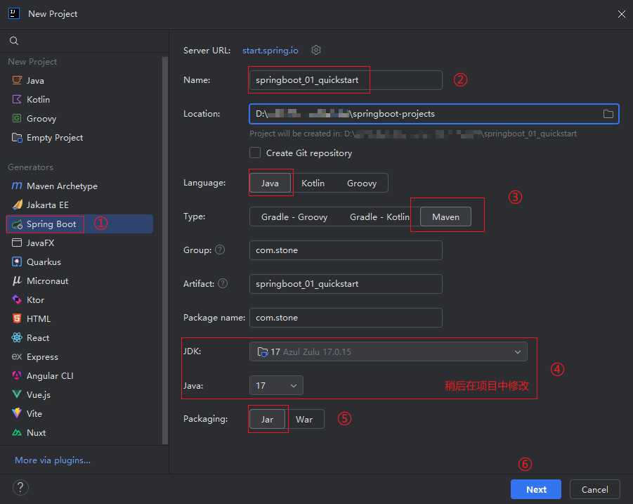

---

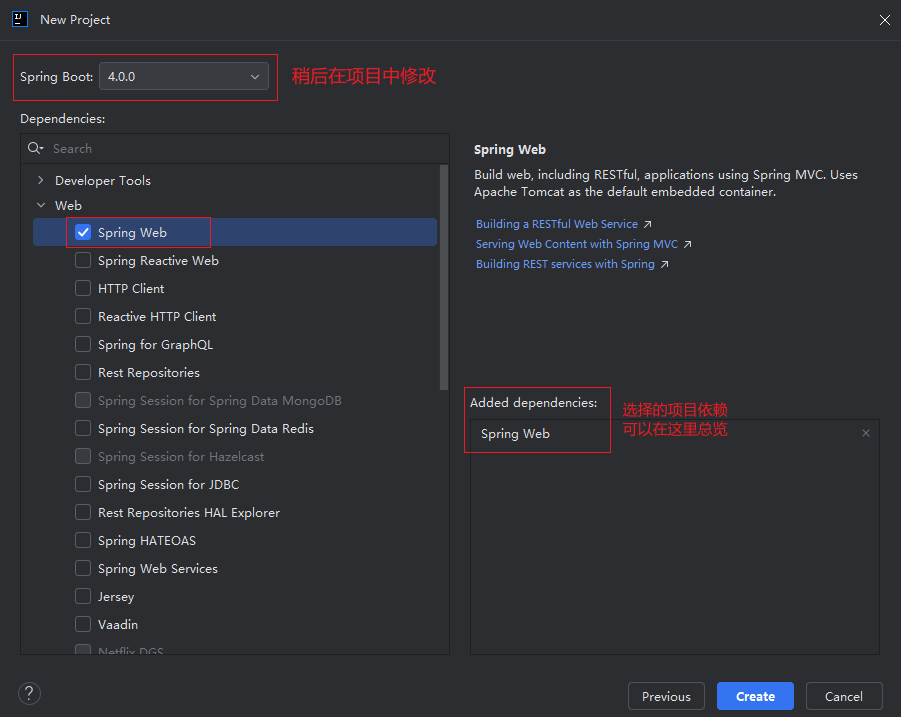

将项目的目录结构清理成如下状态

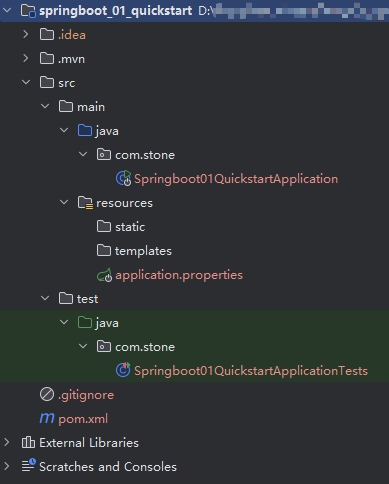

在`pom.xml`中修改SpringBoot版本号和java版本号

```xml
<?xml version="1.0" encoding="UTF-8"?>
<project xmlns="http://maven.apache.org/POM/4.0.0" xmlns:xsi="http://www.w3.org/2001/XMLSchema-instance"
         xsi:schemaLocation="http://maven.apache.org/POM/4.0.0 https://maven.apache.org/xsd/maven-4.0.0.xsd">
    <modelVersion>4.0.0</modelVersion>
    <parent>
        <groupId>org.springframework.boot</groupId>
        <artifactId>spring-boot-starter-parent</artifactId>
        <version>2.5.6</version>
        <relativePath/> <!-- lookup parent from repository -->
    </parent>

    <groupId>com.stone</groupId>
    <artifactId>springboot_01_quickstart</artifactId>
    <version>0.0.1-SNAPSHOT</version>

    <properties>
        <java.version>1.8</java.version>
    </properties>

    <dependencies>
        <dependency>
            <groupId>org.springframework.boot</groupId>
            <artifactId>spring-boot-starter-web</artifactId>
        </dependency>

        <dependency>
            <groupId>org.springframework.boot</groupId>
            <artifactId>spring-boot-starter-test</artifactId>
            <scope>test</scope>
        </dependency>
    </dependencies>

    <build>
        <plugins>
            <plugin>
                <groupId>org.springframework.boot</groupId>
                <artifactId>spring-boot-maven-plugin</artifactId>
            </plugin>
        </plugins>
    </build>

</project>
```

修改项目的**Java版本**和“**Language Level**”

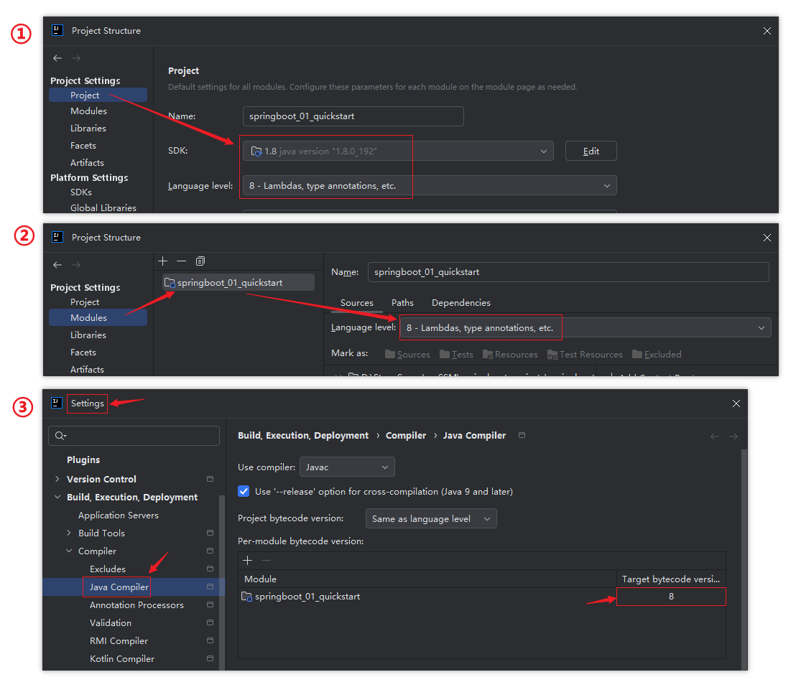

随后创建一个Controller，并启动项目

```java
package com.stone.controller;

import org.springframework.web.bind.annotation.GetMapping;
import org.springframework.web.bind.annotation.RequestMapping;
import org.springframework.web.bind.annotation.RestController;

@RestController
@RequestMapping("/user")
public class UserController {

    @GetMapping("/hello")
    public String hello() {
        return "Hello, World!";
    }

}
```

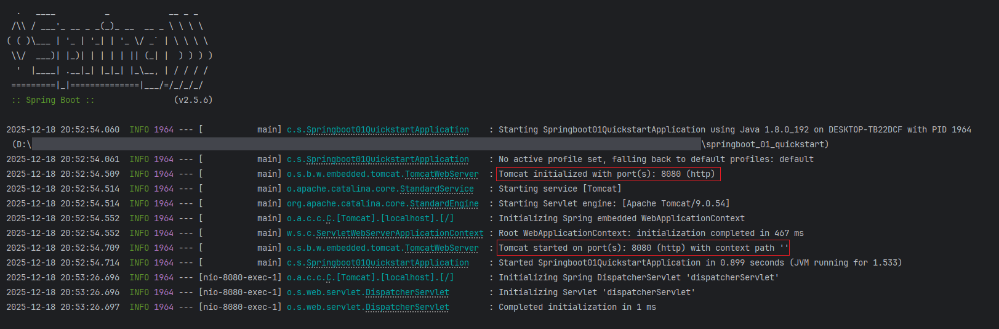

访问url http://localhost:8080/user/hello


<span style="color:red;">此外，我们还可以在Spring的官网创建SpringBoot项目，此处略。</span>


## 快速启动

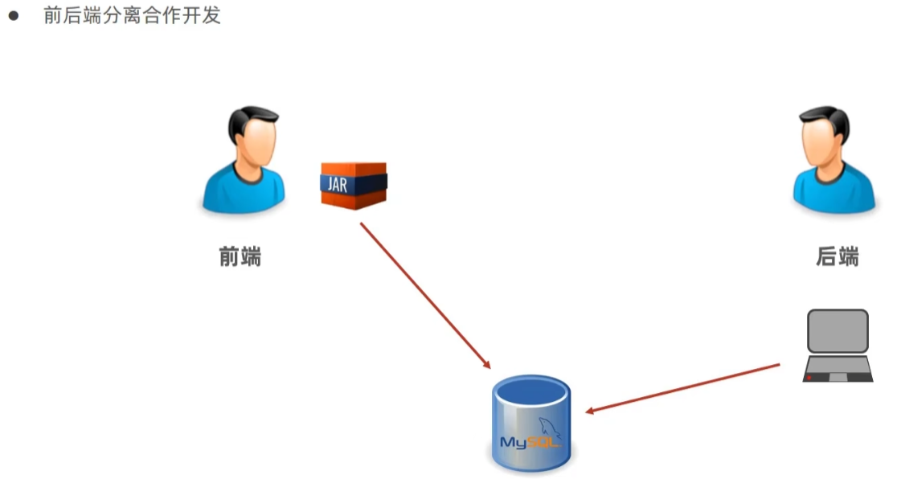

我们将**SpringBoot项目最终编译的jar包**发送给前端开发人员，就可以在他的工作电脑上快速启动该项目，从而避免前后端联调时直连我们的电脑。

<span style="color:red;">这种方法需要一个前提：运行jar包的电脑上需要安装Java！</span>

在项目编译的jar包所在的目录下打开cmd命令行窗口，执行启动指令

```shell
$ java -jar springboot_01_quickstart.jar
```

<span style="color:red;">注意事项：</span>

jar包支持命令行快速启动是需要依赖maven插件支持的，请确认项目打包时是否具有SpringBoot对应的maven插件

```xml
<build>
    <plugins>
        <plugin>
            <groupId>org.springframework.boot</groupId>
            <artifactId>spring-boot-maven-plugin</artifactId>
        </plugin>
    </plugins>
</build>
```


## 框架简介

SpringBoot框架的设计目的是用来<span style="color:red;">简化Spring应用的初始搭建以及开发过程</span>。

SpringBoot针对Spring框架的一些缺点进行了改良：

Spring

- 配置繁琐
- 依赖设置繁琐

SpringBoot

- 自动配置
- 起步依赖（简化依赖配置）
- 辅助功能（内置服务器，......）


**起步依赖**

在SpringBoot项目的`pom.xml`文件中

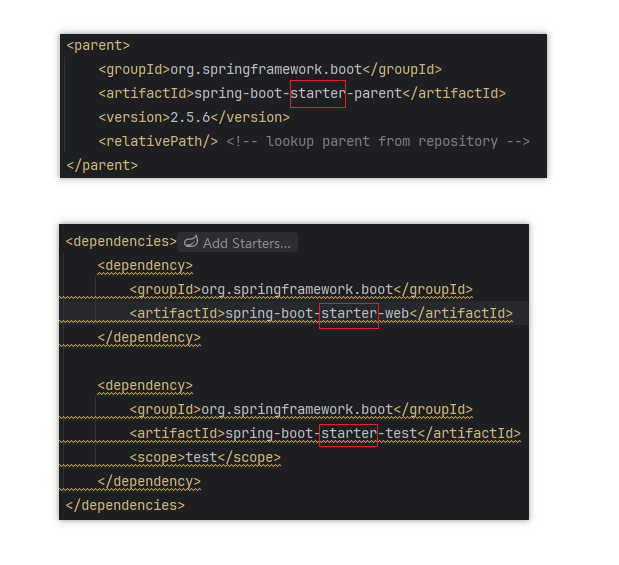

像上图中这些依赖一般称为起步依赖，依赖名称中常带有 **starter** 单词，这些依赖定义了当前项目可能使用的所有依赖坐标，以达到<span style="color:red;">减少依赖配置</span>目的。

其中，**parent** 标签内是所有SpringBoot项目都要继承的父项目，定义了若干个坐标版本号（dependencyManagement 而非 dependencies），以达到<span style="color:red;">减少依赖冲突</span>目的。


**辅助功能**：在SpringBoot的起步依赖中还包含了一些辅助功能的依赖，例如内置的Tomcat服务器、JUnit、日志等。

对于这些辅助功能，我们可以手动将其排除或替换，例如我们可以将Tomcat服务器替换为Jetty服务器：

```xml
<dependency>
    <groupId>org.springframework.boot</groupId>
    <artifactId>spring-boot-starter-web</artifactId>
    <exclusions>
        <exclusion>
            <groupId>org.springframework.boot</groupId>
            <artifactId>spring-boot-starter-tomcat</artifactId>
        </exclusion>
    </exclusions>
</dependency>

<!--Jetty服务器-->
<dependency>
    <groupId>org.springframework.boot</groupId>
    <artifactId>spring-boot-starter-jetty</artifactId>
</dependency>
```


**SpringBoot程序启动**

SpringBoot程序通过引导类来启动，引导类是项目的入口，运行main方法就可以启动项目

```java
@SpringBootApplication
public class Springboot01QuickstartApplication {

    public static void main(String[] args) {
        SpringApplication.run(Springboot01QuickstartApplication.class, args);
    }

}
```

<span style="color:red;">SpringBoot项目采用jar的打包方式</span>


## 基础配置

SpringBoot提供了多种属性配置方式

- properties
- yml
- yaml


创建项目工程`springboot_02_base_config`，创建方式同上

并创建一个`BookController`

```java
package com.stone.controller;

import org.springframework.web.bind.annotation.GetMapping;
import org.springframework.web.bind.annotation.PathVariable;
import org.springframework.web.bind.annotation.RequestMapping;
import org.springframework.web.bind.annotation.RestController;

@RestController
@RequestMapping("/book")
public class BookController {

    @GetMapping("/{id}")
    public String getById(@PathVariable Integer id) {
        System.out.println("id ==> " + id);
        return "Hello, Springboot!";
    }
}
```


然后我们通过多种配置文件格式来修改项目启动时的端口号

`application.properties`

```properties
server.port=8090
```

新建`application.yml`和`application.yaml`

```yaml
server:
  port: 8092
```

<b style="color:red;">其中，yml格式的配置文件是主流格式；三种格式的配置文件加载顺序为 properties > yml > yaml</b>


### yaml格式配置

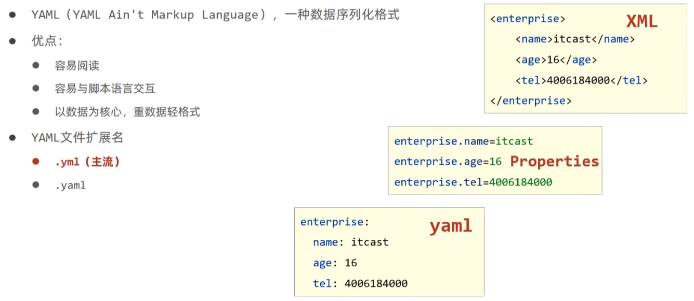

---

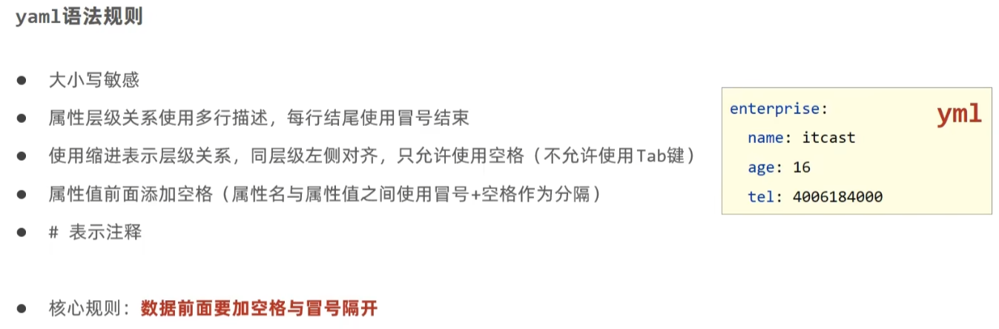

---

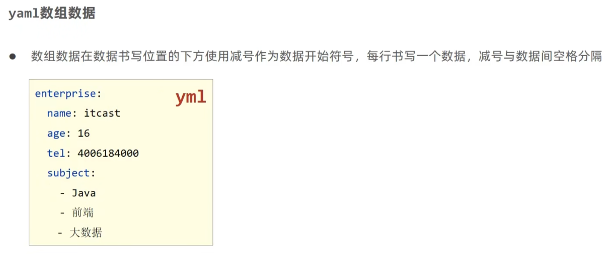


### yaml数据读取

创建项目工程`springboot_03_read_data`，创建方式同上

首先我们在yml配置文件中添加一些自定义数据

```yaml
# 自定义数据
lesson: "SpringBoot"
enterprise:
  name: "北京智谱华章科技有限公司"
  address: "北京市海淀区中关村南大街27号"
  phone: "010-12345678"
  email: "info@zhishupuhuazhang.com"
  website: "http://www.zhishupuhuazhang.com"
  employees:
    - name: "张三"
      age: 30
      position: "软件工程师"
    - name: "李四"
      age: 25
      position: "产品经理"
    - name: "王五"
      age: 35
      position: "项目经理"
```

**方式一**：使用**@Value**读取单个数据，属性名引用方式：${一级属性名.二级属性名...}

**方式二**：封装全部数据到**Environment**对象

**方式三**：自定义对象封装指定数据（使用**@ConfigurationProperties**注解）

`Enterprise`

```java
package com.stone.domain;

import org.springframework.boot.context.properties.ConfigurationProperties;
import org.springframework.stereotype.Component;

import java.util.List;

/**
 * 读取配置方式三：配置属性类
 */
@Component
@ConfigurationProperties(prefix = "enterprise") // 将配置文件中的属性绑定到 Java 对象上
public class Enterprise {
    private String name;
    private String address;
    private String phone;
    private String email;
    private String website;

    private List<Employee> employees;

    public String getName() {
        return name;
    }

    public void setName(String name) {
        this.name = name;
    }

    public String getAddress() {
        return address;
    }

    public void setAddress(String address) {
        this.address = address;
    }

    public String getPhone() {
        return phone;
    }

    public void setPhone(String phone) {
        this.phone = phone;
    }

    public String getEmail() {
        return email;
    }

    public void setEmail(String email) {
        this.email = email;
    }

    public String getWebsite() {
        return website;
    }

    public void setWebsite(String website) {
        this.website = website;
    }

    public List<Employee> getEmployees() {
        return employees;
    }

    public void setEmployees(List<Employee> employees) {
        this.employees = employees;
    }

    @Override
    public String toString() {
        return "Enterprise{" +
                "name='" + name + '\'' +
                ", address='" + address + '\'' +
                ", phone='" + phone + '\'' +
                ", email='" + email + '\'' +
                ", website='" + website + '\'' +
                ", employees=" + employees +
                '}';
    }
}
```

`Employee`

```java
package com.stone.domain;

public class Employee {

    private String name;
    private int age;
    private String position;

    public String getName() {
        return name;
    }

    public void setName(String name) {
        this.name = name;
    }

    public int getAge() {
        return age;
    }

    public void setAge(int age) {
        this.age = age;
    }

    public String getPosition() {
        return position;
    }

    public void setPosition(String position) {
        this.position = position;
    }

    @Override
    public String toString() {
        return "Employee{" +
                "name='" + name + '\'' +
                ", age=" + age +
                ", position='" + position + '\'' +
                '}';
    }
}
```

读取配置数据的三种方式实例

```java
package com.stone.controller;

import com.stone.domain.Enterprise;
import org.springframework.beans.factory.annotation.Value;
import org.springframework.core.env.Environment;
import org.springframework.web.bind.annotation.GetMapping;
import org.springframework.web.bind.annotation.PathVariable;
import org.springframework.web.bind.annotation.RequestMapping;
import org.springframework.web.bind.annotation.RestController;

import javax.annotation.Resource;

@RestController
@RequestMapping("/book")
public class BookController {

    // 读取配置方式一
    @Value("${lesson}")
    private String lesson;

    @Value("${enterprise.name}")
    private String enterpriseName;

    @Value("${enterprise.employees[0].name}")
    private String employeeName_00;

    // 读取配置方式二
    @Resource
    private Environment environment;

    // 读取配置方式三
    @Resource
    private Enterprise enterprise;

    @GetMapping("/{id}")
    public String getById(@PathVariable Integer id) {
        System.out.println("id ==> " + id);
        System.out.println("lesson ==> " + lesson);
        System.out.println("enterpriseName ==> " + enterpriseName);
        System.out.println("employeeName_00 ==> " + employeeName_00);
        System.out.println("-----------------------------");
        System.out.println("lesson ==> " + environment.getProperty("lesson"));
        System.out.println("employeeName_01 ==> " + environment.getProperty("enterprise.employees[1].name"));
        System.out.println("-----------------------------");
        System.out.println("enterprise ==> " + enterprise);
        return "Hello, Springboot!";
    }
}
```


### 多环境启动

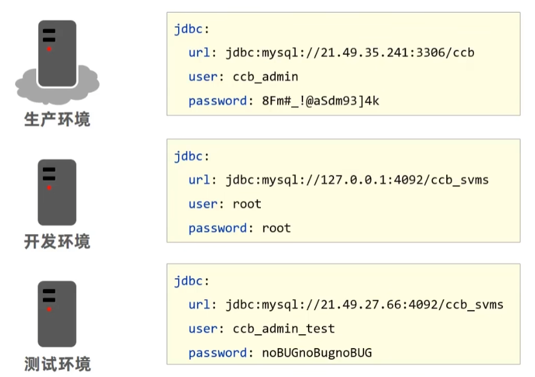

创建项目工程`springboot_04_profile`，创建方式同上

**yml格式**：配置多环境

```yaml
# 设置启用的环境
spring:
  profiles:
    active: test

---
# 开发环境
spring:
  application:
    name: springboot_04_profile
  config:
    activate:
      on-profile: dev
server:
  port: 8080

---
# 测试环境
spring:
  application:
    name: springboot_04_profile
  config:
    activate:
      on-profile: test
server:
  port: 8081

---
# 生产环境
spring:
  application:
    name: springboot_04_profile
  config:
    activate:
      on-profile: prod
server:
  port: 8082
```

**properties格式**：配置多环境

application-prod.properties

```properties
server.port=8090
```

application.properties

```properties
# 设置启用的环境
spring.profiles.active=prod
```


#### 命令行启动参数

```shell
$ java -jar xxx.jar --spring.profiles.active=prod --server.port=9090
```


#### 多环境开发控制

创建项目工程`springboot_05_maven_and_boot_profile`，创建方式同上

配置多环境，并在`pom.xml`中添加如下配置

```xml
<build>
    <plugins>
        <!--
            Maven资源插件，主要用于处理项目资源文件
            它负责将src/main/resources目录下的资源文件复制到输出目录（通常是target/classes）
            -->
        <plugin>
            <groupId>org.apache.maven.plugins</groupId>
            <artifactId>maven-resources-plugin</artifactId>
            <version>3.2.0</version>
            <configuration>
                <!--指定资源文件的编码格式为UTF-8，确保在处理包含非ASCII字符的资源文件时不会出现乱码-->
                <encoding>utf-8</encoding>
                <!--启用默认的分隔符，这允许在资源文件中使用变量占位符（如${variable.name}），Maven会在构建时替换这些占位符为实际值-->
                <useDefaultDelimiters>true</useDefaultDelimiters>
            </configuration>
        </plugin>
    </plugins>
</build>

<!--配置多环境-->
<profiles>
    <profile>
        <id>dev</id>
        <properties>
            <profile.active>dev</profile.active>
        </properties>
    </profile>
    <profile>
        <id>test</id>
        <properties>
            <profile.active>test</profile.active>
        </properties>
    </profile>
    <profile>
        <id>prod</id>
        <properties>
            <profile.active>prod</profile.active>
        </properties>
        <!--将该环境设置为启动环境-->
        <activation>
            <activeByDefault>true</activeByDefault>
        </activation>
    </profile>
</profiles>
```

随后对`application.yml`稍加修改

```yaml
spring:
  profiles:
    # 读取Maven中指定的运行环境
    active: ${profile.active}
```

此后，每次变更运行环境只需要将`pom.xml`中对应的环境激活即可


### 配置文件分类

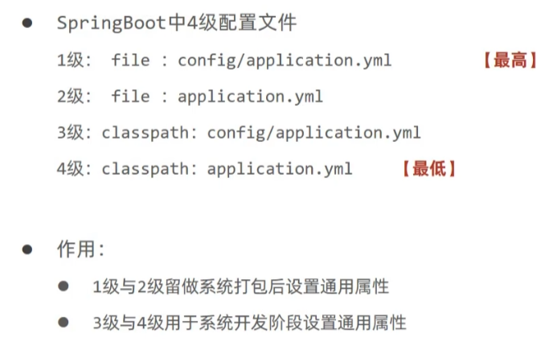

新建项目工程`springboot_06_config_file`，创建方式同上

分别下面四个路径下添加配置文件`application.yml`

`resource`：对应4级

`resource\config`：对应3级

`jar包所在目录`：对应2级

`jar包所在目录\config`：对应1级

<span style="color:red;">可以发现这四级配置文件会依次覆盖</span>


## 整合

### JUnit

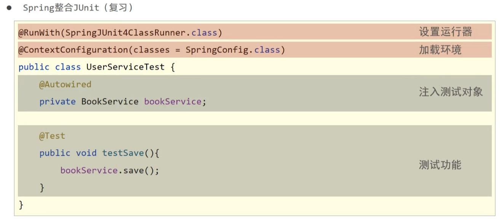


**SpringBoot整合Junit步骤如下**

创建项目工程`springboot_07_junit_test`，创建方式同上（<span style="color:red;">不勾选Web依赖</span>）

此时项目的`pom.xml`中依赖如下

```xml
<dependencies>
    <!--由于没有勾选Web依赖，所以此处的起步依赖发生了变更-->
    <dependency>
        <groupId>org.springframework.boot</groupId>
        <artifactId>spring-boot-starter</artifactId>
    </dependency>
    <!--SpringBoot单元测试依赖，包含Junit-->
    <dependency>
        <groupId>org.springframework.boot</groupId>
        <artifactId>spring-boot-starter-test</artifactId>
        <scope>test</scope>
    </dependency>
</dependencies>
```

创建service层用于单元测试

`BookService`

```java
package com.stone.service;

public interface BookService {

    public void save();
}
```

`BookServiceImpl`

```java
package com.stone.service.impl;

import com.stone.service.BookService;
import org.springframework.stereotype.Service;

@Service
public class BookServiceImpl implements BookService {

    @Override
    public void save() {
        System.out.println("book service is running...");
    }

}
```

然后在`test`目录下编写单元测试方法

```java
package com.stone;

import com.stone.service.BookService;
import org.junit.jupiter.api.Test;
import org.springframework.boot.test.context.SpringBootTest;

import javax.annotation.Resource;

@SpringBootTest
class Springboot07JunitTestApplicationTests {

    @Resource
    private BookService bookService;

    @Test
    void contextLoads() {
        bookService.save();
    }

}
```

如上单元测试就完成了，其中：

**@RunWith(SpringJunit4ClassRunner.class)** 已经被SpringBoot简化为默认配置，所以不用再显式编写；

**@ContextConfiguration(classes = SpringConfig.class)** 也是同理，并且<span style="color:red;">SpringBoot还默认将项目启动的引导类**Springboot07JunitTestApplication**作为Spring配置类去加载，故不需要再额外创建Spring配置类了；</span>


关于@SpringBootTest注解

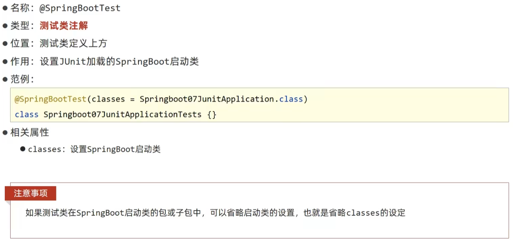


### SSM

<span style="color:red;">SpringBoot不需要在额外整合Spring、SpringMVC了</span>

#### Mybatis

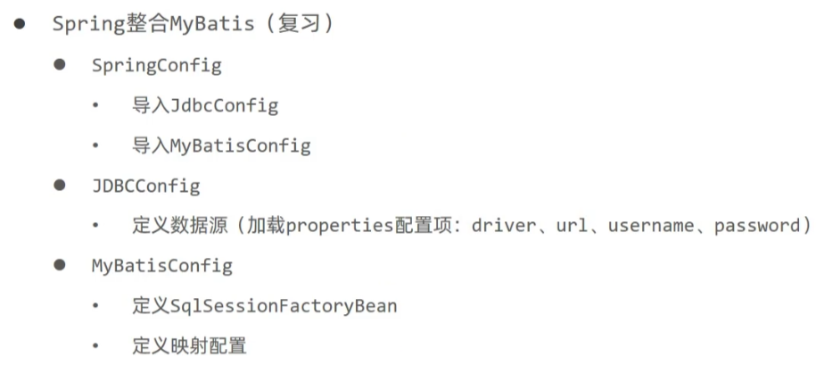

创建项目工程`springboot_08_mybatis`

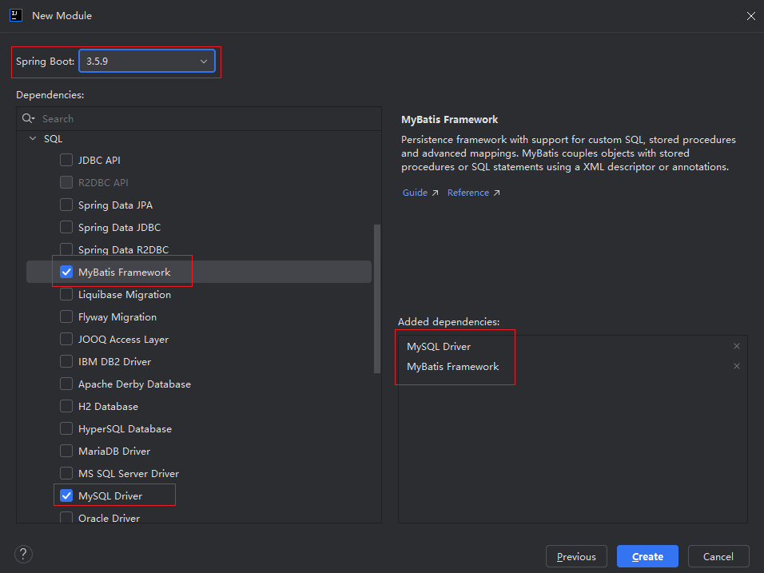

修改`pom.xml`

```xml
<?xml version="1.0" encoding="UTF-8"?>
<project xmlns="http://maven.apache.org/POM/4.0.0" xmlns:xsi="http://www.w3.org/2001/XMLSchema-instance"
         xsi:schemaLocation="http://maven.apache.org/POM/4.0.0 https://maven.apache.org/xsd/maven-4.0.0.xsd">
    <modelVersion>4.0.0</modelVersion>

    <parent>
        <groupId>org.springframework.boot</groupId>
        <artifactId>spring-boot-starter-parent</artifactId>
        <version>2.5.6</version>
        <relativePath/> <!-- lookup parent from repository -->
    </parent>

    <groupId>com.stone</groupId>
    <artifactId>springboot_08_mybatis</artifactId>
    <version>0.0.1-SNAPSHOT</version>

    <properties>
        <java.version>1.8</java.version>
    </properties>

    <dependencies>
        <dependency>
            <groupId>org.mybatis.spring.boot</groupId>
            <artifactId>mybatis-spring-boot-starter</artifactId>
            <version>2.3.1</version>
        </dependency>

        <dependency>
            <groupId>mysql</groupId>
            <artifactId>mysql-connector-java</artifactId>
            <scope>runtime</scope>
        </dependency>

        <dependency>
            <groupId>org.springframework.boot</groupId>
            <artifactId>spring-boot-starter-test</artifactId>
            <scope>test</scope>
        </dependency>
    </dependencies>

    <build>
        <plugins>
            <plugin>
                <groupId>org.springframework.boot</groupId>
                <artifactId>spring-boot-maven-plugin</artifactId>
            </plugin>
        </plugins>
    </build>

</project>
```

添加配置

```yaml
spring:
  application:
    name: springboot_08_mybatis
  datasource:
    driver-class-name: com.mysql.cj.jdbc.Driver
    url: jdbc:mysql://localhost:3306/ssm_db?useUnicode=true&characterEncoding=utf-8&serverTimezone=Asia/Shanghai
    username: root
    password: 1234
```

编写domain和dao

`Book`

```java
package com.stone.domain;

public class Book {

    private Integer id;
    private String name;
    private String type;
    private String description;

    public Integer getId() {
        return id;
    }

    public void setId(Integer id) {
        this.id = id;
    }

    public String getName() {
        return name;
    }

    public void setName(String name) {
        this.name = name;
    }

    public String getType() {
        return type;
    }

    public void setType(String type) {
        this.type = type;
    }

    public String getDescription() {
        return description;
    }

    public void setDescription(String description) {
        this.description = description;
    }

    @Override
    public String toString() {
        return "Book{" +
                "id=" + id +
                ", name='" + name + '\'' +
                ", type='" + type + '\'' +
                ", description='" + description + '\'' +
                '}';
    }
}
```

`BookDao`

```java
package com.stone.dao;

import com.stone.domain.Book;
import org.apache.ibatis.annotations.Mapper;
import org.apache.ibatis.annotations.Select;

@Mapper // 通过该注解注册Dao
public interface BookDao {

    @Select("select * from tbl_book where id = #{id}")
    public Book getById(int id);
}
```

编写测试类

```java
package com.stone;

import com.stone.dao.BookDao;
import com.stone.domain.Book;
import org.junit.jupiter.api.Test;
import org.springframework.boot.test.context.SpringBootTest;

import javax.annotation.Resource;

@SpringBootTest
class Springboot08MybatisApplicationTests {

    @Resource
    private BookDao bookDao;

    @Test
    void contextLoads() {
        Book book = bookDao.getById(1);
        System.out.println(book);
    }

}
```

运行并查看测试结果

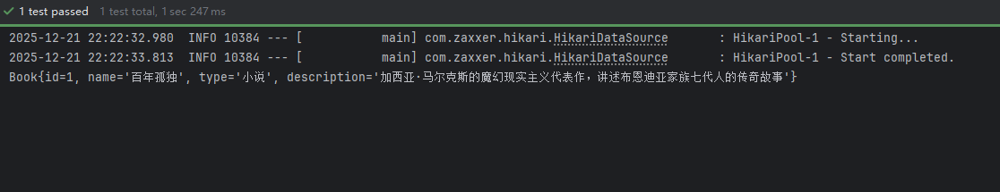


#### Druid数据源

接着我们尝试去更换Druid数据源

导入依赖

```xml
<dependency>
    <groupId>com.alibaba</groupId>
    <artifactId>druid</artifactId>
    <version>1.2.23</version>
</dependency>
```

修改配置

```yaml
spring:
  application:
    name: springboot_08_mybatis
  datasource:
    driver-class-name: com.mysql.cj.jdbc.Driver
    url: jdbc:mysql://localhost:3306/ssm_db?useUnicode=true&characterEncoding=utf-8&serverTimezone=Asia/Shanghai
    username: root
    password: 1234
    # 更换Druid数据源
    type: com.alibaba.druid.pool.DruidDataSource
```


#### 整合案例

创建项目工程`springboot_09_ssm`

`pom.xml`

```xml
<?xml version="1.0" encoding="UTF-8"?>
<project xmlns="http://maven.apache.org/POM/4.0.0" xmlns:xsi="http://www.w3.org/2001/XMLSchema-instance"
	xsi:schemaLocation="http://maven.apache.org/POM/4.0.0 https://maven.apache.org/xsd/maven-4.0.0.xsd">
	<modelVersion>4.0.0</modelVersion>

	<parent>
		<groupId>org.springframework.boot</groupId>
		<artifactId>spring-boot-starter-parent</artifactId>
		<version>2.5.6</version>
		<relativePath/> <!-- lookup parent from repository -->
	</parent>

	<groupId>com.stone</groupId>
	<artifactId>springboot_09_ssm</artifactId>
	<version>0.0.1-SNAPSHOT</version>

	<properties>
		<java.version>1.8</java.version>
	</properties>

	<dependencies>
		<dependency>
			<groupId>org.springframework.boot</groupId>
			<artifactId>spring-boot-starter-web</artifactId>
		</dependency>

		<dependency>
			<groupId>org.mybatis.spring.boot</groupId>
			<artifactId>mybatis-spring-boot-starter</artifactId>
			<version>2.3.1</version>
		</dependency>

		<dependency>
			<groupId>mysql</groupId>
			<artifactId>mysql-connector-java</artifactId>
			<scope>runtime</scope>
		</dependency>

		<dependency>
			<groupId>com.alibaba</groupId>
			<artifactId>druid</artifactId>
			<version>1.2.23</version>
		</dependency>

		<dependency>
			<groupId>org.springframework.boot</groupId>
			<artifactId>spring-boot-starter-test</artifactId>
			<scope>test</scope>
		</dependency>
	</dependencies>

	<build>
		<plugins>
			<plugin>
				<groupId>org.springframework.boot</groupId>
				<artifactId>spring-boot-maven-plugin</artifactId>
			</plugin>
		</plugins>
	</build>

</project>
```

`application.yml`

```yaml
spring:
  application:
    name: springboot_09_ssm
  datasource:
    type: com.alibaba.druid.pool.DruidDataSource
    driver-class-name: com.mysql.cj.jdbc.Driver
    url: jdbc:mysql://localhost:3306/ssm_db?userSSL=true&characterEncoding=utf-8&serverTimezone=Asia/Shanghai
    username: root
    password: 1234
```

编写Dao、Service、Controller，详见项目

**略**

编写Service层的单元测试

```java
package com.stone.service;

import com.stone.domain.Book;
import org.junit.jupiter.api.Test;
import org.springframework.boot.test.context.SpringBootTest;

import javax.annotation.Resource;
import java.util.List;

@SpringBootTest
public class BookServiceTest {

    @Resource
    private BookService bookService;

    @Test
    public void testGetById() {
        Book book = bookService.getById(2);
        System.out.println(book);
    }

    @Test
    public void testGetAll() {
        List<Book> bookList = bookService.getAll();
        System.out.println(bookList);
    }
}
```

拷贝静态资源到`static`目录下

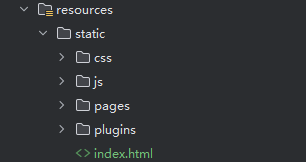

启动项目并访问 http://localhost:8080/

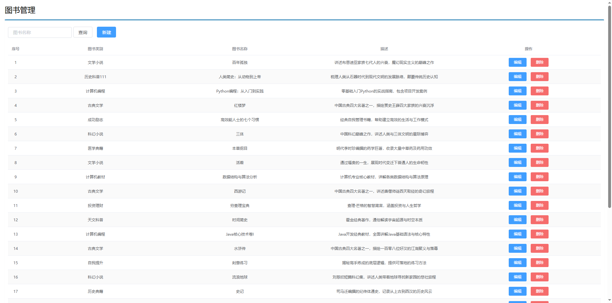


### MybatisPlus

MyBatisPlus（简称MP），是基于MyBatis框架基础上开发的增强型工具，旨在简化开发、太高效率。

官网：https://mybatis.plus/    https://mp.baomidou.com/

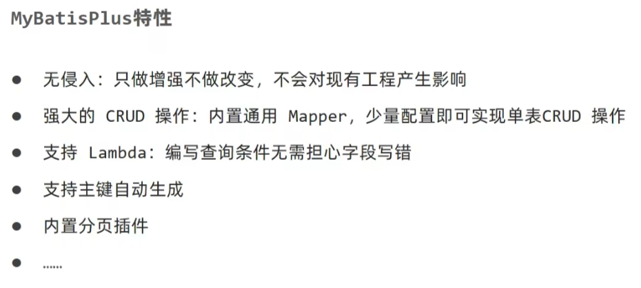


#### 入门案例

MyBatisPlus有三种开发方式：

- 基于MyBatis使用MyBatisPlus
- 基于Spring使用MyBatisPlus
- 基于SpringBoot使用MyBatisPlus

本次案例选择第三种开发方式。

准备数据库表

`mybatisplus_db.user`

```sql
CREATE TABLE `user` (
  `id` bigint(20) NOT NULL AUTO_INCREMENT,
  `name` varchar(255) COLLATE utf8mb4_general_ci DEFAULT NULL,
  `password` varchar(255) COLLATE utf8mb4_general_ci DEFAULT NULL,
  `age` int(11) DEFAULT NULL,
  `tel` varchar(255) COLLATE utf8mb4_general_ci DEFAULT NULL,
  PRIMARY KEY (`id`)
) ENGINE=InnoDB DEFAULT CHARSET=utf8mb4 COLLATE=utf8mb4_general_ci;
```

创建SpringBoot项目工程`mybatisplus_01_quickstart`

`pom.xml`

```xml
<?xml version="1.0" encoding="UTF-8"?>
<project xmlns="http://maven.apache.org/POM/4.0.0" xmlns:xsi="http://www.w3.org/2001/XMLSchema-instance"
         xsi:schemaLocation="http://maven.apache.org/POM/4.0.0 https://maven.apache.org/xsd/maven-4.0.0.xsd">
    <modelVersion>4.0.0</modelVersion>

    <parent>
        <groupId>org.springframework.boot</groupId>
        <artifactId>spring-boot-starter-parent</artifactId>
        <version>2.5.6</version>
        <relativePath/> <!-- lookup parent from repository -->
    </parent>

    <groupId>com.stone</groupId>
    <artifactId>mybatisplus_01_quickstart</artifactId>
    <version>0.0.1-SNAPSHOT</version>

    <properties>
        <java.version>1.8</java.version>
    </properties>
    <dependencies>
        <dependency>
            <groupId>org.springframework.boot</groupId>
            <artifactId>spring-boot-starter</artifactId>
        </dependency>

        <!--MyBatisPlus依赖-->
        <dependency>
            <groupId>com.baomidou</groupId>
            <artifactId>mybatis-plus-boot-starter</artifactId>
            <version>3.4.2</version>
        </dependency>

        <dependency>
            <groupId>com.alibaba</groupId>
            <artifactId>druid</artifactId>
            <version>1.2.23</version>
        </dependency>

        <dependency>
            <groupId>mysql</groupId>
            <artifactId>mysql-connector-java</artifactId>
            <scope>runtime</scope>
        </dependency>

        <dependency>
            <groupId>org.springframework.boot</groupId>
            <artifactId>spring-boot-starter-test</artifactId>
            <scope>test</scope>
        </dependency>
    </dependencies>

    <build>
        <plugins>
            <plugin>
                <groupId>org.springframework.boot</groupId>
                <artifactId>spring-boot-maven-plugin</artifactId>
            </plugin>
        </plugins>
    </build>

</project>
```

`application.yml`

```yaml
spring:
  application:
    name: mybatisplus_01_quickstart
  datasource:
    type: com.alibaba.druid.pool.DruidDataSource
    driver-class-name: com.mysql.cj.jdbc.Driver
    url: jdbc:mysql://localhost:3306/mybatisplus_db?useUnicode=true&characterEncoding=utf-8&useSSL=false&serverTimezone=Asia/Shanghai
    username: root
    password: 1234
```

`User`

```java
package com.stone.domain;

/**
 * user 表对应的实体类（Domain/POJO）
 */
public class User {
    /**
     * 主键ID，自增
     */
    private Long id;

    /**
     * 用户名
     */
    private String name;

    /**
     * 密码（通常为加密存储）
     */
    private String password;

    /**
     * 年龄
     */
    private Integer age;

    /**
     * 手机号码
     */
    private String tel;

    // getter 方法
    public Long getId() {
        return id;
    }

    public String getName() {
        return name;
    }

    public String getPassword() {
        return password;
    }

    public Integer getAge() {
        return age;
    }

    public String getTel() {
        return tel;
    }

    // setter 方法
    public void setId(Long id) {
        this.id = id;
    }

    public void setName(String name) {
        this.name = name;
    }

    public void setPassword(String password) {
        this.password = password;
    }

    public void setAge(Integer age) {
        this.age = age;
    }

    public void setTel(String tel) {
        this.tel = tel;
    }

    // 可选：重写 toString 方法
    @Override
    public String toString() {
        return "User{" +
                "id=" + id +
                ", name='" + name + '\'' +
                ", password='" + password + '\'' +
                ", age=" + age +
                ", tel='" + tel + '\'' +
                '}';
    }
}
```

<span style="color:red;">`UserDao`</span>

```java
package com.stone.dao;

import com.baomidou.mybatisplus.core.mapper.BaseMapper;
import com.stone.domain.User;
import org.apache.ibatis.annotations.Mapper;

@Mapper
public interface UserDao extends BaseMapper<User> {
}
```

编写单元测试

```java
package com.stone;

import com.stone.dao.UserDao;
import org.junit.jupiter.api.Test;
import org.springframework.boot.test.context.SpringBootTest;

import javax.annotation.Resource;

@SpringBootTest
class Mybatisplus01QuickstartApplicationTests {

    @Resource
    private UserDao userDao;

    @Test
    void contextLoads() {
        userDao.selectList(null).forEach(System.out::println);
    }

}
```

最终测试结果

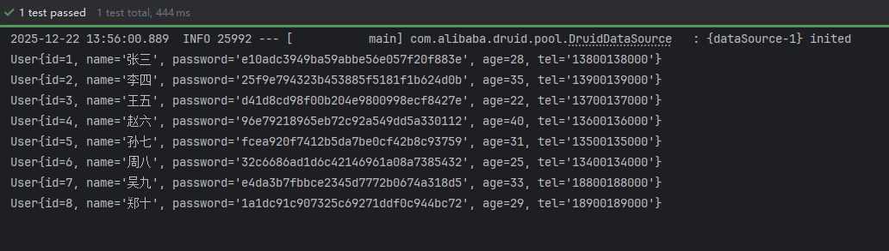


#### 标准数据层开发

MyBatisPlus提供的标准CRUD功能接口如下：

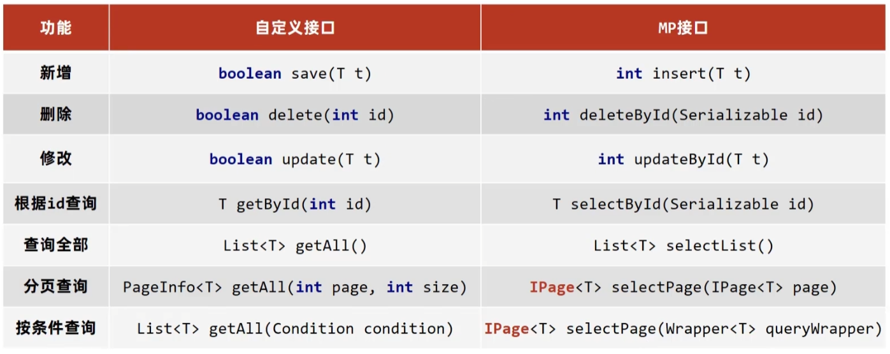

我们可以依次编写单元测试方法来看看效果，详见项目代码


#### 标准分页功能

通过MyBatisPlus拦截器开启分页功能

```java
package com.stone.config;

import com.baomidou.mybatisplus.extension.plugins.MybatisPlusInterceptor;
import com.baomidou.mybatisplus.extension.plugins.inner.PaginationInnerInterceptor;
import org.springframework.context.annotation.Bean;
import org.springframework.context.annotation.Configuration;

/**
 * Mybatis Plus 配置类
 */
@Configuration
public class MPConfig {

    @Bean
    public MybatisPlusInterceptor mybatisPlusInterceptor() {
        // 定义MybatisPlus拦截器
        MybatisPlusInterceptor interceptor = new MybatisPlusInterceptor();
        // 添加分页拦截器
        interceptor.addInnerInterceptor(new PaginationInnerInterceptor());
        return interceptor;
    }
}
```

测试分页查询

```java
@Test
void testGetByPage() {
    IPage<User> page = new Page<>(1, 2);
    IPage<User> userIPage = userDao.selectPage(page, null);
    System.out.println("当前页码值: " + userIPage.getCurrent());
    System.out.println("每页显示数: " + userIPage.getSize());
    System.out.println("总页码数: " + userIPage.getPages());
    System.out.println("总记录数: " + userIPage.getTotal());
    System.out.println("userIPage结果: " + userIPage.getRecords());
}
```

此外我们还可以在`application.yml`中配置开启MyBatisPlus的控制台日志，打印SQL

```yaml
# MyBatisPlus开启控制台日志
mybatis-plus:
  configuration:
    log-impl: org.apache.ibatis.logging.stdout.StdOutImpl
```

最终结果如下

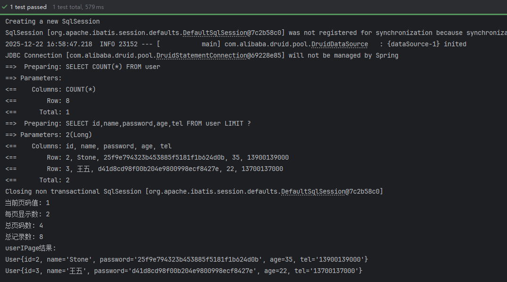


#### DQL编程控制

##### 条件查询

MyBatisPlus将复杂的SQL查询条件进行了封装，使用编程的形式完成查询条件的组合

创建SpringBoot项目工程`mybatisplus_02_dql`

`pom.xml`

```xml
<?xml version="1.0" encoding="UTF-8"?>
<project xmlns="http://maven.apache.org/POM/4.0.0" xmlns:xsi="http://www.w3.org/2001/XMLSchema-instance"
	xsi:schemaLocation="http://maven.apache.org/POM/4.0.0 https://maven.apache.org/xsd/maven-4.0.0.xsd">
	<modelVersion>4.0.0</modelVersion>

	<parent>
		<groupId>org.springframework.boot</groupId>
		<artifactId>spring-boot-starter-parent</artifactId>
		<version>2.5.6</version>
		<relativePath/> <!-- lookup parent from repository -->
	</parent>

	<groupId>com.stone</groupId>
	<artifactId>mybatisplus_02_dql</artifactId>
	<version>0.0.1-SNAPSHOT</version>

	<properties>
		<java.version>1.8</java.version>
	</properties>
	<dependencies>
		<dependency>
			<groupId>org.springframework.boot</groupId>
			<artifactId>spring-boot-starter</artifactId>
		</dependency>

		<!--MyBatisPlus依赖-->
		<dependency>
			<groupId>com.baomidou</groupId>
			<artifactId>mybatis-plus-boot-starter</artifactId>
			<version>3.4.2</version>
		</dependency>

		<dependency>
			<groupId>com.alibaba</groupId>
			<artifactId>druid</artifactId>
			<version>1.2.23</version>
		</dependency>

		<!--lombok-->
		<dependency>
			<groupId>org.projectlombok</groupId>
			<artifactId>lombok</artifactId>
		</dependency>

		<dependency>
			<groupId>mysql</groupId>
			<artifactId>mysql-connector-java</artifactId>
			<scope>runtime</scope>
		</dependency>

		<dependency>
			<groupId>org.springframework.boot</groupId>
			<artifactId>spring-boot-starter-test</artifactId>
			<scope>test</scope>
		</dependency>
	</dependencies>

	<build>
		<plugins>
			<plugin>
				<groupId>org.springframework.boot</groupId>
				<artifactId>spring-boot-maven-plugin</artifactId>
			</plugin>
		</plugins>
	</build>

</project>
```

`application.yml`

```yaml
spring:
  application:
    name: mybatisplus_01_quickstart
  datasource:
    type: com.alibaba.druid.pool.DruidDataSource
    driver-class-name: com.mysql.cj.jdbc.Driver
    url: jdbc:mysql://localhost:3306/mybatisplus_db?useUnicode=true&characterEncoding=utf-8&useSSL=false&serverTimezone=Asia/Shanghai
    username: root
    password: 1234
  # 关闭SpringBoot控制台Banner
  main:
    banner-mode: off
mybatis-plus:
  global-config:
    # 关闭MyBatisPlus控制台Banner
    banner: false
```

配置`logback.xml`用于关闭冗余的控制台日志

```xml
<?xml version="1.0" encoding="UTF-8" ?>
<configuration>
<!--  空标签用于去除多余的控制台日志输出  -->
</configuration>
```

编写Dao和Domain：**略**

编写单元测试方法

```java
package com.stone;

import com.stone.dao.UserDao;
import org.junit.jupiter.api.Test;
import org.springframework.boot.test.context.SpringBootTest;

import javax.annotation.Resource;

@SpringBootTest
class Mybatisplus02DqlApplicationTests {

	@Resource
	private UserDao userDao;

	@Test
	void testGetAll() {
		userDao.selectList(null).forEach(System.out::println);
	}

}
```

<span style="color:red;">接下来我们尝试将查询全部改造为条件查询</span>

```java
@Test
void testGetAll() {
    // 方式一：创建条件构造器
    QueryWrapper<User> wrapper = new QueryWrapper<>();
    // 构造查询条件：age < 25
    wrapper.lt("age", 25);
    userDao.selectList(wrapper).forEach(System.out::println);

    // 方式二：Lambda格式按条件查询
    QueryWrapper<User> lambdaWrapper = new QueryWrapper<>();
    lambdaWrapper.lambda().lt(User::getAge, 25);
    userDao.selectList(lambdaWrapper).forEach(System.out::println);

    // 方式三：Lambda格式按条件查询（推荐）
    LambdaQueryWrapper<User> lambdaQueryWrapper2 = new LambdaQueryWrapper<>();
    // lambdaQueryWrapper2.lt(User::getAge, 25);
    // and 方式连接多条件 链式编程
    // lambdaQueryWrapper2.lt(User::getAge, 30).gt(User::getAge, 10);
    // or  方式连接多条件 链式编程
    // lambdaQueryWrapper2.lt(User::getAge, 10).or().gt(User::getAge, 30);
    userDao.selectList(lambdaQueryWrapper2).forEach(System.out::println);
}
```

##### NULL判定

模仿前端表单传值，查询条件会存在为null的情况，因此我们需要对其进行处理

```java
@Test
void testNullValue() {
    // 模拟查询条件
    UserQuery userQuery = new UserQuery();
    userQuery.setMinAge(20);
    // userQuery.setMaxAge(30);

    LambdaQueryWrapper<User> lambdaQueryWrapper = new LambdaQueryWrapper<>();
    // 只有当查询条件传值非空时，对应的查询条件才会生效
    lambdaQueryWrapper.lt(userQuery.getMaxAge() != null, User::getAge, userQuery.getMaxAge());
    lambdaQueryWrapper.gt(userQuery.getMinAge() != null, User::getAge, userQuery.getMinAge());
    userDao.selectList(lambdaQueryWrapper).forEach(System.out::println);
}
```

##### 查询投影

查询结果包含模型类中部分属性

```java
@Test
void testData() {
    // LambdaQueryWrapper<User> queryWrapper = new LambdaQueryWrapper<>();
    // queryWrapper.select(User::getId, User::getName, User::getAge);
    // 或
    QueryWrapper<User> queryWrapper = new QueryWrapper<>();
    queryWrapper.select("id", "name", "age");
    userDao.selectList(queryWrapper).forEach(System.out::println);
}
```

查询结果包含模型类中未定义的属性

```java
@Test
void testData() {
    QueryWrapper<User> queryWrapper = new QueryWrapper<>();
    queryWrapper.select("count(*) as count, tel");
    queryWrapper.groupBy("tel");
    userDao.selectList(queryWrapper).forEach(System.out::println);
}
```

##### 查询条件

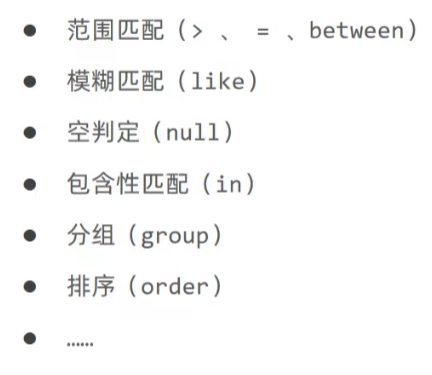

```java
@Test
void testCondition() {
    LambdaQueryWrapper<User> lambdaQueryWrapper = new LambdaQueryWrapper<>();
    lambdaQueryWrapper.eq(User::getName, "Tom").eq(User::getPassword, "Jerry");
    User user = userDao.selectOne(lambdaQueryWrapper);
    System.out.println(user);

    LambdaQueryWrapper<User> lambdaQueryWrapper2 = new LambdaQueryWrapper<>();
    // 范围查询：lt le gt ge between eq
    lambdaQueryWrapper2.between(User::getAge, 20, 30);
    userDao.selectList(lambdaQueryWrapper2).forEach(System.out::println);

    LambdaQueryWrapper<User> lambdaQueryWrapper3 = new LambdaQueryWrapper<>();
    // 模糊查询：like
    lambdaQueryWrapper3.like(User::getName, "Tom");
    userDao.selectList(lambdaQueryWrapper2).forEach(System.out::println);
}
```

##### 映射匹配兼容性

两个注解：

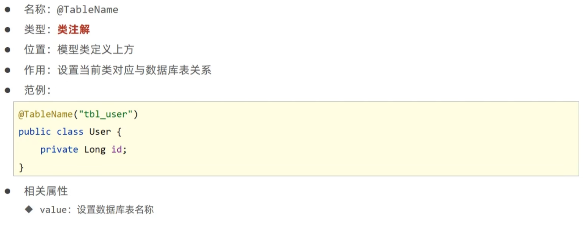

---

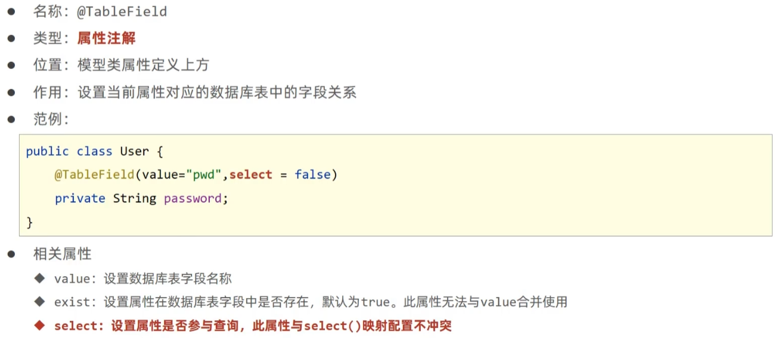

```java
package com.stone.domain;

import com.baomidou.mybatisplus.annotation.TableField;
import com.baomidou.mybatisplus.annotation.TableName;
import lombok.Data;

@Data
@TableName("user")
public class User {
    /**
     * 主键
     */
    private Long id;

    /**
     * 用户名
     */
    private String name;

    /**
     * 密码（通常为加密存储）
     */
    @TableField(value = "pwd", select = false)
    private String password;

    /**
     * 年龄
     */
    private Integer age;

    /**
     * 手机号码
     */
    private String tel;

    /**
     * 邮箱
     */
    @TableField(exist = false)
    private String email;
}
```


#### DML编程控制

##### ID生成策略


---

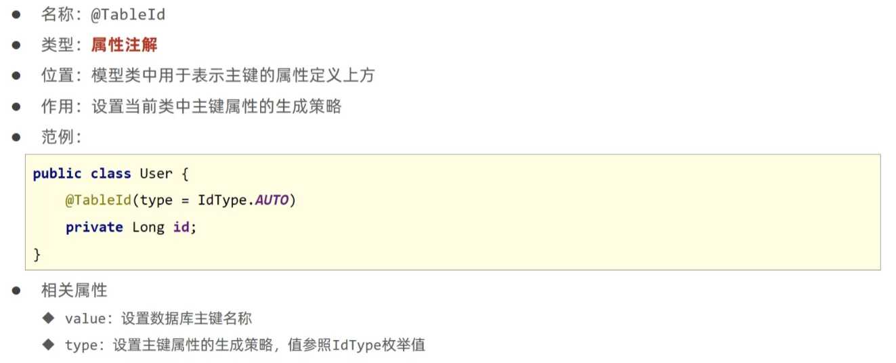

创建SpringBoot项目工程`mybatisplus_03_dml`，基本配置和代码同上

在domain中指定ID生成策略

```java
package com.stone.domain;

import com.baomidou.mybatisplus.annotation.IdType;
import com.baomidou.mybatisplus.annotation.TableId;
import com.baomidou.mybatisplus.annotation.TableName;
import lombok.Data;

@Data
@TableName("user")
public class User {
    // 指定ID生成策略
    @TableId(type = IdType.AUTO)
    private Long id;
    private String name;
    private Integer age;
    private String password;
    private String tel;
}
```

编写单元测试方法

```java
@Test
void testInsert() {
    User user = new User();
    user.setName("张三");
    user.setAge(20);
    user.setPassword("zhangsan@stone.com");
    user.setTel("123456789");
    userDao.insert(user);
}
```

关于几种ID生成策略：

- AUTO：使用数据库id自增策略控制id生成
- NONE：不设置id生成策略
- INPUT：用户手动输入id
- ASSIGN_ID：雪花算法生成id（可兼容数值型与字符串型）
- ASSIGN_UUID：以UUID生成算法作为id生成策略

<span style="color:red;">此外还可以通过配置文件全局配置ID生成策略</span>

```yaml
mybatis-plus:
  global-config:
    db-config:
      # id生成策略
      id-type: auto
      # 指定表名前缀
      table-prefix: tbl_
```

##### 多数据操作

```java
@Test
void testBatchOper() {
    List<Long> list = new ArrayList<>();
    list.add(1L);
    list.add(2L);
    list.add(3L);
    // 批量删除
    userDao.deleteBatchIds(list);
    // 批量查询
    userDao.selectBatchIds(list).forEach(System.out::println);
}
```

##### 逻辑删除

修改表结构

```sql
ALTER TABLE `mybatisplus_db`.`user` 
ADD COLUMN `deleted` int(1) NULL DEFAULT 0 AFTER `tel`;
```

实体类中添加属性

```java
@TableLogic(value = "0", delval = "1")
private Integer deleted;
```

执行删除操作

```java
@Test
void testLogicDel() {
    userDao.deleteById(1L);
}
```

<span style="color:red;">全局配置逻辑删除</span>

```yaml
mybatis-plus:
  global-config:
    db-config:
      # id生成策略
      id-type: auto
      # 指定表名前缀
      table-prefix: tbl_
      # 逻辑删除
      logic-delete-field: deleted
      logic-delete-value: 1
      logic-not-delete-value: 0
```


#### 乐观锁

业务并发现象带来的问题：秒杀

修改表结构

```sql
ALTER TABLE `mybatisplus_db`.`user` 
ADD COLUMN `version` int(11) NULL DEFAULT 1 AFTER `deleted`;
```

实体类中添加属性

```java
@Version
private Integer version;
```

配置文件中开启MyBatisPlus的日志

```yaml
mybatis-plus:
  configuration:
    log-impl: org.apache.ibatis.logging.stdout.StdOutImpl
```

添加乐观锁拦截器

```java
package com.stone.config;

import com.baomidou.mybatisplus.extension.plugins.MybatisPlusInterceptor;
import com.baomidou.mybatisplus.extension.plugins.inner.OptimisticLockerInnerInterceptor;
import com.baomidou.mybatisplus.extension.plugins.inner.PaginationInnerInterceptor;
import org.springframework.context.annotation.Bean;
import org.springframework.context.annotation.Configuration;

@Configuration
public class MpConfig {

    @Bean
    public MybatisPlusInterceptor mpInterceptor(){
        MybatisPlusInterceptor mpInterceptor = new MybatisPlusInterceptor();
        // 添加分页拦截器
        mpInterceptor.addInnerInterceptor(new PaginationInnerInterceptor());
        // 添加乐观锁拦截器
        mpInterceptor.addInnerInterceptor(new OptimisticLockerInnerInterceptor());
        return mpInterceptor;
    }
}
```

编写单元测试方法

```java
@Test
void testOptimisticLock() {
    User user = userDao.selectById(2L);
    user.setName("李四");
    userDao.updateById(user);
}
```

查看控制台打印日志

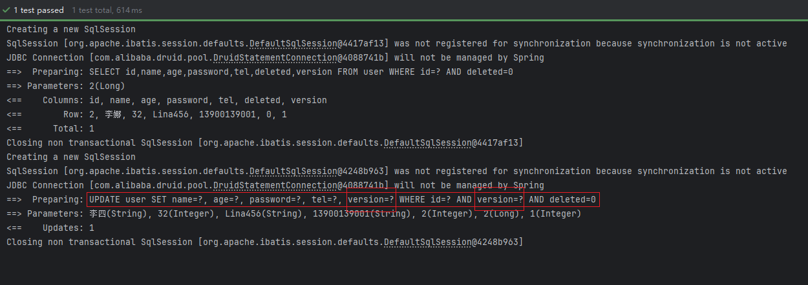

<span style="color:red;">乐观锁作用的业务模拟</span>

```java
@Test
void testOptimisticLock() {
    User user = userDao.selectById(2L);  // version = 3
    User user2 = userDao.selectById(2L); // version = 3

    user.setName("StoneAAA");
    userDao.updateById(user);  // version = 4

    user2.setName("StoneBBB");
    userDao.updateById(user2); // 执行update失败，因为id=2L的record的version = 4，而user2的version = 3
}
```


#### 代码生成器

创建SpringBoot项目工程`mybatisplus_04_generator`，详见项目代码；


# END

https://www.bilibili.com/video/BV1Fi4y1S7ix?spm_id_from=333.788.player.switch&vd_source=71b23ebd2cd9db8c137e17cdd381c618&p=118

